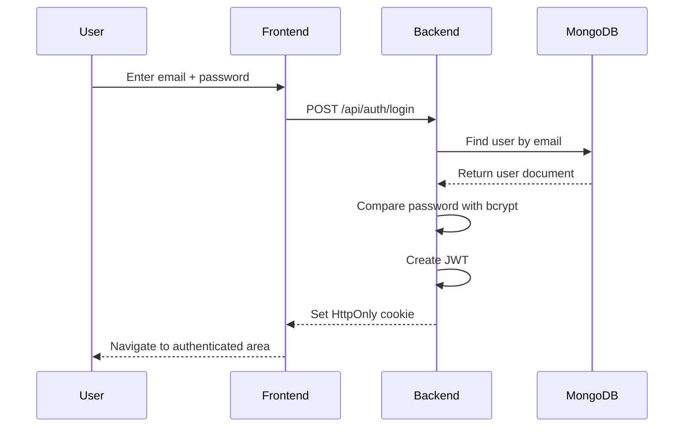
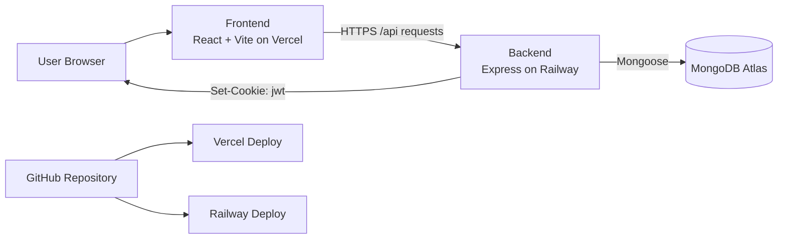
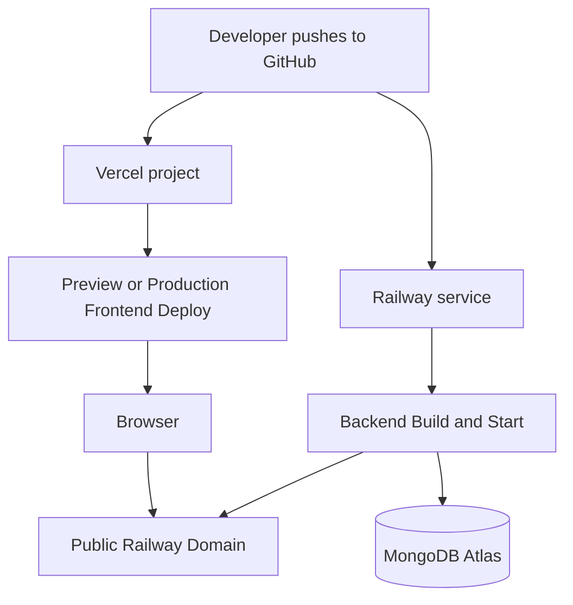

# 💬 RealTime Chat Web App

This project is a modern real-time chat application designed to demonstrate production-style full-stack engineering practices:
- clean modular architecture
- frontend and backend separation
- validation on both client and server
- secure authentication with JWT + cookie
- deployable monorepo workflow
- cloud-ready configuration
-roadmap toward Socket.IO, messaging, media sharing, and profile features


---

#Live links
**Frontend:** `https://chatapp-ldrp.vercel.app/`  
**Backend:** `realtimechatwebapp-production-51a2.up.railway.app`

---
# 🚀 Current Status

### ✅ Completed

- User Registration
- User Login
- JWT Authentication
- HTTP-only Cookie Authentication
- Client-side Validation (React Hook Form + Zod)
- Server-side Validation (Zod)
- Zustand Authentication Store
- Axios API Integration
- Toast Notifications (Sonner)
- Loading Spinner
- MongoDB Atlas Integration
- Automatic Deployment (Vercel + Railway)

### 🚧 In Progress

- Protected Routes
- Authentication Persistence (`checkAuth`)
- Chat UI
- Socket.io Integration

---

# 🛠 Tech Stack

## Frontend

- React 19
- Vite
- Tailwind CSS v4
- shadcn/ui
- React Router DOM
- Axios
- Zustand
- React Hook Form
- Zod
- Sonner
- Lucide React

## Backend

- Node.js
- Express.js
- MongoDB Atlas
- Mongoose
- JWT
- bcryptjs
- Cookie Parser
- Zod
- dotenv
- CORS

## Deployment

- Vercel
- Railway
- MongoDB Atlas
- GitHub

---

# 📂 Project Structure

```text
RealTimeChatWebApp/
├── frontend/
│   ├── src/
│   │   ├── api/
│   │   │   └── axios.js
│   │   ├── assets/
│   │   ├── components/
│   │   │   └── ui/
│   │   ├── lib/
│   │   ├── pages/
│   │   │   ├── Welcome.jsx
│   │   │   ├── Register.jsx
│   │   │   ├── Login.jsx
│   │   │   └── Chat.jsx
│   │   ├── routes/
│   │   │   └── AppRoutes.jsx
│   │   ├── store/
│   │   │   └── useAuthStore.js
│   │   ├── validations/
│   │   │   └── auth.validation.js
│   │   ├── App.jsx
│   │   ├── main.jsx
│   │   └── index.css
│   ├── .env
│   └── package.json
├── backend/
│   ├── src/
│   │   ├── config/
│   │   │   ├── db.js
│   │   │   └── env.js
│   │   ├── controllers/
│   │   │   └── auth.controller.js
│   │   ├── middlewares/
│   │   │   └── validate.middleware.js
│   │   ├── models/
│   │   │   └── user.model.js
│   │   ├── routes/
│   │   │   └── auth.route.js
│   │   ├── utils/
│   │   │   └── generateToken.js
│   │   ├── validations/
│   │   │   └── auth.validation.js
│   │   ├── app.js
│   │   └── server.js
│   ├── .env
│   └── package.json
└── README.md
```

---

# 🏗 Architecture

## Backend

- Config
- Controllers
- Models
- Routes
- Middlewares
- Validation
- Utilities

## Frontend

- Pages
- Components
- API Layer
- Zustand Store
- Routes
- Validation Schemas

---

# 🔐 Authentication Flow



# 🏗 Architecture Diagram



# ☁️ Deployment Flow




# ✨ Features

## Authentication

- User Registration
- User Login
- JWT Authentication
- HTTP-only Cookies
- Password Hashing

## Frontend

- Responsive UI
- Form Validation
- Toast Notifications
- Loading Indicators
- Zustand State Management

## Backend

- REST APIs
- MVC Architecture
- Secure Authentication
- MongoDB Atlas
- Standardized API Responses

---

# 📡 API Endpoints

## Health Check

```http
GET /
```

## Register

```http
POST /api/auth/register
```

## Login

```http
POST /api/auth/login
```

---

# 🔒 Validation

Validation is performed on both the frontend and backend using **Zod**.

Field Rule

---
```
First Name 2--30 characters, letters only
Last Name 2--30 characters, letters only
Email Valid email
Date of Birth Minimum age 13
Password Minimum 8 characters
Confirm Password Must match password
```
---

# 🌐 Environment Variables

## Backend

```env
PORT=5000
MONGO_URI=mongodb_uri
CLIENT_URL=http://localhost:5173
JWT_SECRET=something
JWT_EXPIRE=7d
```

## Frontend

```env
VITE_API_URL=http://localhost:5000
```

---

# ▶️ Running Locally

```bash
git clone <repository-url>
cd RealTimeChatWebApp
```

### Backend

```bash
cd backend
npm install
npm run dev
```

### Frontend

```bash
cd frontend
npm install
npm run dev
```

---

# ☁️ Deployment

Service Platform

---

Frontend Vercel
Backend Railway
Database MongoDB Atlas

Every push to the `main` branch automatically deploys the latest
version.

---

# 🗺 Roadmap

## Phase 1 -- Authentication

- ✅ Register
- ✅ Login
- ✅ JWT Authentication
- ✅ Cookie Authentication
- 🔄 Protected Routes
- 🔄 Authentication Persistence

## Phase 2 -- User Management

- Profile
- Edit Profile
- Profile Picture Upload

## Phase 3 -- Messaging

- One-to-One Chat
- Recent Conversations
- Message Persistence

## Phase 4 -- Real-Time

- Socket.io
- Typing Indicator
- Online Status
- Read Receipts

## Phase 5 -- Advanced

- Group Chats
- Image & File Sharing
- Cloudinary
- Emoji Picker
- Notifications

---

# 📖 Development Workflow

```text
Planning
   ↓
Database Design
   ↓
API Design
   ↓
Backend Development
   ↓
Postman Testing
   ↓
Frontend Development
   ↓
Integration Testing
   ↓
Git Commit
   ↓
Automatic Deployment
```

---

# 📸 Screenshots

> Screenshots and GIFs will be added as development progresses.

---

# 🎯 Project Goal

Build a production-inspired real-time chat application demonstrating:

- Clean Architecture
- REST API Design
- Secure Authentication & Authorization
- Modern React Development
- Socket.io Real-Time Communication
- Responsive UI/UX
- CI/CD Deployment Workflow

This project serves as both a **Master's Project** and a
**portfolio-ready application**.
