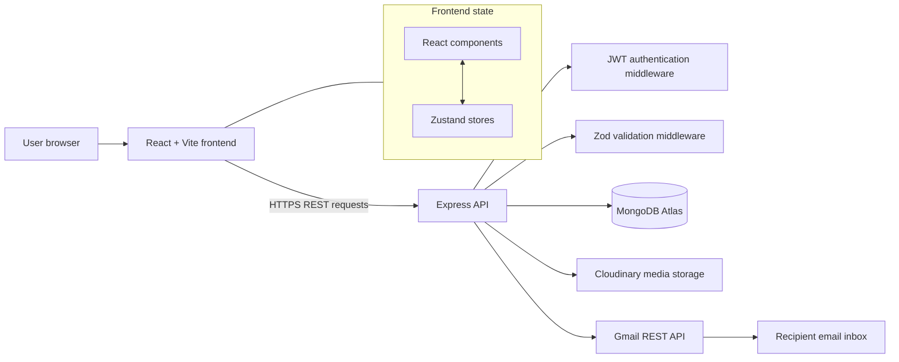
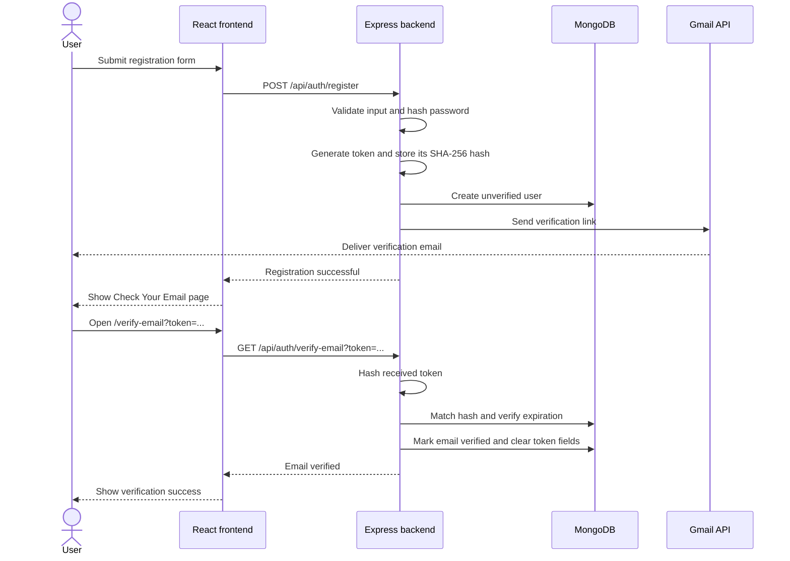
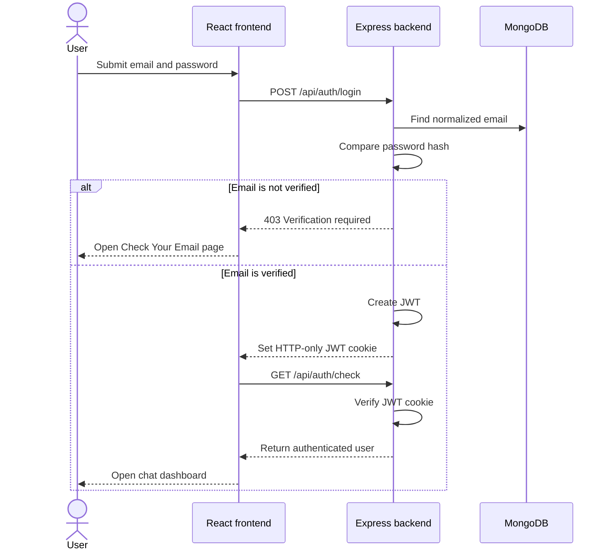
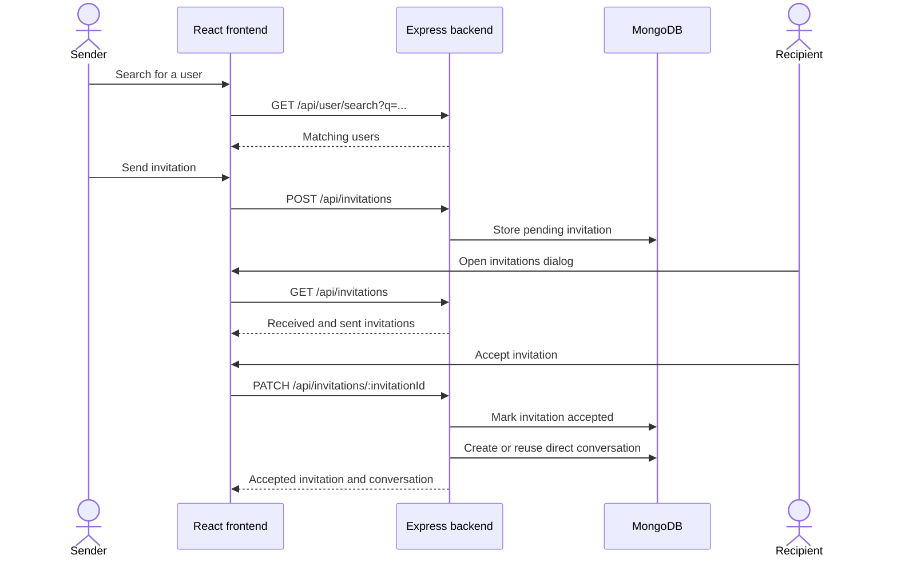
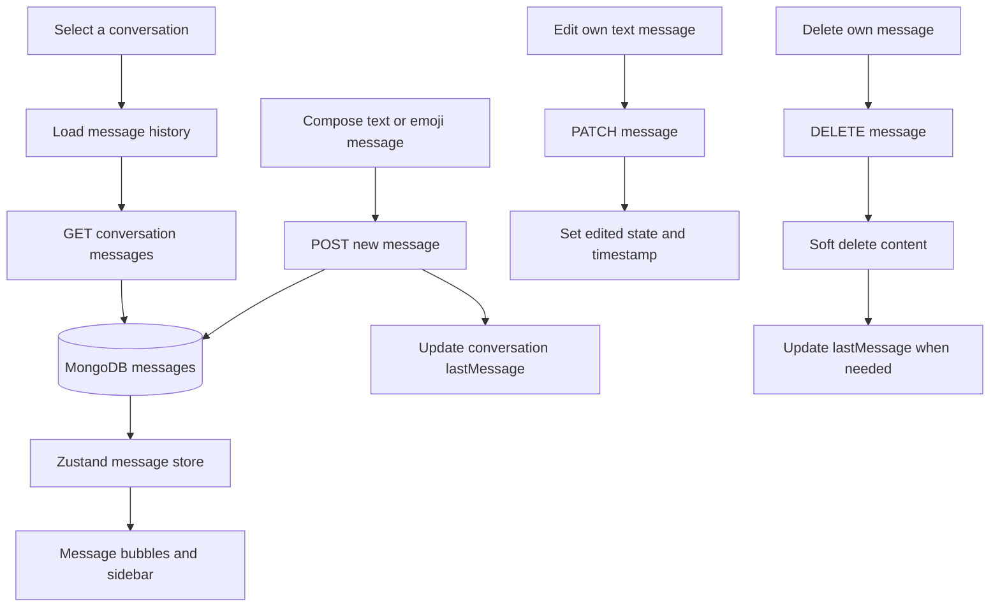
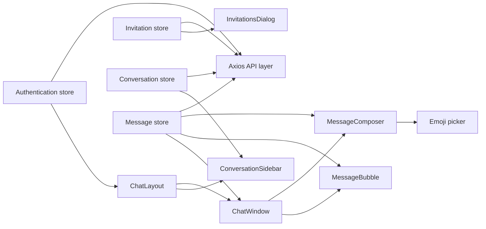
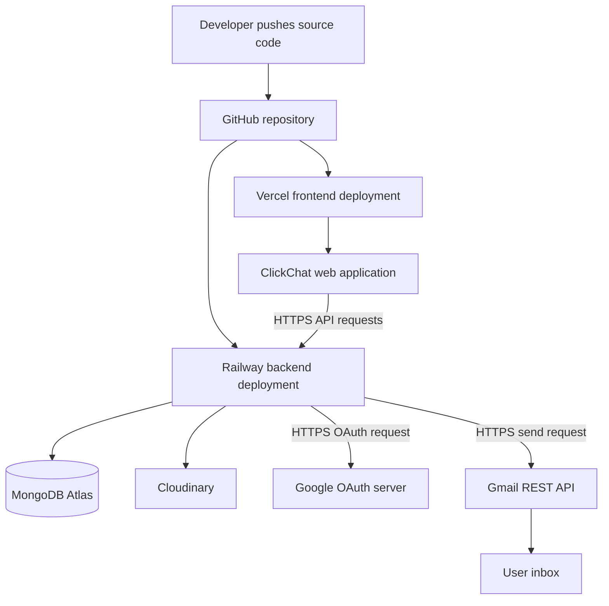

# ClickChat

ClickChat is a full-stack chat application built with the MERN stack. It currently supports secure authentication, user invitations, direct conversations, persistent text messages, emoji input, and message editing and deletion through a responsive interface.

The project is being developed as a Master's project and as a foundation for future real-time communication with Socket.IO.

## Live demo

- Frontend: https://chatapp-ldrp.vercel.app
- Backend API: https://realtimechatwebapp-production-51a2.up.railway.app

> The Railway service may take a few seconds to respond after a period of inactivity.

## Current features

### Authentication and users

- User registration, login, and logout
- Email verification before login
- Secure, hashed verification tokens with 24-hour expiration
- Verification-email resend with a 60-second cooldown
- Gmail REST API delivery using Google OAuth 2.0
- Rate limiting for registration and verification-email requests
- JWT authentication using an HTTP-only cookie
- Persistent authentication and protected routes
- Password hashing
- User profile page
- Cloudinary profile-picture upload
- User search by name or email
- Online status and last-seen fields

### Invitations and contacts

- Send chat invitations
- View received and sent invitations
- Accept or decline invitations
- Prevent duplicate pending invitations
- Show invitation notification counts and pending states
- View accepted contacts
- Automatically create a direct conversation when an invitation is accepted

### Conversations and messages

- Direct one-to-one conversations
- Conversation sidebar with real user information
- Persistent MongoDB message history
- Send and retrieve text messages through REST APIs
- Display the latest message in the conversation list
- Emoji picker in the message composer
- Edit your own text messages
- Delete your own messages for everyone using a soft delete
- Edited and deleted message states
- Responsive desktop and mobile chat layout

### UI and development

- Light, dark, and system themes
- Loading skeletons and toast notifications
- Client-side and server-side Zod validation
- Zustand stores for authentication, users, invitations, conversations, and messages
- MVC-style Express backend
- Automatic deployment through Vercel and Railway

## Technology stack

### Frontend

- React 19 and Vite
- React Router
- Zustand
- Axios
- React Hook Form and Zod
- Tailwind CSS
- shadcn/ui and Radix UI
- emoji-picker-react

### Backend

- Node.js and Express
- MongoDB and Mongoose
- JWT and HTTP-only cookies
- Zod
- Multer and Cloudinary
- Gmail REST API and Google OAuth 2.0

## System architecture



The frontend communicates with the backend through Axios with credentials
enabled. The backend validates requests, authorizes protected resources, and
coordinates persistence and external services.

## Core workflows

### Registration and email verification



Only a hash of the verification token is stored. The raw token appears in the
email link and expires after 24 hours. Resend requests rotate the token, apply
a per-user cooldown, and are also protected by an IP-based rate limiter.

### Login and protected-route authentication



### Invitation and conversation creation



### REST message lifecycle



Messages are authorized against both the conversation and authenticated
sender. Deletion is a soft delete so the conversation history can display a
deleted-message state without removing the database record.

### Frontend component and state flow



## Project structure

```text
ClickChat/
|-- frontend/
|   |-- src/
|   |   |-- api/
|   |   |-- components/
|   |   |   |-- chat/
|   |   |   |-- profile/
|   |   |   `-- ui/
|   |   |-- layout/
|   |   |-- pages/
|   |   |-- routes/
|   |   |-- store/
|   |   `-- validations/
|   `-- package.json
|-- backend/
|   |-- src/
|   |   |-- config/
|   |   |-- controllers/
|   |   |-- middleware/
|   |   |-- models/
|   |   |-- routes/
|   |   |-- services/
|   |   |-- utils/
|   |   `-- validations/
|   `-- package.json
`-- README.md
```

## Running locally

### Prerequisites

- Node.js
- npm
- MongoDB database or MongoDB Atlas cluster
- Cloudinary account for profile pictures
- Google Cloud project with the Gmail API enabled
- Dedicated Gmail sender account
- Google OAuth client ID, client secret, and refresh token

### 1. Clone and open the project

```bash
git clone <repository-url>
cd click-chat
```

### 2. Configure the backend

Create `backend/.env`:

```env
PORT=5000
MONGO_URI=your_mongodb_connection_string
CLIENT_URL=http://localhost:5173
JWT_SECRET=your_secure_jwt_secret
JWT_EXPIRE=7d
NODE_ENV=development
CLOUDINARY_CLOUD_NAME=your_cloud_name
CLOUDINARY_API_KEY=your_api_key
CLOUDINARY_API_SECRET=your_api_secret
GMAIL_USER=your_project_gmail_address
GOOGLE_CLIENT_ID=your_google_oauth_client_id
GOOGLE_CLIENT_SECRET=your_google_oauth_client_secret
GOOGLE_REDIRECT_URI=http://localhost:3000/oauth2callback
GOOGLE_REFRESH_TOKEN=your_google_oauth_refresh_token
```

After enabling the Gmail API and creating a Desktop OAuth client, generate the
sender account's refresh token locally:

```bash
cd backend
npm run gmail:token
```

Open the authorization URL printed in the terminal, approve the `gmail.send`
permission with the project Gmail account, and add the returned refresh token
to both the local backend environment and Railway. OAuth credentials and
refresh tokens must never be committed to source control.

Install dependencies and start the API:

```bash
cd backend
npm install
npm run dev
```

### 3. Configure the frontend

Create `frontend/.env`:

```env
VITE_API_URL=http://localhost:5000
```

Open another terminal, then run:

```bash
cd frontend
npm install
npm run dev
```

Open `http://localhost:5173` in your browser.

## API endpoints

All protected requests use the JWT cookie and must include credentials.

### Authentication

| Method | Endpoint | Description |
| --- | --- | --- |
| `POST` | `/api/auth/register` | Register a user |
| `POST` | `/api/auth/login` | Log in |
| `GET` | `/api/auth/check` | Retrieve the authenticated user |
| `GET` | `/api/auth/logout` | Log out |
| `GET` | `/api/auth/verify-email?token=...` | Verify an email address |
| `POST` | `/api/auth/resend-verification` | Send a new verification link |

### Users and invitations

| Method | Endpoint | Description |
| --- | --- | --- |
| `PATCH` | `/api/user/profilePic` | Upload a profile picture |
| `GET` | `/api/user/search?q=query` | Search for users |
| `GET` | `/api/invitations` | Retrieve sent and received invitations |
| `POST` | `/api/invitations` | Send an invitation |
| `PATCH` | `/api/invitations/:invitationId` | Accept or decline an invitation |
| `GET` | `/api/invitations/contacts` | Retrieve accepted contacts |

### Conversations and messages

| Method | Endpoint | Description |
| --- | --- | --- |
| `GET` | `/api/conversations` | Retrieve the user's conversations |
| `GET` | `/api/conversations/:conversationId/messages` | Retrieve message history |
| `POST` | `/api/conversations/:conversationId/messages` | Send a text message |
| `PATCH` | `/api/conversations/:conversationId/messages/:messageId` | Edit your message |
| `DELETE` | `/api/conversations/:conversationId/messages/:messageId` | Delete your message |

Example message body:

```json
{
  "content": "Hello!"
}
```

## Current limitations

- New messages do not yet appear instantly for another user; the application currently uses REST requests and refresh-based retrieval.
- Group-conversation fields exist in the data model, but the complete group-chat workflow is not implemented yet.
- Socket.IO packages are installed, but real-time events are not integrated yet.

## Roadmap

- Socket.IO real-time message delivery
- Reply to messages
- Group chat creation and management
- Typing indicators
- Read receipts and unread counts
- Media and document sharing
- Message search
- Notifications
- Voice and video calling

## Deployment

- Frontend: Vercel
- Backend: Railway
- Database: MongoDB Atlas
- Media storage: Cloudinary

Pushing to the configured production branch triggers the deployment workflow for the corresponding service.



The production backend uses Gmail's HTTPS API instead of SMTP, which keeps
email delivery compatible with Railway's outbound networking restrictions.

## Project goal

ClickChat demonstrates secure authentication, REST API design, maintainable frontend state management, responsive React development, cloud media storage, and an incremental path toward a production-style real-time chat application.
