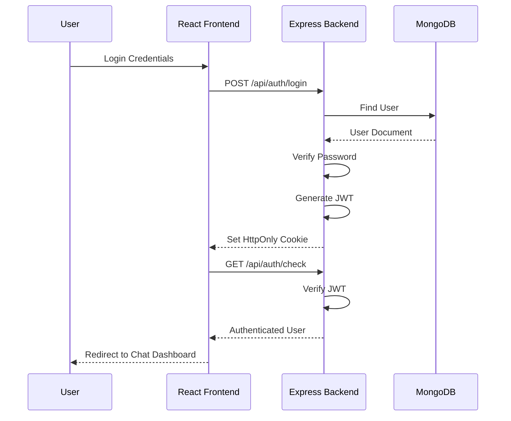
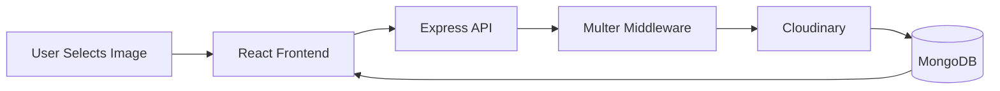
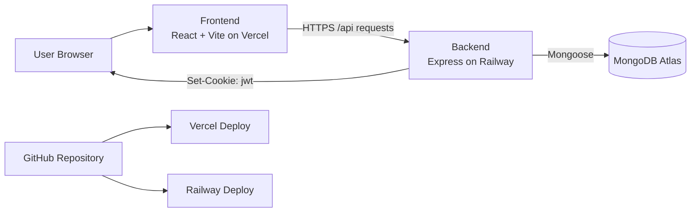
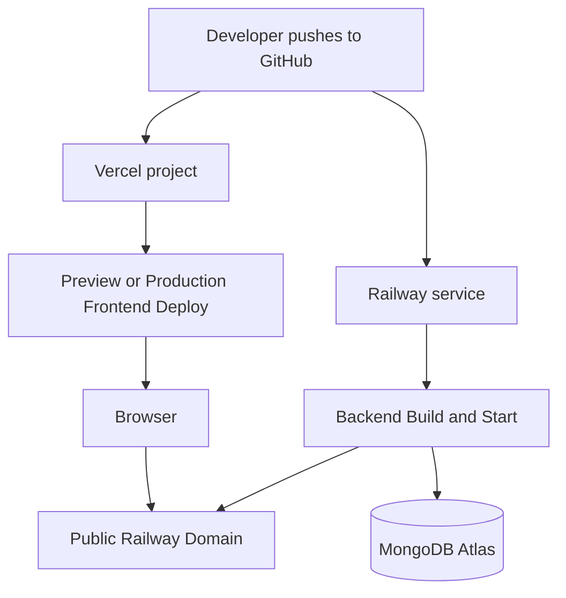
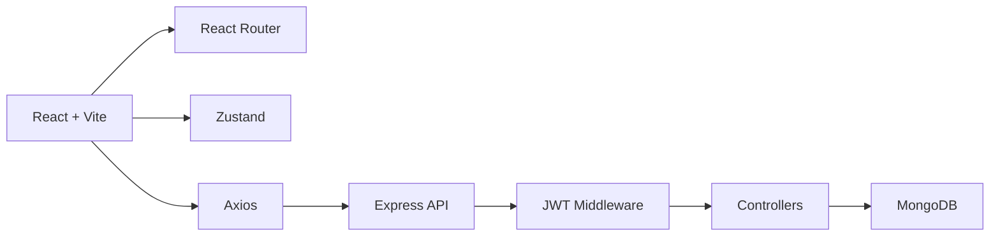
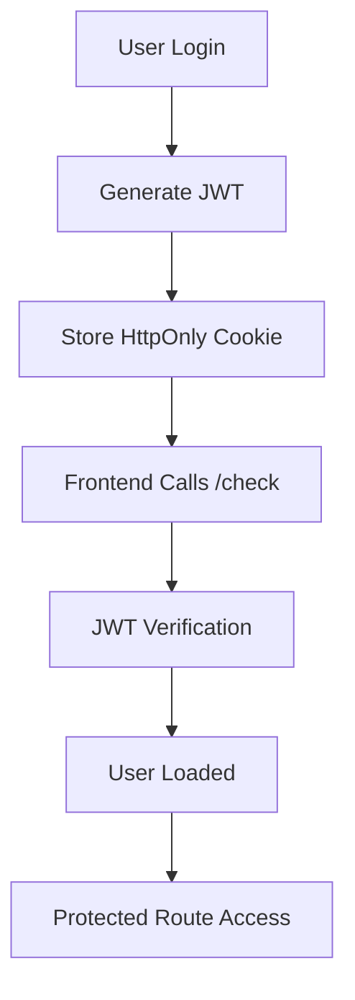

# 💬 ClickChat

> **ClickChat** is a modern **WhatsApp-inspired Real-Time Chat
> Application** built using the **MERN Stack**, designed with
> production-level architecture, secure authentication, and cloud-native
> media management.

Developed as a **Master's Project**, ClickChat demonstrates
industry-standard full-stack development practices while providing a
scalable foundation for real-time communication, media sharing, and
collaborative messaging.

### ✨ Highlights

- 🏗 Modular full-stack architecture (Frontend & Backend separation)
- 🔐 Secure JWT Authentication with HTTP-only Cookies
- ☁️ Cloudinary integration for profile image management
- 🛡 Client-side & Server-side validation using Zod
- ⚡ Global state management with Zustand
- 🎨 Modern UI built with React, Tailwind CSS & shadcn/ui
- 📦 RESTful API design following MVC architecture
- 🚀 Automatic CI/CD deployment with GitHub, Vercel & Railway
- 📱 Fully responsive user interface
- 🔄 Designed for future Socket.IO real-time communication
- 📈 Built with scalability and maintainability in mind


---

# 🌐 Live Demo

---

Service URL

---

🌍 Frontend https://chatapp-ldrp.vercel.app

🚀 Backend https://realtimechatwebapp-production-51a2.up.railway.app
API

---

> **Note:** The backend is hosted on Railway's free tier and may take a
> few seconds to respond after periods of inactivity.

---

# 🚀 Current Status

## ✅ Completed

### Authentication

- User Registration
- User Login
- User Logout
- JWT Authentication
- HTTP-only Cookie Authentication
- Authentication Persistence (`checkAuth`)
- Protected Routes

### User Management

- User Profile Page
- Profile Picture Upload
- Cloudinary Image Storage
- Avatar Preview
- Online Status
- Last Seen Tracking

### Frontend

- React Router DOM
- React Hook Form
- Zod Client Validation
- Zustand Authentication Store
- Zustand User Store
- Axios API Layer
- shadcn/ui Components
- Responsive UI
- Toast Notifications (Sonner)
- Loading States
- Chat Dashboard
- Conversation Sidebar
- Responsive Chat Layout
- User Search by Name or Email
- New Chat Dialog
- Invitation Notification Badge
- Sent and Received Invitation Lists
- Accept and Decline Invitation Actions
- Pending Invitation Button States
- Light, Dark & System Theme Support

### Backend

- RESTful API
- MVC Architecture
- MongoDB Atlas Integration
- JWT Middleware
- Cookie-based Authentication
- Multer File Upload
- Cloudinary Integration
- Server-side Validation (Zod)
- User Search API
- Chat Invitation API
- Send and Retrieve Invitations
- Accept and Decline Invitations
- Duplicate Pending Invitation Prevention
- Invitation Authorization and ObjectId Validation

### DevOps

- Automatic Deployment (Vercel + Railway)
- GitHub Version Control

---

## 🚧 In Progress

- Conversation Management
- One-to-One Messaging

---

## 📅 Planned

- Socket.IO Integration
- Group Chats
- Media & Document Sharing
- Typing Indicators
- Read Receipts
- Notifications
- Message Search

---

# 📂 Project Structure

```text
ClickChat/
├── frontend/
│   ├── src/
│   │   ├── api/
│   │   │   └── axios.js
│   │   ├── assets/
│   │   ├── components/
│   │   │   ├── profile/
│   │   │   └── ui/
│   │   ├── lib/
│   │   ├── pages/
│   │   │   ├── Welcome.jsx
│   │   │   ├── Register.jsx
│   │   │   ├── Login.jsx
│   │   │   ├── Chat.jsx
│   │   │   └── Profile.jsx
│   │   ├── routes/
│   │   │   └── AppRoutes.jsx
│   │   ├── store/
│   │   │   ├── useAuthStore.js
│   │   │   └── useUserStore.js
│   │   ├── validations/
│   │   │   └── auth.validation.js
│   │   ├── App.jsx
│   │   ├── main.jsx
│   │   └── index.css
│   ├── .env
│   └── package.json
├── backend/
│   ├── src/
│   │   ├── config/
│   │   │   ├── db.js
│   │   │   ├── db.js
│   │   │   ├── env.js
│   │   │   └── cloudinary.js
│   │   ├── controllers/
│   │   │   ├── auth.controller.js
│   │   │   └── user.controller.js
│   │   ├── middlewares/
│   │   │   ├── auth.middleware.js
│   │   │   ├── upload.middleware.js
│   │   │   └── validate.middleware.js
│   │   ├── models/
│   │   │   └── user.model.js
│   │   ├── routes/
│   │   │   ├── auth.route.js
│   │   │   └── user.route.js
│   │   ├── services/
│   │   │   └── cloudinary.service.js
│   │   ├── utils/
│   │   │   └── token.js
│   │   ├── validations/
│   │   │   └── auth.validation.js
│   │   ├── app.js
│   │   └── server.js
│   ├── .env
│   └── package.json
└── README.md
```

---

# 🏗 Architecture

## Backend

- Config
- Controllers
- Models
- Routes
- Middlewares
- Validation
- Utilities

## Frontend

- Pages
- Components
- API Layer
- Zustand Store
- Routes
- Validation Schemas

---

# 🔐 Authentication Flow



# ☁️ Profile Picture Upload Flow



# 🏗 Architecture Diagram



# ☁️ Deployment Flow



# 🏛 Project Architecture



# 🔒 Authentication Lifecycle



# ✨ Features

## Authentication

- User Registration
- User Login
- User Logout
- JWT Authentication
- HTTP-only Cookie Authentication
- Protected Routes
- Authentication Persistence
- Secure Password Hashing

## Frontend

- Responsive UI
- React Router Protected Navigation
- React Hook Form
- Zod Validation
- Zustand Global Authentication Store
- Axios API Integration
- Sonner Toast Notifications
- Loading States
- shadcn/ui Components

## Backend

- RESTful APIs
- MVC Architecture
- JWT Authentication
- Cookie-based Session Handling
- Authentication Middleware
- Standardized API Responses
- MongoDB Atlas Integration

---

# 📡 API Endpoints

## Health Check

```http
GET /
```

## Register

```http
POST /api/auth/register
```

## Login

```http
POST /api/auth/login
```

## Logout

```http
GET /api/auth/logout
```

## checkAuth

```http
GET /api/auth/check
```

## Upload Profile Picture

```http
PATCH /api/user/profilePic
```

## Search Users

```http
GET /api/user/search?q=query
```

## Send Chat Invitation

```http
POST /api/invitations
```

## Get Sent and Received Invitations

```http
GET /api/invitations
```

## Accept or Decline Invitation

```http
PATCH /api/invitations/:invitationId
```

---

# 🔒 Validation

Validation is performed on both the frontend and backend using **Zod**.

Field Rule

---

    First Name 2--30 characters, letters only
    Last Name 2--30 characters, letters only
    Email Valid email
    Date of Birth Minimum age 13
    Password Minimum 8 characters
    Confirm Password Must match password

---

# 🌐 Environment Variables

## Backend

```env
PORT=5000
MONGO_URI=mongodb_uri
CLIENT_URL=http://localhost:5173
JWT_SECRET=something
JWT_EXPIRE=7d
CLOUDINARY_CLOUD_NAME=
CLOUDINARY_API_KEY=
CLOUDINARY_API_SECRET=
```

## Frontend

```env
VITE_API_URL=http://localhost:5000/api
```

---

# ▶️ Running Locally

```bash
git clone <repository-url>
cd RealTimeChatWebApp
```

### Backend

```bash
cd backend
npm install
npm run dev
```

### Frontend

```bash
cd frontend
npm install
npm run dev
```

---

# ☁️ Deployment

Service Platform

---

Frontend Vercel Backend Railway Database MongoDB Atlas

Every push to the `main` branch automatically deploys the latest
version.

---

# 🗺 Roadmap

## ✅ Phase 1 --- Authentication

- ✅ User Registration
- ✅ User Login
- ✅ User Logout
- ✅ JWT Authentication
- ✅ HTTP-only Cookies
- ✅ Protected Routes
- ✅ Authentication Persistence

## 🚧 Phase 2 --- Chat Interface

- ✅ Chat Dashboard
- ✅ Conversation Sidebar
- ✅ User Search
- ✅ New Chat Dialog
- ✅ Chat Invitation Workflow
- ✅ Sent and Received Invitation Lists
- ✅ Accept and Decline Invitations
- ✅ Responsive Layout
- User Menu

## 📨 Phase 3 --- Messaging

- One-to-One Chat
- Recent Conversations
- MongoDB Message Storage

## ⚡ Phase 4 --- Real-Time Communication

- Socket.IO
- Online Status
- Typing Indicator
- Read Receipts

## 🚀 Phase 5 --- Advanced Features

- Group Chats
- Media Sharing
- Voice Messages
- Video Calling
- Emoji Picker
- Notifications
- Message Search

---

# 📖 Development Workflow

```text
Planning
   │
   ▼
Database Design
   │
   ▼
Backend API Development
   │
   ▼
Authentication & Security
   │
   ▼
Postman API Testing
   │
   ▼
Frontend Development
   │
   ▼
API Integration
   │
   ▼
Authentication Persistence
   │
   ▼
UI Testing
   │
   ▼
Git Commit
   │
   ▼
Automatic CI/CD Deployment
```

---

# 📸 Screenshots

> Screenshots and GIFs will be added as development progresses.

---

# 🎯 Project Goal

Build a production-inspired real-time chat application demonstrating:

- Clean Architecture
- REST API Design
- Secure Authentication & Authorization
- Modern React Development
- Socket.io Real-Time Communication
- Responsive UI/UX
- CI/CD Deployment Workflow

This project serves as both a **Master's Project** and a
**portfolio-ready application**.
