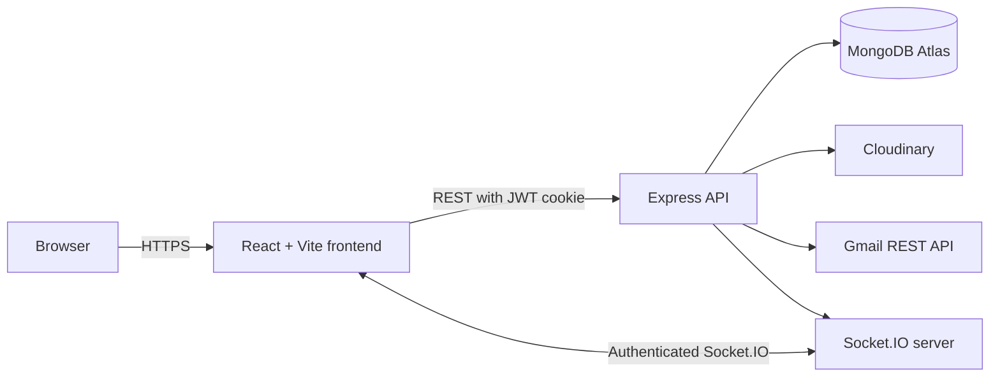

# ClickChat

ClickChat is a full-stack real-time chat application built with the MERN stack and Socket.IO. It provides verified account onboarding, real-time invitations, persistent direct messaging, synchronized message edits and deletions, multi-tab presence tracking, last-seen state, and a responsive React interface.

The project is being developed as a Master’s project and as a practical demonstration of secure REST APIs, authenticated real-time communication, MongoDB data modelling, client-side state management, cloud integrations, and incremental production engineering.

## Live demo

- Frontend: https://chatapp-ldrp.vercel.app
- Backend API: https://realtimechatwebapp-production-51a2.up.railway.app

> The Railway service may take a few seconds to respond after inactivity.

## Highlights

- Registration, Gmail API email verification, login, logout, and protected routes
- HTTP-only JWT authentication shared by REST and Socket.IO
- Cloudinary profile-picture uploads
- User search and real-time chat invitations
- Automatic direct-conversation creation on invitation acceptance
- Persistent text and emoji messages
- Real-time message creation, editing, and soft deletion
- Latest-message previews without full conversation-list refreshes
- WhatsApp-style message date separators
- Multi-tab online/offline presence with a five-second reconnect grace period
- Persisted last-seen timestamps and stale-presence cleanup after server restarts
- Light, dark, and system themes
- Responsive desktop and mobile chat layouts

## Architecture


```mermaid
flowchart LR
    U["Browser"] -->|"HTTPS"| F["React + Vite frontend"]
    F -->|"REST with JWT cookie"| B["Express API"]
    F <-->|"Authenticated Socket.IO"| S["Socket.IO server"]
    B --> DB[("MongoDB Atlas")]
    B --> C["Cloudinary"]
    B --> G["Gmail REST API"]
    B --> S
```

REST handles validation, authorization, persistence, uploads, and error responses. Socket.IO distributes persisted message and invitation changes and manages presence through private `user:<userId>` rooms.

## Technology stack

| Layer | Technologies |
| --- | --- |
| Frontend | React 19, Vite, React Router, Zustand, Axios, React Hook Form, Zod, Tailwind CSS, shadcn/ui, Radix UI, Socket.IO Client |
| Backend | Node.js, Express 5, Socket.IO, Mongoose, JWT, bcrypt, Zod, Multer |
| Data and cloud | MongoDB Atlas, Cloudinary, Gmail REST API with Google OAuth 2.0 |
| Deployment | Vercel frontend and Railway backend |

## Quick start

### Prerequisites

- Node.js 22 or newer
- npm
- MongoDB connection
- Cloudinary credentials
- Google OAuth credentials and Gmail API sender refresh token

### Backend

Create `backend/.env` using the variables described in [Setup and deployment](docs/08-setup-and-deployment.md#environment-variables), then run:

```bash
cd backend
npm install
npm run dev
```

### Frontend

Create `frontend/.env`:

```env
VITE_API_URL=http://localhost:5000
```

Then run:

```bash
cd frontend
npm install
npm run dev
```

Open `http://localhost:5173`.

## Documentation

Detailed technical documentation lives in [`docs/`](docs/README.md).

| Document | Contents |
| --- | --- |
| [Project overview](docs/01-project-overview.md) | Objectives, scope, actors, implemented features, and exclusions |
| [System architecture](docs/02-system-architecture.md) | Component boundaries, workflows, state flow, presence, and deployment diagrams |
| [Data model](docs/03-data-model.md) | Collection field tables, relationships, validation, and indexes |
| [API reference](docs/04-api-reference.md) | Complete REST endpoint tables, request validation, and behavior |
| [Real-time events](docs/05-realtime-events.md) | Socket.IO event table, payloads, rooms, invitations, messages, and presence |
| [Frontend design](docs/06-frontend-design.md) | Routes, components, stores, responsive behavior, and client data flow |
| [Security](docs/07-security.md) | Authentication, authorization, uploads, privacy, risks, and recommendations |
| [Setup and deployment](docs/08-setup-and-deployment.md) | Environment variables, commands, Gmail setup, and cloud deployment |
| [Testing and roadmap](docs/09-testing-and-roadmap.md) | Acceptance checks, limitations, test strategy, and prioritized future work |

## Project structure

```text
click-chat/
|-- backend/
|   `-- src/
|       |-- config/
|       |-- controllers/
|       |-- middleware/
|       |-- models/
|       |-- routes/
|       |-- services/
|       |-- socket/
|       |-- utils/
|       `-- validations/
|-- frontend/
|   `-- src/
|       |-- api/
|       |-- components/
|       |-- layout/
|       |-- pages/
|       |-- routes/
|       |-- store/
|       `-- validations/
|-- docs/
`-- README.md
```

## Current limitations

- Message retrieval is limited to the latest 50 messages; older-message pagination is next.
- Unread counts, complete read receipts, and typing indicators are not implemented.
- Reply storage/rendering exists, but reply selection in the composer is incomplete.
- Group and attachment schema/service foundations exist, but their complete workflows are not implemented.
- Presence and Socket.IO currently assume one backend instance.
- Automated test coverage has not yet been configured.

## Next priorities

1. Automated integration and Socket.IO tests
2. Cursor-based message-history pagination
3. Unread counts and read receipts
4. Typing indicators
5. Complete reply interactions
6. Attachments and group chat

See [Testing and roadmap](docs/09-testing-and-roadmap.md) for the full prioritized plan.

## Deployment

The frontend is deployed to Vercel, the backend to Railway, data to MongoDB Atlas, profile media to Cloudinary, and verification email through the Gmail REST API. Pushing to the configured production branch triggers the corresponding deployment workflow.
