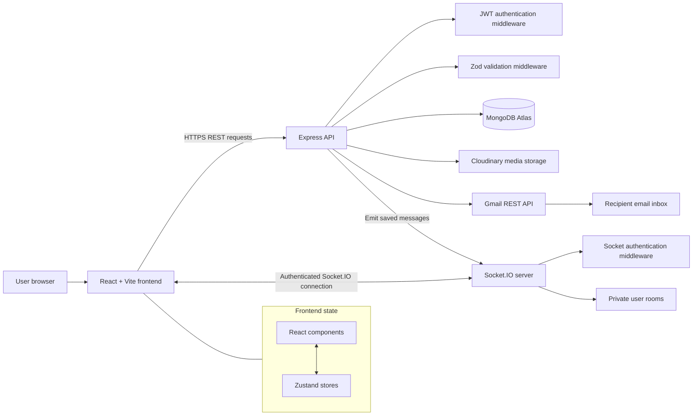
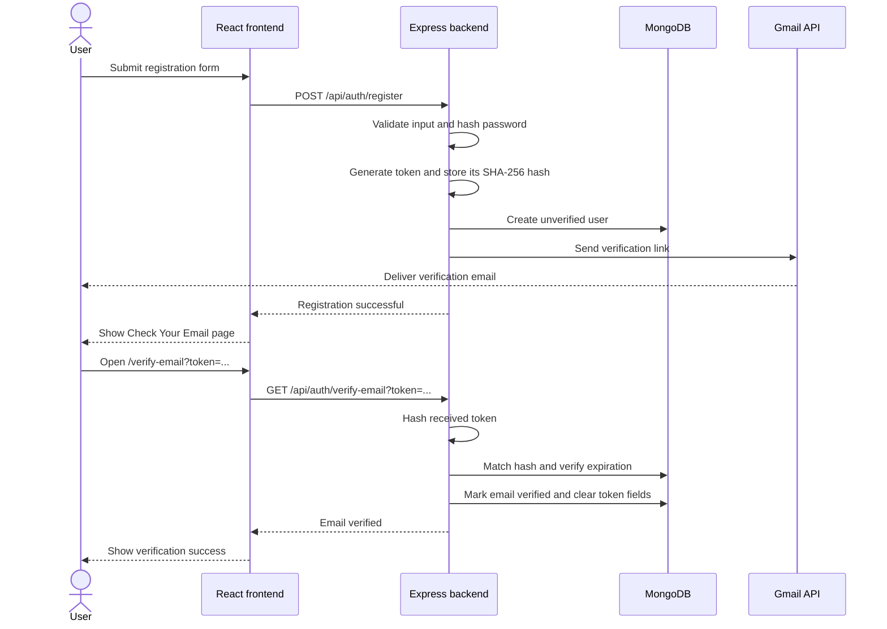
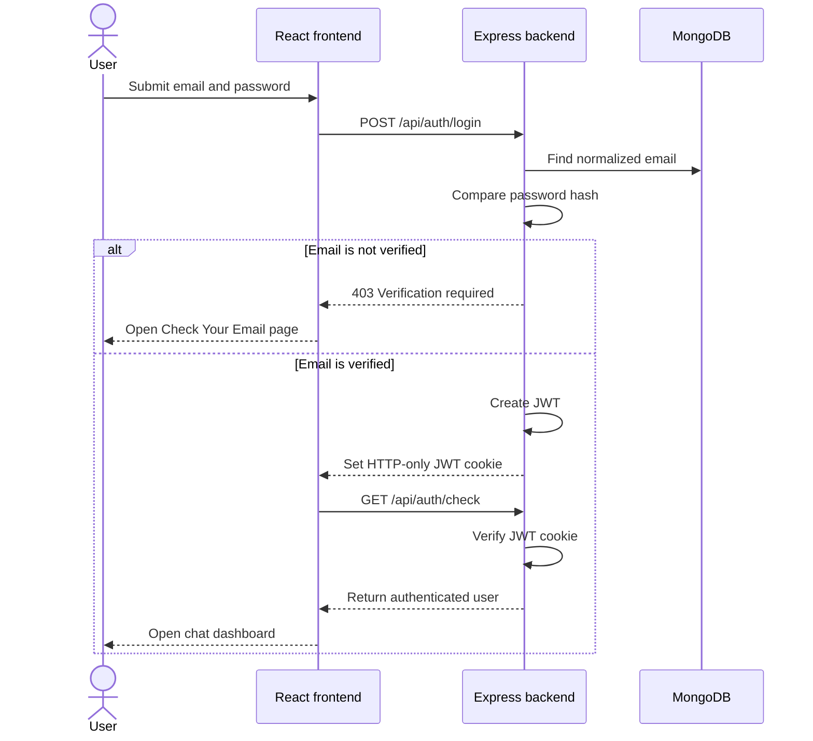
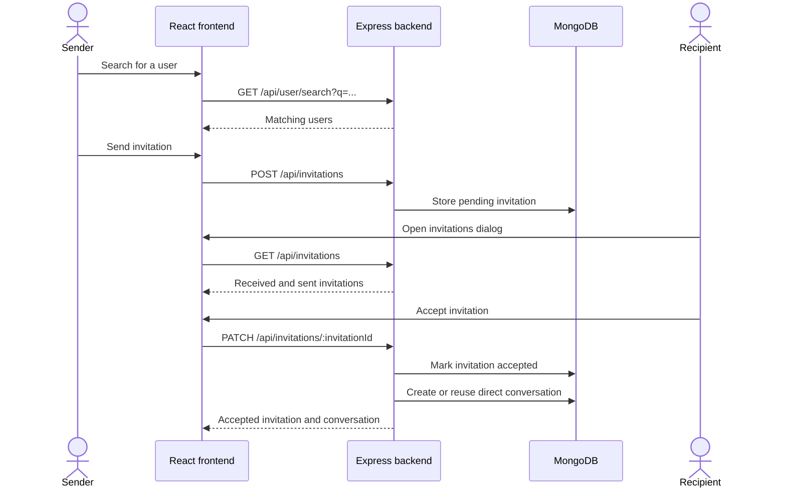
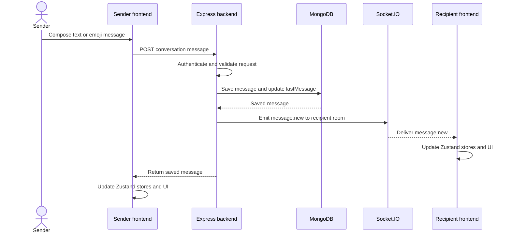
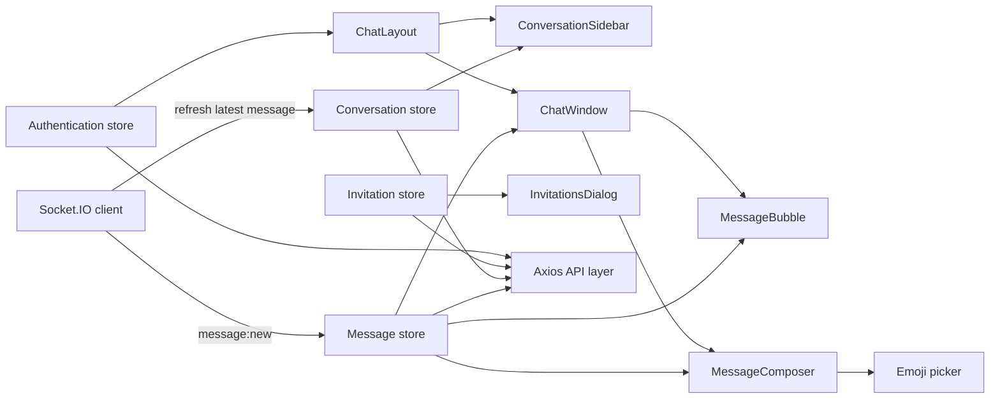
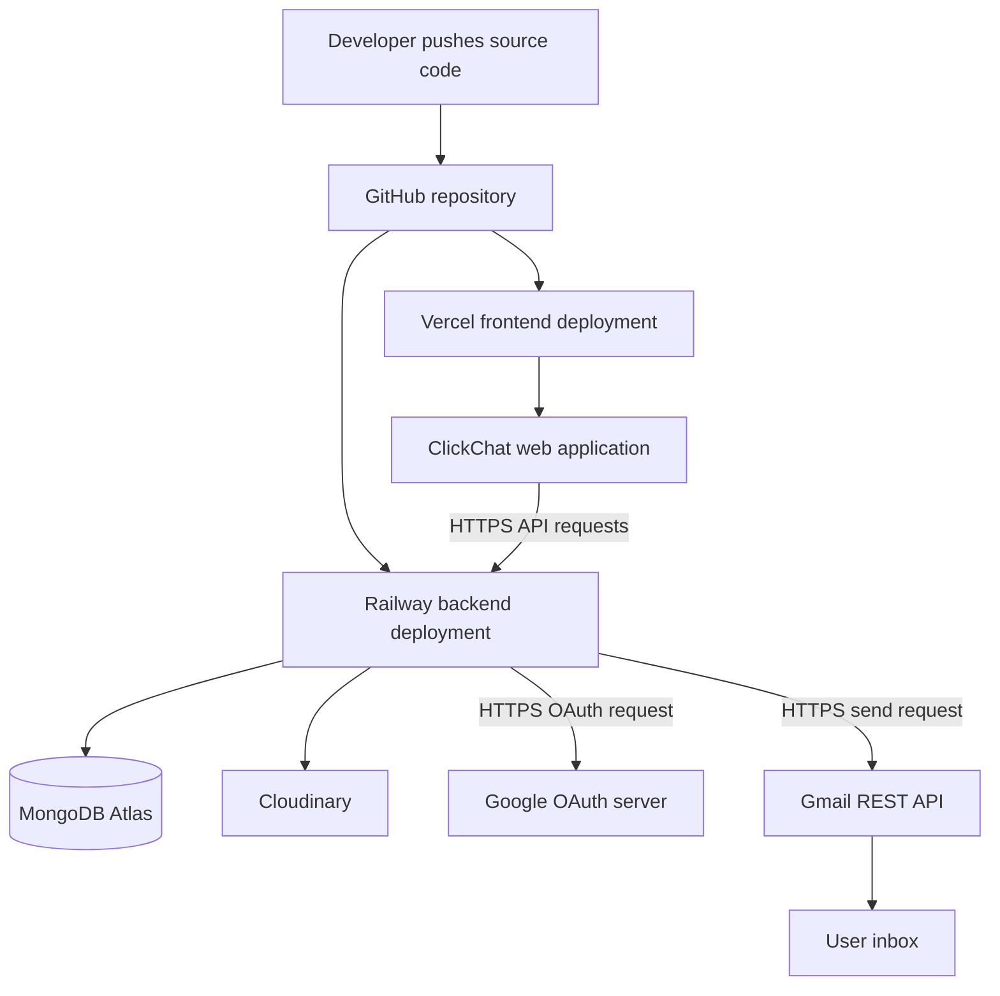

# ClickChat

ClickChat is a full-stack real-time chat application built with the MERN stack and Socket.IO. It currently supports secure authentication, user invitations, direct conversations, persistent text messages, emoji input, real-time delivery of new messages, and message editing and deletion through a responsive interface.

The project is being developed as a Master's project and is being expanded incrementally toward production-style presence, messaging, and attachment features.

## Live demo

- Frontend: https://chatapp-ldrp.vercel.app
- Backend API: https://realtimechatwebapp-production-51a2.up.railway.app

> The Railway service may take a few seconds to respond after a period of inactivity.

## Current features

### Authentication and users

- User registration, login, and logout
- Email verification before login
- Secure, hashed verification tokens with 24-hour expiration
- Verification-email resend with a 60-second cooldown
- Gmail REST API delivery using Google OAuth 2.0
- Rate limiting for registration and verification-email requests
- JWT authentication using an HTTP-only cookie
- Persistent authentication and protected routes
- Password hashing
- User profile page
- Cloudinary profile-picture upload
- User search by name or email
- Online status and last-seen fields

### Invitations and contacts

- Send chat invitations
- View received and sent invitations
- Accept or decline invitations
- Prevent duplicate pending invitations
- Show invitation notification counts and pending states
- View accepted contacts
- Automatically create a direct conversation when an invitation is accepted

### Conversations and messages

- Direct one-to-one conversations
- Conversation sidebar with real user information
- Persistent MongoDB message history
- Send and retrieve text messages through REST APIs
- Receive newly saved messages in real time through Socket.IO
- Authenticated Socket.IO connections using the existing HTTP-only JWT cookie
- Private per-user socket rooms with support for multiple tabs or devices
- Display the latest message in the conversation list
- Emoji picker in the message composer
- Edit your own text messages
- Delete your own messages for everyone using a soft delete
- Edited and deleted message states
- Responsive desktop and mobile chat layout

### UI and development

- Light, dark, and system themes
- Loading skeletons and toast notifications
- Client-side and server-side Zod validation
- Zustand stores for authentication, users, invitations, conversations, and messages
- MVC-style Express backend
- Automatic deployment through Vercel and Railway

## Technology stack

### Frontend

- React 19 and Vite
- React Router
- Zustand
- Axios
- React Hook Form and Zod
- Tailwind CSS
- shadcn/ui and Radix UI
- emoji-picker-react
- Socket.IO Client

### Backend

- Node.js and Express
- MongoDB and Mongoose
- JWT and HTTP-only cookies
- Zod
- Multer and Cloudinary
- Gmail REST API and Google OAuth 2.0
- Socket.IO with authenticated user rooms
- `cookie` for parsing the Socket.IO handshake cookie

## System architecture


```mermaid
flowchart LR
    U["User browser"] --> F["React + Vite frontend"]
    F -->|"HTTPS REST requests"| B["Express API"]
    F <-->|"Authenticated Socket.IO connection"| S["Socket.IO server"]
    B --> A["JWT authentication middleware"]
    B --> V["Zod validation middleware"]
    B --> DB[("MongoDB Atlas")]
    B --> C["Cloudinary media storage"]
    B --> G["Gmail REST API"]
    S --> SA["Socket authentication middleware"]
    S --> UR["Private user rooms"]
    B -->|"Emit saved messages"| S
    G --> R["Recipient email inbox"]

    subgraph FS["Frontend state"]
        Z["Zustand stores"]
        UI["React components"]
        UI <--> Z
    end

    F --- FS
```

The frontend communicates with the backend through Axios with credentials
enabled. REST remains responsible for validation, authorization, persistence,
uploads, and error responses. After a new message is successfully saved, the
backend uses Socket.IO to deliver it to the recipient's private user room.

Socket connections are authenticated separately from Express routes because
they use a different middleware pipeline. Both pipelines verify the same
HTTP-only JWT cookie. Authenticated sockets join a `user:<userId>` room, which
allows all active tabs and devices belonging to that user to receive events.

## Core workflows

### Registration and email verification


```mermaid
sequenceDiagram
    actor U as User
    participant F as React frontend
    participant B as Express backend
    participant DB as MongoDB
    participant G as Gmail API

    U->>F: Submit registration form
    F->>B: POST /api/auth/register
    B->>B: Validate input and hash password
    B->>B: Generate token and store its SHA-256 hash
    B->>DB: Create unverified user
    B->>G: Send verification link
    G-->>U: Deliver verification email
    B-->>F: Registration successful
    F-->>U: Show Check Your Email page
    U->>F: Open /verify-email?token=...
    F->>B: GET /api/auth/verify-email?token=...
    B->>B: Hash received token
    B->>DB: Match hash and verify expiration
    B->>DB: Mark email verified and clear token fields
    B-->>F: Email verified
    F-->>U: Show verification success
```

Only a hash of the verification token is stored. The raw token appears in the
email link and expires after 24 hours. Resend requests rotate the token, apply
a per-user cooldown, and are also protected by an IP-based rate limiter.

### Login and protected-route authentication


```mermaid
sequenceDiagram
    actor U as User
    participant F as React frontend
    participant B as Express backend
    participant DB as MongoDB

    U->>F: Submit email and password
    F->>B: POST /api/auth/login
    B->>DB: Find normalized email
    B->>B: Compare password hash
    alt Email is not verified
        B-->>F: 403 Verification required
        F-->>U: Open Check Your Email page
    else Email is verified
        B->>B: Create JWT
        B-->>F: Set HTTP-only JWT cookie
        F->>B: GET /api/auth/check
        B->>B: Verify JWT cookie
        B-->>F: Return authenticated user
        F-->>U: Open chat dashboard
    end
```

### Invitation and conversation creation


```mermaid
sequenceDiagram
    actor S as Sender
    participant F as React frontend
    participant B as Express backend
    participant DB as MongoDB
    actor R as Recipient

    S->>F: Search for a user
    F->>B: GET /api/user/search?q=...
    B-->>F: Matching users
    S->>F: Send invitation
    F->>B: POST /api/invitations
    B->>DB: Store pending invitation
    R->>F: Open invitations dialog
    F->>B: GET /api/invitations
    B-->>F: Received and sent invitations
    R->>F: Accept invitation
    F->>B: PATCH /api/invitations/:invitationId
    B->>DB: Mark invitation accepted
    B->>DB: Create or reuse direct conversation
    B-->>F: Accepted invitation and conversation
```

### Real-time message lifecycle


```mermaid
sequenceDiagram
    actor S as Sender
    participant SF as Sender frontend
    participant B as Express backend
    participant DB as MongoDB
    participant IO as Socket.IO
    participant RF as Recipient frontend

    S->>SF: Compose text or emoji message
    SF->>B: POST conversation message
    B->>B: Authenticate and validate request
    B->>DB: Save message and update lastMessage
    DB-->>B: Saved message
    B->>IO: Emit message:new to recipient room
    IO-->>RF: Deliver message:new
    RF->>RF: Update Zustand stores and UI
    B-->>SF: Return saved message
    SF->>SF: Update Zustand stores and UI
```

Messages are authorized against both the conversation and authenticated
sender. MongoDB remains the source of truth: Socket.IO announces a message only
after it has been saved successfully. The sender receives the saved message in
the REST response, while other participants receive `message:new` through their
private rooms. Duplicate insertion is prevented using the MongoDB message ID.

Editing and deletion remain persisted through REST. Deletion is a soft delete
so the conversation history can display a deleted-message state without
removing the database record. Real-time edit and delete events are planned next.

### Frontend component and state flow


```mermaid
flowchart LR
    AL["ChatLayout"] --> CS["ConversationSidebar"]
    AL --> CW["ChatWindow"]
    CW --> MB["MessageBubble"]
    CW --> MC["MessageComposer"]
    MC --> EP["Emoji picker"]

    AS["Authentication store"] --> AL
    IS["Invitation store"] --> ID["InvitationsDialog"]
    COS["Conversation store"] --> CS
    MS["Message store"] --> CW
    MS --> MB
    MS --> MC
    SO["Socket.IO client"] -->|"message:new"| MS
    SO -->|"refresh latest message"| COS

    AS --> API["Axios API layer"]
    IS --> API
    COS --> API
    MS --> API
```

## Project structure

```text
ClickChat/
|-- frontend/
|   |-- src/
|   |   |-- api/
|   |   |-- components/
|   |   |   |-- chat/
|   |   |   |-- profile/
|   |   |   `-- ui/
|   |   |-- layout/
|   |   |-- pages/
|   |   |-- routes/
|   |   |-- store/
|   |   `-- validations/
|   `-- package.json
|-- backend/
|   |-- src/
|   |   |-- config/
|   |   |-- controllers/
|   |   |-- middleware/
|   |   |-- models/
|   |   |-- routes/
|   |   |-- services/
|   |   |-- socket/
|   |   |-- utils/
|   |   `-- validations/
|   `-- package.json
`-- README.md
```

## Running locally

### Prerequisites

- Node.js 22 or newer
- npm
- MongoDB database or MongoDB Atlas cluster
- Cloudinary account for profile pictures
- Google Cloud project with the Gmail API enabled
- Dedicated Gmail sender account
- Google OAuth client ID, client secret, and refresh token

### 1. Clone and open the project

```bash
git clone <repository-url>
cd click-chat
```

### 2. Configure the backend

Create `backend/.env`:

```env
PORT=5000
MONGO_URI=your_mongodb_connection_string
CLIENT_URL=http://localhost:5173
JWT_SECRET=your_secure_jwt_secret
JWT_EXPIRE=7d
NODE_ENV=development
CLOUDINARY_CLOUD_NAME=your_cloud_name
CLOUDINARY_API_KEY=your_api_key
CLOUDINARY_API_SECRET=your_api_secret
GMAIL_USER=your_project_gmail_address
GOOGLE_CLIENT_ID=your_google_oauth_client_id
GOOGLE_CLIENT_SECRET=your_google_oauth_client_secret
GOOGLE_REDIRECT_URI=http://localhost:3000/oauth2callback
GOOGLE_REFRESH_TOKEN=your_google_oauth_refresh_token
```

After enabling the Gmail API and creating a Desktop OAuth client, generate the
sender account's refresh token locally:

```bash
cd backend
npm run gmail:token
```

Open the authorization URL printed in the terminal, approve the `gmail.send`
permission with the project Gmail account, and add the returned refresh token
to both the local backend environment and Railway. OAuth credentials and
refresh tokens must never be committed to source control.

Install dependencies and start the API:

```bash
cd backend
npm install
npm run dev
```

### 3. Configure the frontend

Create `frontend/.env`:

```env
VITE_API_URL=http://localhost:5000
```

Open another terminal, then run:

```bash
cd frontend
npm install
npm run dev
```

Open `http://localhost:5173` in your browser.

## API endpoints

All protected requests use the JWT cookie and must include credentials.

Socket.IO connections use the same JWT cookie during the handshake. After
authentication, each socket joins a private `user:<userId>` room. The currently
implemented server-to-client event is:

| Event | Direction | Description |
| --- | --- | --- |
| `message:new` | Server to client | Deliver a newly saved message to other conversation participants |

### Authentication

| Method | Endpoint | Description |
| --- | --- | --- |
| `POST` | `/api/auth/register` | Register a user |
| `POST` | `/api/auth/login` | Log in |
| `GET` | `/api/auth/check` | Retrieve the authenticated user |
| `GET` | `/api/auth/logout` | Log out |
| `GET` | `/api/auth/verify-email?token=...` | Verify an email address |
| `POST` | `/api/auth/resend-verification` | Send a new verification link |

### Users and invitations

| Method | Endpoint | Description |
| --- | --- | --- |
| `PATCH` | `/api/user/profilePic` | Upload a profile picture |
| `GET` | `/api/user/search?q=query` | Search for users |
| `GET` | `/api/invitations` | Retrieve sent and received invitations |
| `POST` | `/api/invitations` | Send an invitation |
| `PATCH` | `/api/invitations/:invitationId` | Accept or decline an invitation |
| `GET` | `/api/invitations/contacts` | Retrieve accepted contacts |

### Conversations and messages

| Method | Endpoint | Description |
| --- | --- | --- |
| `GET` | `/api/conversations` | Retrieve the user's conversations |
| `GET` | `/api/conversations/:conversationId/messages` | Retrieve message history |
| `POST` | `/api/conversations/:conversationId/messages` | Send a text message |
| `PATCH` | `/api/conversations/:conversationId/messages/:messageId` | Edit your message |
| `DELETE` | `/api/conversations/:conversationId/messages/:messageId` | Delete your message |

Example message body:

```json
{
  "content": "Hello!"
}
```

## Current limitations

- Message edits and deletions are persisted but are not yet broadcast in real time.
- Online/offline presence fields exist in the user model, but socket-based presence tracking is not implemented yet.
- Typing indicators, read receipts, and unread counts are not implemented yet.
- Attachments, GIF selection, and voice recording are not implemented yet.
- Group-conversation fields exist in the data model, but the complete group-chat workflow is not implemented yet.

## Roadmap

- Real-time message editing and deletion events
- Online/offline presence with multi-tab connection tracking
- Last-seen updates with a reconnect grace period
- Reply to messages
- Group chat creation and management
- Typing indicators
- Read receipts and unread counts
- Image, media, and document sharing
- GIF picker and voice messages
- Message search
- Notifications
- Voice and video calling

## Deployment

- Frontend: Vercel
- Backend: Railway
- Database: MongoDB Atlas
- Media storage: Cloudinary

Pushing to the configured production branch triggers the deployment workflow for the corresponding service.


```mermaid
flowchart TD
    DEV["Developer pushes source code"] --> GH["GitHub repository"]
    GH --> VE["Vercel frontend deployment"]
    GH --> RW["Railway backend deployment"]
    VE --> UI["ClickChat web application"]
    UI -->|"HTTPS API requests"| RW
    RW --> MA[("MongoDB Atlas")]
    RW --> CL["Cloudinary"]
    RW -->|"HTTPS OAuth request"| GO["Google OAuth server"]
    RW -->|"HTTPS send request"| GM["Gmail REST API"]
    GM --> IN["User inbox"]
```

The production backend uses Gmail's HTTPS API instead of SMTP, which keeps
email delivery compatible with Railway's outbound networking restrictions.

## Project goal

ClickChat demonstrates secure authentication, REST API design, authenticated real-time communication, maintainable frontend state management, responsive React development, cloud media storage, and an incremental path toward a production-style chat application.
