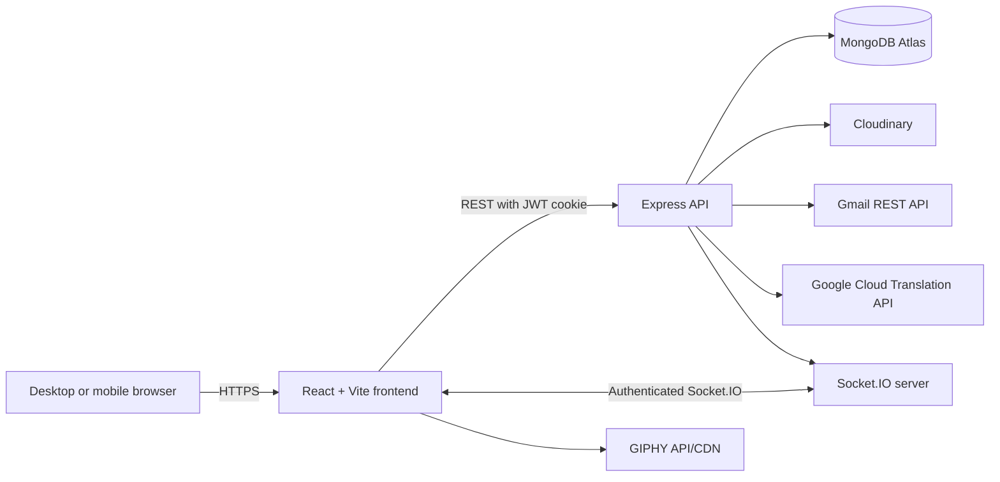

# ClickChat

ClickChat is a full-stack real-time messaging application built with the MERN stack and Socket.IO. It combines verified account onboarding, password recovery, real-time invitations, persistent direct messaging, rich-media sharing, on-demand message translation, synchronized message updates, multi-tab presence tracking, and a compact responsive interface for desktop and mobile browsers.

The project is being developed as a Master’s project and as a practical demonstration of secure REST APIs, authenticated real-time communication, MongoDB data modelling, client-side state management, cloud integrations, and incremental production engineering.

## Live demo

- Web application: [clickchat-ldrp.vercel.app](https://clickchat-ldrp.vercel.app/)
- Backend API — Render (active): [click-chat-64j1.onrender.com](https://click-chat-64j1.onrender.com/)
- Backend API — Railway (inactive): [click-chat-production.up.railway.app](https://click-chat-production.up.railway.app/)

> A free Railway/Render service may take additional time to respond after inactivity while the backend wakes up.

## Highlights

- Registration, Gmail API email verification, login, logout, password change, password reset, and protected routes
- HTTP-only JWT authentication shared by REST and Socket.IO
- Inline name, bio, preferred-language, password, and Cloudinary profile-picture management
- User search and real-time chat invitations
- Automatic direct-conversation creation on invitation acceptance
- Persistent text and emoji messages
- Image, video, audio, PDF, Office-document, text, and CSV attachments with captions and upload progress
- Combined GIPHY GIF/sticker picker with trending results, debounced search, pagination, analytics, and real-time delivery
- Automatic YouTube link previews and clickable links in text messages
- Per-message Google Cloud Translation with automatic source detection, user-selected target language, MongoDB caching, and hard internal usage caps
- Real-time message creation, editing, and soft deletion
- Contextual message actions for copy, translate, edit, delete, and media download
- Latest-message previews without full conversation-list refreshes
- WhatsApp-style message date separators
- Multi-tab online/offline presence with a five-second reconnect grace period
- Real-time typing indicators with sender inactivity and receiver safety timeouts
- Persisted last-seen timestamps and stale-presence cleanup after server restarts
- Light, dark, and system themes
- Responsive landing, authentication, chat, and profile interfaces
- Compact single-header chat layout, mobile browser Back support, hidden message scrollbar, and media-aware automatic scrolling
- Clickable avatars with a basic public-profile dialog
- Branded application loading experience

## Architecture


```mermaid
flowchart LR
    U["Desktop or mobile browser"] -->|"HTTPS"| F["React + Vite frontend"]
    F -->|"REST with JWT cookie"| B["Express API"]
    F <-->|"Authenticated Socket.IO"| S["Socket.IO server"]
    B --> DB[("MongoDB Atlas")]
    B --> C["Cloudinary"]
    B --> G["Gmail REST API"]
    B --> T["Google Cloud Translation API"]
    F --> Y["GIPHY API/CDN"]
    B --> S
```

REST handles validation, authorization, persistence, uploads, and error responses. Socket.IO distributes persisted message and invitation changes and manages presence through private `user:<userId>` rooms.

## Technology stack

| Layer | Technologies |
| --- | --- |
| Frontend | React 19, Vite, React Router, Zustand, Axios, React Hook Form, Zod, Tailwind CSS, shadcn/ui, Radix UI, Socket.IO Client |
| Backend | Node.js, Express 5, Socket.IO, Mongoose, JWT, bcrypt, Zod, Multer |
| Data and cloud | MongoDB Atlas, Cloudinary, Gmail REST API with Google OAuth 2.0, Google Cloud Translation Basic v2, GIPHY API/CDN |
| Deployment | Vercel frontend and Railway backend |

## Quick start

### Prerequisites

- Node.js 22 or newer
- npm
- MongoDB connection
- Cloudinary credentials
- Google OAuth credentials and Gmail API sender refresh token
- Google Cloud Translation API key when translation is enabled
- GIPHY API key when GIF/sticker search is enabled

### Backend

Create `backend/.env` using the variables described in [Setup and deployment](docs/08-setup-and-deployment.md#environment-variables), then run:

```bash
cd backend
npm install
npm run dev
```

### Frontend

Create `frontend/.env`:

```env
VITE_API_URL=http://localhost:5000
VITE_GIPHY_API_KEY=your_giphy_api_key
```

Then run:

```bash
cd frontend
npm install
npm run dev
```

Open `http://localhost:5173`.

## Documentation

Detailed technical documentation lives in [`docs/`](docs/README.md).

| Document | Contents |
| --- | --- |
| [Project overview](docs/01-project-overview.md) | Objectives, scope, actors, implemented features, and exclusions |
| [System architecture](docs/02-system-architecture.md) | Component boundaries, workflows, state flow, presence, and deployment diagrams |
| [Data model](docs/03-data-model.md) | Collection field tables, relationships, validation, and indexes |
| [API reference](docs/04-api-reference.md) | Complete REST endpoint tables, request validation, and behavior |
| [Real-time events](docs/05-realtime-events.md) | Socket.IO event table, payloads, rooms, invitations, messages, and presence |
| [Frontend design](docs/06-frontend-design.md) | Routes, components, stores, responsive behavior, and client data flow |
| [Security](docs/07-security.md) | Authentication, authorization, uploads, privacy, risks, and recommendations |
| [Setup and deployment](docs/08-setup-and-deployment.md) | Environment variables, commands, Gmail setup, and cloud deployment |
| [Testing and roadmap](docs/09-testing-and-roadmap.md) | Acceptance checks, limitations, test strategy, and prioritized future work |
| [Translation and cost controls](docs/11-translation-and-cost-controls.md) | Translation request flow, caching, quotas, failure modes, billing boundaries, and deployment safeguards |

## Project structure

```text
click-chat/
|-- backend/
|   `-- src/
|       |-- config/
|       |-- controllers/
|       |-- middleware/
|       |-- models/
|       |-- routes/
|       |-- services/
|       |-- socket/
|       |-- utils/
|       `-- validations/
|-- frontend/
|   `-- src/
|       |-- api/
|       |-- components/
|       |-- layout/
|       |-- lib/
|       |-- pages/
|       |-- routes/
|       |-- store/
|       `-- validations/
|-- docs/
`-- README.md
```

## Current limitations

- Message retrieval is limited to the latest 50 messages; older-message pagination is next.
- Unread counts and complete read receipts are not implemented.
- Reply storage/rendering exists, but reply selection in the composer is incomplete.
- Group-chat schema foundations exist, but group workflows are not implemented.
- Attachments are limited to one file and 10 MB per message; cancellation and retry are not yet implemented.
- Uploads and normal message creation do not yet have per-user storage/traffic quotas; public deployments should add them before broad access.
- Cloudinary attachment delivery URLs are stored with messages; stronger private delivery is recommended for sensitive files.
- Presence and Socket.IO currently assume one backend instance.
- Automated test coverage has not yet been configured.

## Next priorities

1. Automated integration and Socket.IO tests
2. Cursor-based message-history pagination
3. Per-user upload/message quotas and authenticated attachment delivery
4. Unread counts and read receipts
5. Complete reply interactions, group chat, and multi-file attachment galleries

See [Testing and roadmap](docs/09-testing-and-roadmap.md) for the full prioritized plan.

## Deployment

The web frontend is deployed to Vercel, the backend to Railway/Render, data to MongoDB Atlas, profile media to Cloudinary, and verification email through the Gmail REST API. This repository currently contains the web application and backend only; the earlier experimental Android/Capacitor project is not part of the maintained source tree.

When deploying the backend on Render, configure `/health` as the **Health Check Path**. It provides a lightweight process-health response and does not expose credentials or application data.
