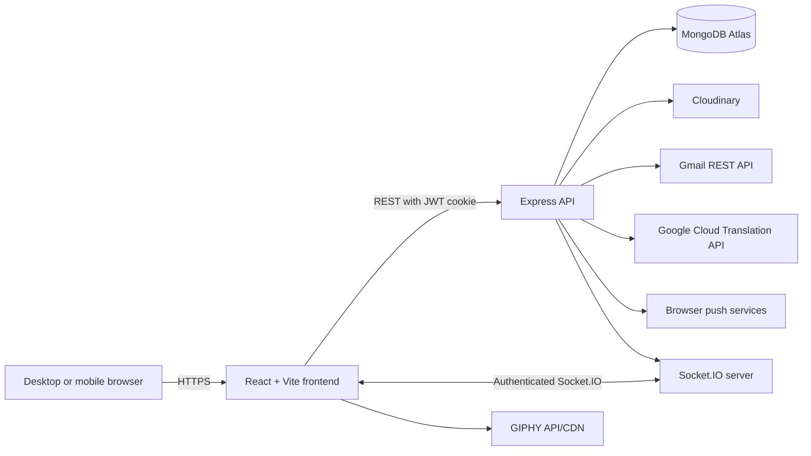

# ClickChat

ClickChat is a full-stack real-time messaging application built with the MERN stack and Socket.IO. It combines verified account onboarding, password recovery, real-time invitations, direct and managed group conversations, rich-media sharing, on-demand message translation, background Web Push notifications, synchronized message updates, multi-tab presence tracking, and a responsive interface for desktop and mobile browsers.

The project is being developed as a Master’s project and as a practical demonstration of secure REST APIs, authenticated real-time communication, MongoDB data modelling, client-side state management, cloud integrations, and incremental production engineering.

## Live demo

- Web application: [clickchat-ldrp.vercel.app](https://clickchat-ldrp.vercel.app/)
- Backend API — Render (active): [click-chat-64j1.onrender.com](https://click-chat-64j1.onrender.com/)
- Backend API — Railway (inactive): [click-chat-production.up.railway.app](https://click-chat-production.up.railway.app/)

> A free Railway/Render service may take additional time to respond after inactivity while the backend wakes up.

## Features

### Authentication and account security

- Register an account with age validation.
- Verify an email address through Gmail API verification links.
- Resend verification emails with expiry, cooldown, and rate-limit protection.
- Sign in with email and password or Google Sign-In.
- Keep sessions authenticated with HTTP-only JWT cookies shared by REST and Socket.IO.
- Restrict application pages and real-time connections to authenticated users.
- Log out securely from the current session.
- Change the current password from Settings.
- Request and complete a password reset without exposing whether an account exists.
- Store passwords with bcrypt hashing and verification tokens as SHA-256 hashes.

### Profile and preferences

- View and edit first name, last name, and biography inline.
- Upload or replace a Cloudinary-hosted profile picture using file selection or drag and drop.
- Validate profile images locally and show upload progress.
- Open another user's public profile by selecting their avatar.
- Choose a preferred language for message translation.
- Manage appearance, language, notifications, and password security from centralized Settings.

### Contacts and invitations

- Search for users by first name, last name, full name, or email address.
- Send chat invitations and view incoming or outgoing requests.
- Accept or decline invitations in real time.
- Prevent self-invitations and duplicate pending or accepted connections.
- Automatically create or reuse a direct conversation when an invitation is accepted.
- Synchronize accepted contacts and new conversations for both participants without a refresh.

### Direct conversations

- Exchange persistent one-to-one messages.
- Clear every message and shared upload from a direct chat while retaining the connection.
- Delete a direct conversation and its associated connection.
- View the other participant's online or last-seen status.
- Open the other participant's public profile from the chat header or conversation list.

### Group conversations

- Create a group from accepted contacts and assign a group name.
- Upload or replace the group picture.
- Rename an existing group.
- View the complete member list and each member's administrator status.
- Add accepted contacts to an existing group.
- Promote members to group administrator or remove their administrator role.
- Remove members from a group when authorized.
- Leave a group without deleting it for the remaining members.
- Permanently delete a group when authorized.
- Synchronize group creation, updates, membership changes, leaving, and deletion in real time.

### Messages and rich media

- Send persistent text and emoji messages up to 5,000 characters.
- Receive new messages instantly through Socket.IO.
- Edit sent messages and display their edited state in real time.
- Soft-delete sent messages and display a deleted-message placeholder.
- Copy message text from the contextual message menu.
- Upload one image, video, audio file, PDF, Office document, text file, or CSV file per message.
- Add an optional caption to an attachment and monitor upload progress.
- Download shared media and documents from message actions.
- Browse trending GIPHY GIFs and stickers.
- Search GIPHY with debounced queries, load additional results, and send a selection in real time.
- Detect links in message text and make them clickable.
- Generate automatic previews for supported YouTube links.
- Display Today, Yesterday, and calendar-date separators between messages.
- Show latest-message previews in the conversation list without reloading every conversation.
- Focus the composer with Enter when no other interactive control owns the keypress.
- Scroll intelligently as new messages and media load.

### Translation

- Translate an individual message on demand with Google Cloud Translation.
- Detect the source language automatically.
- Translate into the user's selected preferred language.
- Cache translations in MongoDB to avoid repeating identical requests.
- Enforce internal translation usage caps to control API spending.

### Real-time presence and typing

- Show online status and persisted last-seen timestamps.
- Track active sockets across multiple browser tabs and devices.
- Apply a five-second reconnect grace period to prevent presence flicker.
- Reset stale online flags after backend restarts.
- Show animated typing bubbles in direct conversations.
- Show the typing member's name in group conversations.
- Stop typing indicators automatically after sender inactivity or lost stop events.

### Notifications

- Deliver background Web Push notifications for text, attachments, GIFs, and stickers.
- Enable or disable notifications independently in each browser.
- Show a dismissible notification-discovery prompt.
- Open the relevant conversation from notification deep links.
- Remove stale push subscriptions automatically.

### Appearance and responsive experience

- Choose from six coordinated application and chat appearance themes.
- Use light, dark, or system color mode while preserving the selected appearance theme.
- Use responsive landing, authentication, chat, profile, and settings interfaces on desktop and mobile.
- Navigate mobile conversations with browser Back support.
- Use a compact single-header chat layout with a hidden message scrollbar.
- View a branded loading experience during application startup.
- Install the shared React application through the maintained Capacitor Android wrapper.

## Architecture


```mermaid
flowchart LR
    U["Desktop or mobile browser"] -->|"HTTPS"| F["React + Vite frontend"]
    F -->|"REST with JWT cookie"| B["Express API"]
    F <-->|"Authenticated Socket.IO"| S["Socket.IO server"]
    B --> DB[("MongoDB Atlas")]
    B --> C["Cloudinary"]
    B --> G["Gmail REST API"]
    B --> T["Google Cloud Translation API"]
    B --> P["Browser push services"]
    F --> Y["GIPHY API/CDN"]
    B --> S
```

ClickChat retains MVC within a feature-based modular monolith: Mongoose provides Models, React pages and components provide Views, and Express Controllers coordinate validated requests and responses. REST handles validation, authorization, persistence, uploads, and error responses. Socket.IO distributes persisted message and invitation changes and manages presence through private `user:<userId>` rooms.

## Technology stack

| Layer | Technologies |
| --- | --- |
| Frontend | React 19, Vite, React Router, Zustand, Axios, React Hook Form, Zod, Tailwind CSS, shadcn/ui, Radix UI, Socket.IO Client |
| Backend | Node.js, Express 5, Socket.IO, Mongoose, JWT, bcrypt, Zod, Multer |
| Data and cloud | MongoDB Atlas, Cloudinary, Gmail REST API with Google OAuth 2.0, Google Cloud Translation Basic v2, Web Push/VAPID, GIPHY API/CDN |
| Deployment | Vercel frontend and Railway backend |

## Quick start

### Prerequisites

- Node.js 22 or newer
- npm
- MongoDB connection
- Cloudinary credentials
- Google OAuth credentials and Gmail API sender refresh token
- Google Cloud Translation API key when translation is enabled
- GIPHY API key when GIF/sticker search is enabled
- A generated VAPID key pair for background browser notifications

### Backend

Create `backend/.env` using the variables described in [Setup and deployment](docs/08-setup-and-deployment.md#environment-variables), then run:

```bash
cd backend
npm install
npm run dev
```

### Frontend

Create `frontend/.env`:

```env
VITE_API_URL=http://localhost:5000
VITE_GIPHY_API_KEY=your_giphy_api_key
VITE_VAPID_PUBLIC_KEY=your_vapid_public_key
```

Then run:

```bash
cd frontend
npm install
npm run dev
```

Open `http://localhost:5173`.

## Documentation

Detailed technical documentation lives in [`docs/`](docs/README.md).

| Document | Contents |
| --- | --- |
| [Project overview](docs/01-project-overview.md) | Objectives, scope, actors, implemented features, and exclusions |
| [System architecture](docs/02-system-architecture.md) | Component boundaries, workflows, state flow, presence, and deployment diagrams |
| [Data model](docs/03-data-model.md) | Collection field tables, relationships, validation, and indexes |
| [API reference](docs/04-api-reference.md) | Complete REST endpoint tables, request validation, and behavior |
| [Real-time events](docs/05-realtime-events.md) | Socket.IO event table, payloads, rooms, invitations, messages, and presence |
| [Frontend design](docs/06-frontend-design.md) | Routes, components, stores, responsive behavior, and client data flow |
| [Security](docs/07-security.md) | Authentication, authorization, uploads, privacy, risks, and recommendations |
| [Setup and deployment](docs/08-setup-and-deployment.md) | Environment variables, commands, Gmail setup, and cloud deployment |
| [Testing and roadmap](docs/09-testing-and-roadmap.md) | Acceptance checks, limitations, test strategy, and prioritized future work |
| [Translation and cost controls](docs/11-translation-and-cost-controls.md) | Translation request flow, caching, quotas, failure modes, billing boundaries, and deployment safeguards |
| [Groups and Web Push](docs/12-groups-and-web-push.md) | Group lifecycle, authorization, socket synchronization, subscriptions, service workers, and notification delivery |

## Project structure

```text
click-chat/
|-- backend/
|   `-- src/
|       |-- config/
|       |-- integrations/       # Cloudinary, email, and other providers
|       |-- middleware/
|       |-- modules/            # Feature-owned routes, controllers, services, schemas, and models
|       |   |-- auth/
|       |   |-- attachments/
|       |   |-- conversations/
|       |   |-- groups/
|       |   |-- invitations/
|       |   |-- messages/
|       |   |-- notifications/
|       |   |-- translations/
|       |   `-- users/
|       |-- realtime/           # Socket server, authentication, presence, and typing
|       |-- routes/
|       |-- shared/             # Cross-feature HTTP and error primitives
|       |-- utils/
|       |-- app.js
|       `-- server.js
|-- frontend/
|   |-- android/             # Capacitor Android wrapper
|   |-- capacitor.config.json
|   `-- src/
|       |-- app/               # Application shell and route composition
|       |-- components/ui/     # shadcn-managed UI primitives
|       |-- features/          # Feature-owned pages, components, stores, and schemas
|       |   |-- auth/
|       |   |-- chat/
|       |   |-- invitations/
|       |   |-- landing/
|       |   |-- profile/
|       |   `-- settings/
|       |-- lib/               # shadcn-compatible shared utilities
|       |-- platform/          # Capacitor-specific behavior
|       `-- shared/            # API, realtime, themes, constants, and formatters
|-- docs/
`-- README.md
```

## Current limitations

- Message history loads in cursor-based pages of 50 as users scroll upward.
- Per-conversation unread counts and sent/delivered/read receipts persist and synchronize across tabs and devices.
- Reply storage/rendering exists, but reply selection in the composer is incomplete.
- Attachments are limited to one file and 10 MB per message; cancellation and retry are not yet implemented.
- Uploads and normal message creation do not yet have per-user storage/traffic quotas; public deployments should add them before broad access.
- Cloudinary attachment delivery URLs are stored with messages; stronger private delivery is recommended for sensitive files.
- Presence and Socket.IO currently assume one backend instance.
- Automated test coverage has not yet been configured.
- Web Push requires browser permission and HTTPS in production; regular browser notifications retain browser/origin attribution unless the site is installed as a PWA.

## Next priorities

1. Automated integration and Socket.IO tests
2. Per-user upload/message quotas and authenticated attachment delivery
3. Complete reply interactions and optimistic send retry
4. Blocking/reporting and multi-file attachment galleries

See [Testing and roadmap](docs/09-testing-and-roadmap.md) for the full prioritized plan.

## Deployment

The web frontend is deployed to Vercel, the backend to Railway/Render, data to MongoDB Atlas, profile media to Cloudinary, and verification email through the Gmail REST API. A maintained Capacitor Android wrapper packages the same React frontend as an installable APK.

When deploying the backend on Render, configure `/health` as the **Health Check Path**. It provides a lightweight process-health response and does not expose credentials or application data.
