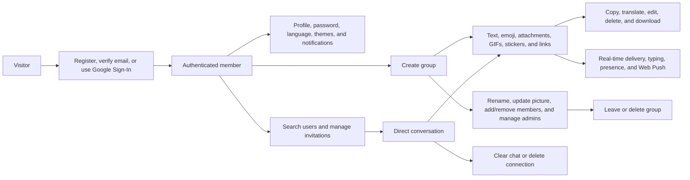

# Project overview

## Purpose

ClickChat is a browser-based real-time communication application built as a Master’s project. It demonstrates secure account onboarding, protected REST APIs, authenticated Socket.IO communication, persistent MongoDB data, cloud media storage, and responsive React state management.

## Problem statement

Users need a lightweight web application in which they can register securely, discover other users, establish mutual chat contacts, exchange persistent messages, and see changes without manually refreshing the page. The implementation must coordinate database persistence with real-time delivery and remain usable across desktop and mobile layouts.

## Objectives

- Provide registration, email verification, login, logout, and persistent authentication.
- Allow users to search for other accounts and establish contacts through invitations.
- Create one direct conversation per accepted user pair.
- Persist text messages and synchronize new, edited, and deleted states in real time.
- Track online state correctly across multiple tabs or devices and persist last-seen time.
- Keep conversation previews and invitation lists synchronized without full-page refreshes.
- Provide a maintainable separation between API, socket, state, and presentation layers.
- Deploy the frontend, backend, database, email provider, and media provider as cloud services.

## Actors

| Actor | Description |
| --- | --- |
| Visitor | Unauthenticated user who can view the welcome, registration, login, and verification pages |
| Registered user | Account holder whose email may still require verification |
| Authenticated user | Verified user with access to profile, invitations, conversations, messages, and presence |
| Gmail API | Delivers verification emails through Google OAuth 2.0 |
| Cloudinary | Stores and transforms profile pictures and chat attachments |
| MongoDB Atlas | Stores users, invitations, conversations, and messages |
| Google Cloud Translation | Translates selected message text with automatic source-language detection |
| GIPHY | Supplies externally hosted GIF and sticker search results |
| Browser push services | Deliver encrypted Web Push payloads to subscribed browsers |

## Functional scope

### Implemented features

#### Authentication and profile

- Account registration for users aged 18 or older.
- Password hashing with bcrypt.
- Email verification using a 64-character token whose SHA-256 hash is stored in MongoDB.
- Verification expiry after 24 hours and resend cooldown of 60 seconds.
- IP-based email request rate limiting: 10 requests per 15 minutes.
- Login restricted to verified accounts.
- JWT authentication through an HTTP-only cookie.
- Protected frontend routes and persistent authentication checks.
- Profile display and Cloudinary profile-picture replacement.
- Inline first-name, last-name, and biography editing without a separate edit modal.
- Preferred-language selection for message translation.
- Authenticated password change and generic-response forgot/reset-password flows.
- Clickable avatars that open a basic public-profile dialog.
- Drag-and-drop or file-picker profile-image selection with immediate upload, local validation, progress feedback, and automatic dialog closure after success.
- Light, dark, and system theme support.
- A branded responsive landing page, shared authentication shell, application loading screen, chat dashboard, and account profile interface built from reusable shadcn/Radix primitives.

#### Invitations and contacts

- Search by first name, last name, full name, or email.
- Send, view, accept, and decline invitations.
- Reject self-invitations and duplicate pending or accepted relationships.
- Real-time `invitation:new` and `invitation:responded` synchronization.
- Automatic direct-conversation creation or reuse on acceptance.
- Immediate local conversation insertion for both users.

#### Messaging

- Persistent one-to-one and group conversations.
- Group creation with accepted contacts, names, Cloudinary images, membership management, administrator promotion/demotion, leave, and permanent deletion workflows.
- Latest-message conversation previews.
- Text and emoji messages up to 5,000 characters.
- Retrieval of the latest 50 messages.
- Real-time message creation, editing, and soft deletion.
- Per-bubble actions for copy, translate, edit, delete, and media download.
- Single-file image, video, audio, PDF, Office-document, text, and CSV messages up to 10 MB, with optional captions and upload progress.
- GIPHY GIF/sticker discovery with trending results, debounced search, pagination, analytics, and real-time delivery.
- Clickable YouTube previews for supported URLs.
- On-demand Translation to the recipient's preferred language with caching and hard usage caps.
- Sidebar previews normalized to one line and shortened to 42 Unicode characters.
- Edited and deleted UI states.
- Reply references supported by the API, schema, and message rendering; composer selection is not complete.
- Sender read-receipt entries are stored when a message is created; complete receipt processing is not implemented.
- Date separators for Today, Yesterday, and earlier calendar dates.
- Enter-key shortcut to focus the composer when no other interactive control owns the keypress.
- Real-time typing indicators scoped to conversation participants, with a 1.5-second sender inactivity timeout and a 3-second receiver safety timeout.
- Animated typing bubbles for direct chats and named typing bubbles for groups.
- Background browser notifications for text, attachments, GIFs, and stickers through Web Push and VAPID.
- Per-browser notification enable/disable controls and a seven-day dismissible discovery prompt.

#### Presence

- Authenticated Socket.IO connections and private per-user rooms.
- Active-socket counting across multiple browser tabs or devices.
- Five-second offline grace period for temporary reconnects.
- Persistent `isOnline` and `lastSeen` fields.
- Contact-scoped `presence:update` events.
- Startup reset of stale online flags before the socket server accepts connections.

## Non-functional goals

| Goal | Current approach |
| --- | --- |
| Security | HTTP-only JWT, password hashing, hashed verification tokens, authorization checks, validation, and rate limiting |
| Consistency | MongoDB is updated before real-time message events are emitted |
| Responsiveness | Mobile/desktop layouts, a full-screen authentication loader, local Zustand updates, and targeted socket events |
| Maintainability | Feature-based modular MVC, separated realtime/integration layers, feature-owned frontend stores and schemas, reusable hooks, and shadcn UI primitives |
| Availability | Vercel frontend, Railway/Render backend, MongoDB Atlas, Cloudinary, and Gmail REST API |
| Scalability | Suitable for one backend instance; distributed presence and Socket.IO require Redis later |

## Out of scope or incomplete

- Cursor-based loading of messages older than the latest 50.
- Unread counts and complete read-receipt workflows.
- Complete reply selection in the composer.
- Multi-file attachment galleries and recorded voice messages.
- Per-user upload/storage quotas and private Cloudinary delivery for sensitive attachments.
- Message search and calling.
- Redis-backed multi-instance presence and Socket.IO fan-out.

## Maintained platforms

The maintained repository contains the browser-based React frontend, Node.js backend, and a Capacitor Android wrapper under `frontend/android`. Android packages the same Vite application and communicates with the deployed HTTPS backend; it is not a separate native messaging implementation.
