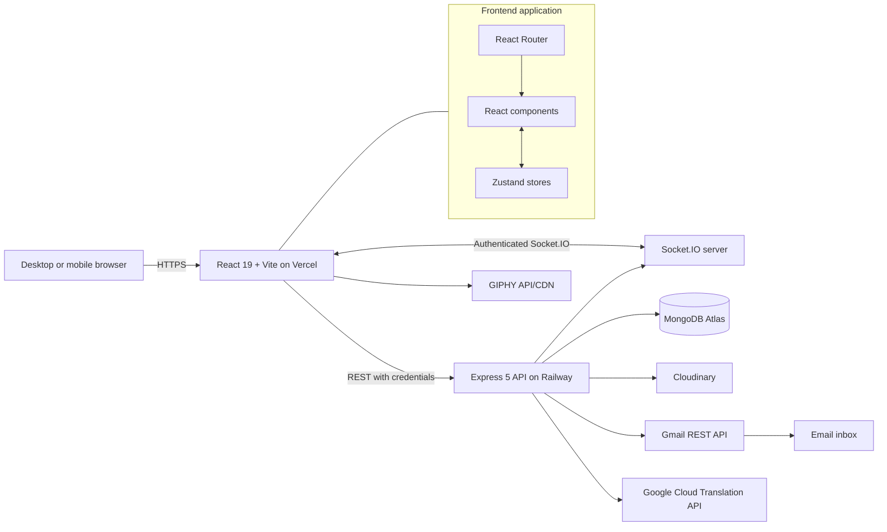
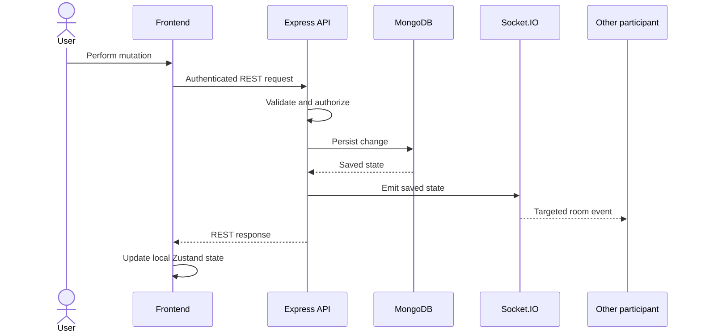
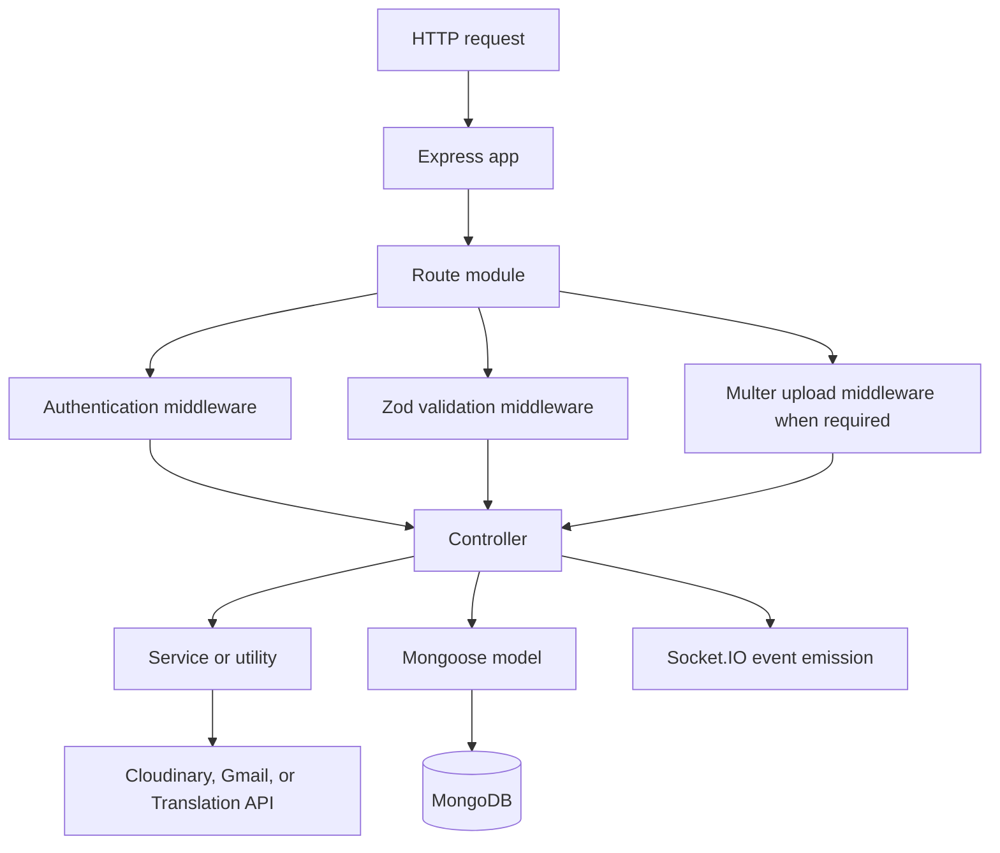
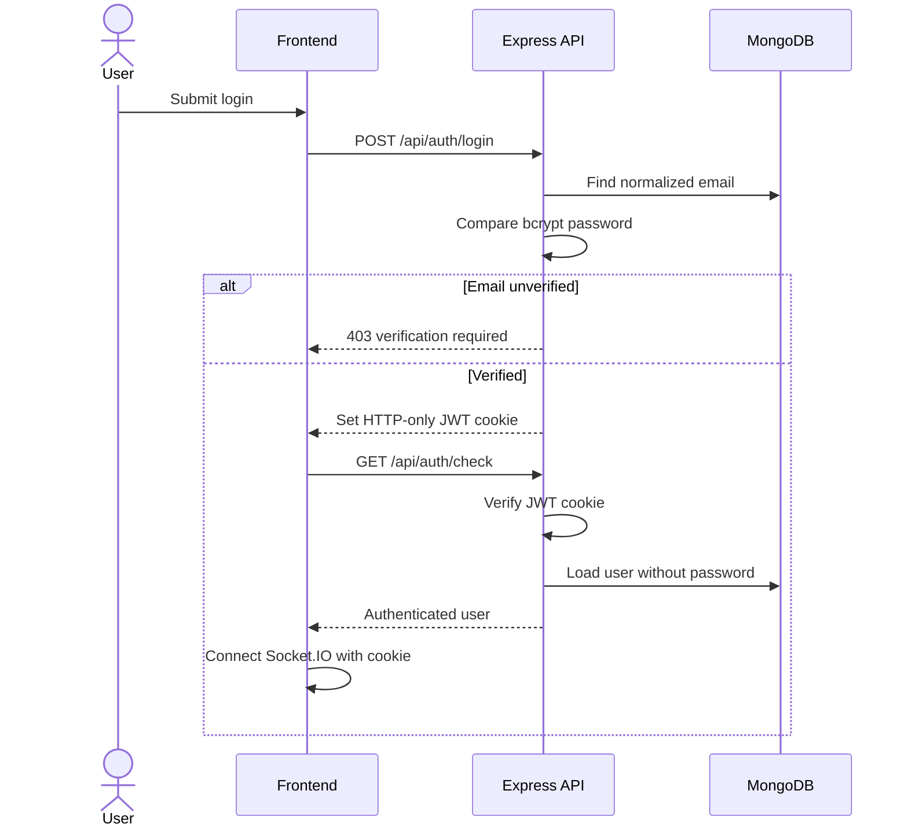
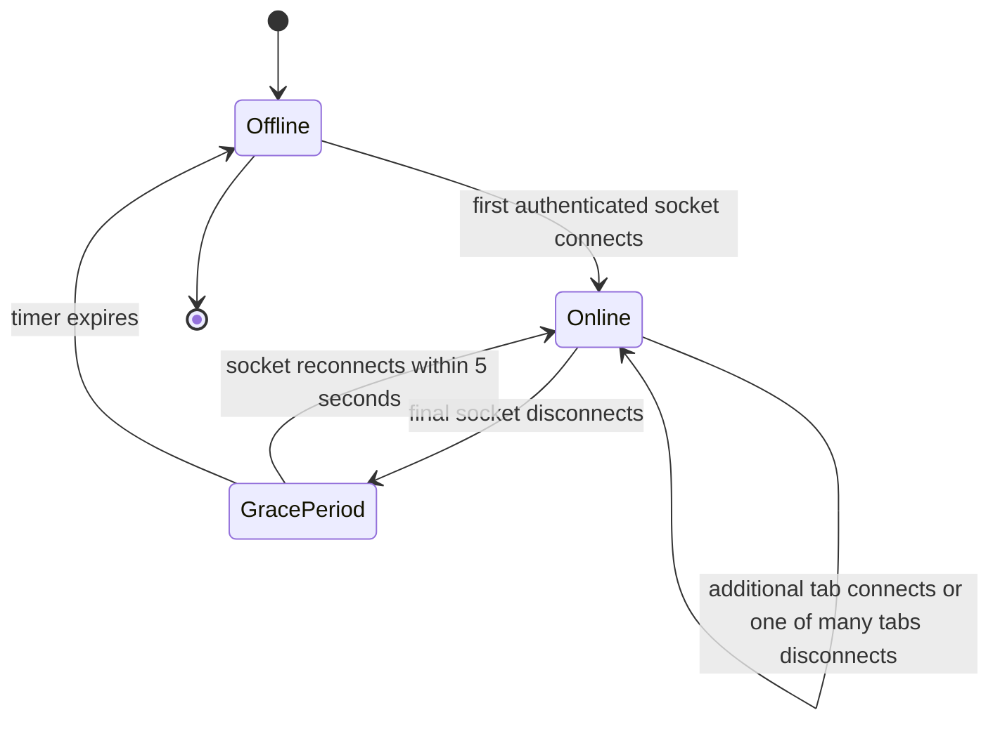
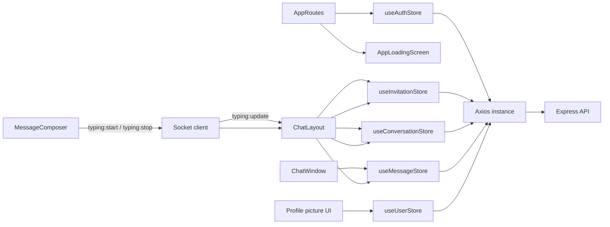
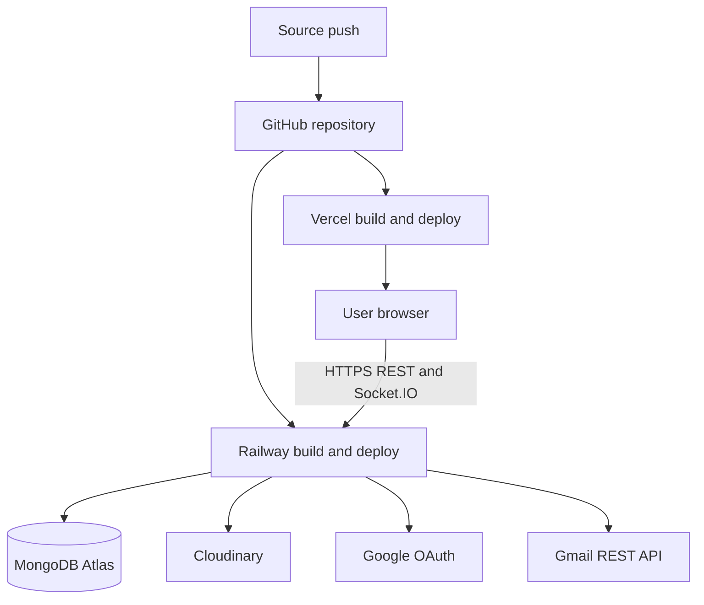

# System architecture

## High-level architecture

## Component responsibilities

| Component | Responsibilities |
| --- | --- |
| React frontend | Routing, forms, responsive UI, local state, REST calls, and socket event handling |
| App loading screen | Replaces the application routes while the initial authentication check is in progress |
| Axios client | Sends API requests to `VITE_API_URL/api` with cookies enabled |
| Zustand stores | Own authentication, invitation, conversation, message, and profile-update state |
| Express API | Routing, validation, authentication, authorization, persistence, upload handling, and responses |
| Socket.IO | Authenticates the JWT cookie, joins user rooms, delivers real-time events, and tracks presence |
| MongoDB/Mongoose | Persistent source of truth and schema validation |
| Gmail API | Sends email-verification and password-reset links using Google OAuth 2.0 |
| Cloudinary | Stores/transforms profile pictures and chat attachments and deletes message assets during cleanup |
| Google Cloud Translation | Translates cache misses after atomic daily/monthly character reservation |
| GIPHY | Provides client-side GIF/sticker discovery and externally hosted media delivery |

## REST and Socket.IO boundary

REST is authoritative for mutations. Socket.IO distributes changes only after persistence for message operations. The sender normally updates from the REST response; other participants update from socket events.

Typing state is an exception because it is ephemeral. The composer emits `typing:start` and `typing:stop` directly through Socket.IO. The server verifies conversation membership and forwards `typing:update` only to the other participants; no typing state is written to MongoDB.

Translation is REST-only. It produces a derived view of existing message content and does not mutate or emit the message. Cache entries include the source content hash, so an edited message cannot reuse stale translated text.

Attachment upload is a compound mutation: membership and reply checks run before the Cloudinary upload, metadata is persisted with the message, the conversation's `lastMessage` is updated, and only then is `message:new` emitted. If persistence fails before completion, the controller attempts to remove the new Cloudinary asset.

## Backend layering

## Authentication architecture

The REST authentication middleware and Socket.IO middleware separately validate the same `jwt` cookie because Express and Socket.IO have different middleware pipelines.

## Presence architecture

The single-process server stores socket counts and timers in memory. MongoDB stores the public `isOnline` and `lastSeen` state. At startup, stale online flags are reset before Socket.IO begins accepting connections.

## Frontend state flow

## Deployment architecture

Vercel rewrites frontend routes to `/` so React Router can handle direct navigation. Railway runs `node src/server.js`. The current presence algorithm assumes one Railway backend process.

The maintained deployment targets are:

- Web application: `https://clickchat-ldrp.vercel.app/`
- Backend API and Socket.IO server: `https://click-chat-production.up.railway.app/`
