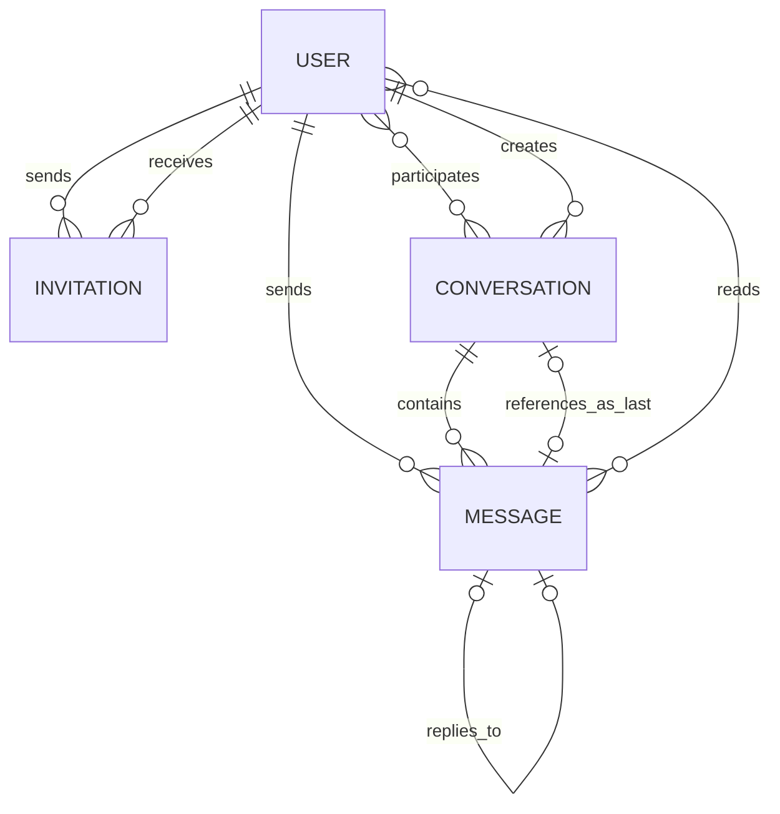
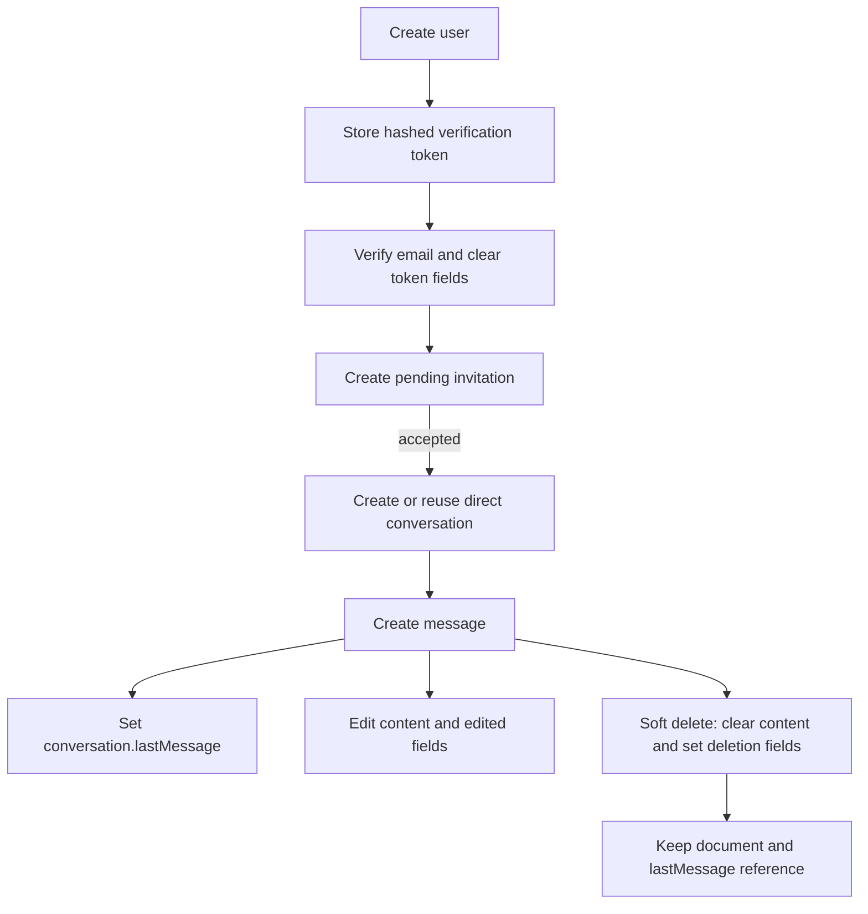

# Data model

## Collection relationships

MongoDB collection names are Mongoose’s pluralized forms: `users`, `invitations`, `conversations`, and `messages`.

## Users collection

| Name | Type | Description |
| --- | --- | --- |
| `_id` | ObjectId | Primary identifier |
| `firstName` | String | Required, trimmed, 2–30 letters at API registration validation |
| `lastName` | String | Required, trimmed, 2–30 letters at API registration validation |
| `email` | String | Required, unique, lowercase, trimmed login identifier |
| `isEmailVerified` | Boolean | Whether the account completed email verification; defaults to `false` |
| `emailVerificationToken` | String or null | SHA-256 hash of the active token; excluded from normal queries |
| `emailVerificationExpiresAt` | Date or null | Token expiry, currently 24 hours after creation; excluded from normal queries |
| `emailVerificationSentAt` | Date or null | Used for resend cooldown; excluded from normal queries |
| `passwordResetToken` | String or null | SHA-256 hash of the active reset token; excluded from normal queries |
| `passwordResetExpiresAt` | Date or null | Reset-token expiry; excluded from normal queries |
| `passwordResetSentAt` | Date or null | Reset request timestamp; excluded from normal queries |
| `passwordChangedAt` | Date or null | Invalidates JWTs issued before the password change |
| `dateOfBirth` | Date | Required; registration validation requires age 18 or older |
| `password` | String | Required bcrypt hash; never returned by protected-route user lookup |
| `profilePic.url` | String | Public Cloudinary URL |
| `profilePic.publicId` | String | Cloudinary deletion/replacement identifier; excluded from normal queries |
| `profilePic.resourceType` | String | Cloudinary resource type; excluded from normal queries |
| `bio` | String | Optional profile text, maximum 150 characters |
| `preferredLanguage` | String | Lowercase Translation target; defaults to `en` |
| `appearance.preset` | String enum | Selected ClickChat, Ocean, Forest, Sunset, Lavender, or Midnight preset |
| `appearance.colorMode` | String enum | Selected `light`, `dark`, or `system` color mode |
| `isOnline` | Boolean | Persisted presence state; defaults to `false` |
| `lastSeen` | Date or null | Time the final socket was declared offline |
| `pushSubscriptions` | Embedded document[] | Per-browser Web Push endpoint, `p256dh`, `auth`, and creation time |
| `createdAt` | Date | Mongoose timestamp |
| `updatedAt` | Date | Mongoose timestamp |

### Constraints and behavior

- Email has a unique index generated by `unique: true`.
- Raw verification tokens are emailed but never stored; only their hash is saved.
- Profile-picture internal Cloudinary fields require explicit selection.
- Presence is updated from authenticated socket connections, not from ordinary REST activity.

## Invitations collection

| Name | Type | Description |
| --- | --- | --- |
| `_id` | ObjectId | Primary identifier |
| `sender` | ObjectId → User | User who created the invitation |
| `recipient` | ObjectId → User | User authorized to accept or decline it |
| `status` | Enum String | `pending`, `accepted`, or `declined`; defaults to `pending` |
| `createdAt` | Date | Mongoose timestamp |
| `updatedAt` | Date | Response time is reflected here after status changes |

### Indexes and business constraints

| Index | Purpose |
| --- | --- |
| `{ sender: 1, recipient: 1, status: 1 }` | Supports relationship/status queries |

The send controller rejects self-invitations and searches both user directions for an existing `pending` or `accepted` invitation. The index is not unique, so controller logic currently enforces duplication rules.

## Conversations collection

| Name | Type | Description |
| --- | --- | --- |
| `_id` | ObjectId | Primary identifier |
| `type` | Enum String | `direct` or `group`; defaults to `direct` |
| `participants` | ObjectId[] → User | Unique conversation members |
| `directKey` | String or null | Sorted pair of user IDs joined with `:` for direct-conversation uniqueness |
| `groupName` | String or null | Group name, 2–50 characters |
| `groupImage.url` | String | Public group-image URL |
| `groupImage.publicId` | String | Cloudinary replacement/deletion identifier, excluded from normal queries |
| `groupImage.resourceType` | String | Cloudinary resource type, excluded from normal queries |
| `groupAdmins` | ObjectId[] → User | Members authorized to manage the group |
| `createdBy` | ObjectId → User | User who initiated the relationship or group |
| `lastMessage` | ObjectId or null → Message | Latest message, including a soft-deleted latest message |
| `createdAt` | Date | Mongoose timestamp |
| `updatedAt` | Date | Updated when the conversation document is saved, including new last messages |

### Validation rules

- Participant IDs must be unique.
- A direct conversation requires exactly two participants and a `directKey`.
- Group creation requires at least three participants, a group name, and one creator-administrator.
- An established group may drop below three members as users leave, but it must retain a participant and administrator while stored.
- Every administrator must also be a participant.
- Group creation and member addition are limited to accepted contacts and 100 total members.

### Indexes

| Index | Purpose |
| --- | --- |
| Unique partial `{ directKey: 1 }` where `type: "direct"` | Guarantees one direct conversation for a sorted user pair |

## Messages collection

| Name | Type | Description |
| --- | --- | --- |
| `_id` | ObjectId | Primary identifier and real-time deduplication key |
| `conversation` | ObjectId → Conversation | Required owning conversation; indexed |
| `sender` | ObjectId → User | Required message author |
| `content` | String | Trimmed text or attachment caption up to 5,000 characters; attachment captions may be empty |
| `messageType` | Enum String | `text`, `image`, `video`, `audio`, `file`, `gif`, or `sticker` |
| `attachment` | Embedded object or null | Cloudinary metadata for a multimedia message |
| `attachment.url` | String | Secure Cloudinary delivery URL |
| `attachment.publicId` | String | Cloudinary identifier used for cleanup |
| `attachment.originalName` | String | Original client filename, limited to 255 characters |
| `attachment.mimeType` | String | Validated upload MIME type |
| `attachment.size` | Number | Stored asset size in bytes |
| `attachment.resourceType` | Enum String | Cloudinary `image`, `video`, or `raw` resource category |
| `attachment.width`, `attachment.height` | Number or null | Media dimensions when Cloudinary provides them |
| `attachment.duration` | Number or null | Video/audio duration when Cloudinary provides it |
| `externalMedia` | Embedded object or null | Provider-neutral GIPHY GIF/sticker metadata |
| `externalMedia.mediaType` | Enum String | `gif` or `sticker`; must match `messageType` |
| `externalMedia.providerId` | String | GIPHY result identifier supplied by the picker |
| `externalMedia.url`, `externalMedia.previewUrl` | String | Display and picker-preview URLs hosted by GIPHY |
| `externalMedia.width`, `externalMedia.height` | Number | Media display dimensions |
| `gif` | Embedded object or null | Legacy compatibility field for GIF messages created before `externalMedia` |
| `replyTo` | ObjectId or null → Message | Optional reference to a non-deleted message in the same conversation |
| `readBy` | Embedded receipt[] | Prepared read-receipt list; sender receipt is inserted on creation |
| `readBy[].user` | ObjectId → User | User who read the message |
| `readBy[].readAt` | Date | Receipt time, defaulting to creation time |
| `isEdited` | Boolean | Whether content was edited; defaults to `false` |
| `editedAt` | Date or null | Most recent edit time |
| `isDeleted` | Boolean | Soft-deletion marker; defaults to `false` |
| `deletedAt` | Date or null | Soft-deletion time |
| `createdAt` | Date | Mongoose timestamp used for ordering and date separators |
| `updatedAt` | Date | Mongoose timestamp |

### Indexes

| Index | Purpose |
| --- | --- |
| `{ conversation: 1, createdAt: -1 }` | Retrieves recent messages within a conversation |
| `{ sender: 1, createdAt: -1 }` | Supports sender history/moderation-style queries |
| Single-field `conversation` index | Added by `index: true` on the field; overlaps with the compound prefix |

## Additional translation collections

Translation adds Mongoose-pluralized `messagetranslations`, `translationusages`, and `translationdailyusages` collections.

### Message translations

| Name | Type | Description |
| --- | --- | --- |
| `message` | ObjectId → Message | Source message |
| `targetLanguage` | String | Lowercase preferred target language |
| `contentHash` | String | SHA-256 hash of source content at translation time |
| `translatedText` | String | Decoded translated result |
| `detectedSourceLanguage` | String | Google-detected source language when available |
| `createdAt`, `updatedAt` | Date | Cache timestamps |

The unique index `{ message: 1, targetLanguage: 1, contentHash: 1 }` prevents duplicate cache records while permitting a fresh result after a message edit or language change.

### Translation usage

`TranslationUsage` stores one unique `monthKey` record, while `TranslationDailyUsage` stores one unique `dayKey` record. Each contains `charactersUsed` and timestamps. Conditional atomic increments reserve capacity before an external call. Keys use the `America/Los_Angeles` calendar boundary.

These are conservative application accounting records, not Google invoices. They protect only calls passing through backend deployments that share the same MongoDB database.

## Data lifecycle

Soft deletion preserves message history and allows all clients to render a deleted-message state. It also allows the conversation preview to show “Message deleted” when the deleted record remains the latest message.
