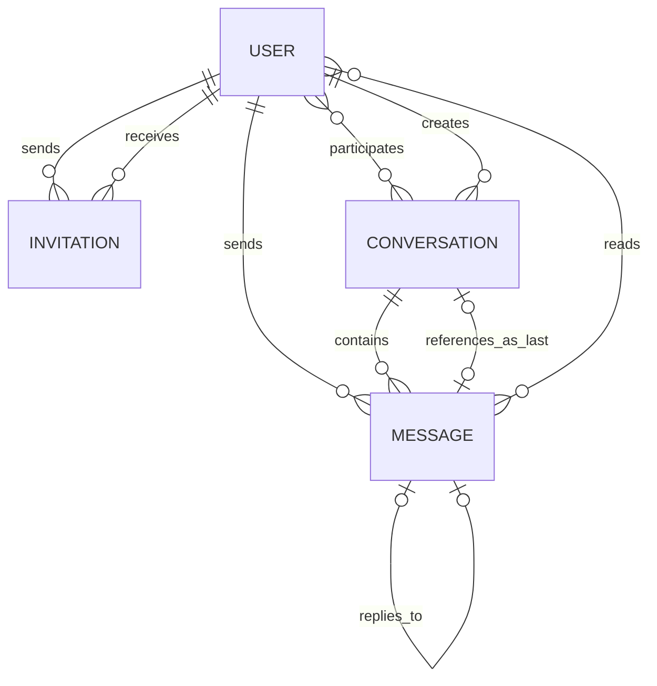
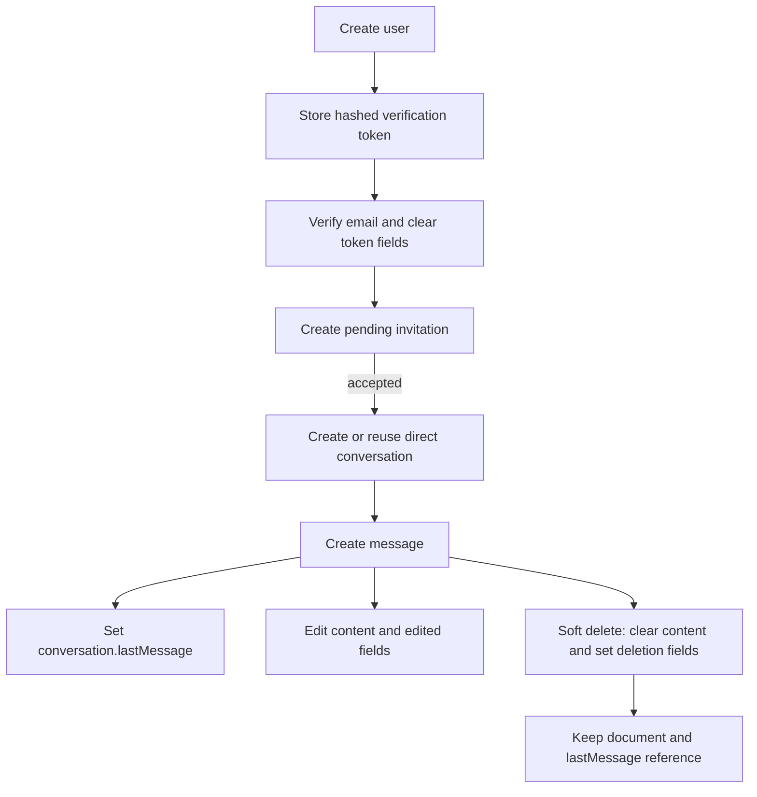

# Data model

## Collection relationships

MongoDB collection names are Mongoose’s pluralized forms: `users`, `invitations`, `conversations`, and `messages`.

## Users collection

| Name | Type | Description |
| --- | --- | --- |
| `_id` | ObjectId | Primary identifier |
| `firstName` | String | Required, trimmed, 2–30 letters at API registration validation |
| `lastName` | String | Required, trimmed, 2–30 letters at API registration validation |
| `email` | String | Required, unique, lowercase, trimmed login identifier |
| `isEmailVerified` | Boolean | Whether the account completed email verification; defaults to `false` |
| `emailVerificationToken` | String or null | SHA-256 hash of the active token; excluded from normal queries |
| `emailVerificationExpiresAt` | Date or null | Token expiry, currently 24 hours after creation; excluded from normal queries |
| `emailVerificationSentAt` | Date or null | Used for resend cooldown; excluded from normal queries |
| `dateOfBirth` | Date | Required; registration validation requires age 18 or older |
| `password` | String | Required bcrypt hash; never returned by protected-route user lookup |
| `profilePic.url` | String | Public Cloudinary URL |
| `profilePic.publicId` | String | Cloudinary deletion/replacement identifier; excluded from normal queries |
| `profilePic.resourceType` | String | Cloudinary resource type; excluded from normal queries |
| `bio` | String | Optional profile text, maximum 150 characters |
| `isOnline` | Boolean | Persisted presence state; defaults to `false` |
| `lastSeen` | Date or null | Time the final socket was declared offline |
| `createdAt` | Date | Mongoose timestamp |
| `updatedAt` | Date | Mongoose timestamp |

### Constraints and behavior

- Email has a unique index generated by `unique: true`.
- Raw verification tokens are emailed but never stored; only their hash is saved.
- Profile-picture internal Cloudinary fields require explicit selection.
- Presence is updated from authenticated socket connections, not from ordinary REST activity.

## Invitations collection

| Name | Type | Description |
| --- | --- | --- |
| `_id` | ObjectId | Primary identifier |
| `sender` | ObjectId → User | User who created the invitation |
| `recipient` | ObjectId → User | User authorized to accept or decline it |
| `status` | Enum String | `pending`, `accepted`, or `declined`; defaults to `pending` |
| `createdAt` | Date | Mongoose timestamp |
| `updatedAt` | Date | Response time is reflected here after status changes |

### Indexes and business constraints

| Index | Purpose |
| --- | --- |
| `{ sender: 1, recipient: 1, status: 1 }` | Supports relationship/status queries |

The send controller rejects self-invitations and searches both user directions for an existing `pending` or `accepted` invitation. The index is not unique, so controller logic currently enforces duplication rules.

## Conversations collection

| Name | Type | Description |
| --- | --- | --- |
| `_id` | ObjectId | Primary identifier |
| `type` | Enum String | `direct` or `group`; defaults to `direct` |
| `participants` | ObjectId[] → User | Unique conversation members |
| `directKey` | String or null | Sorted pair of user IDs joined with `:` for direct-conversation uniqueness |
| `groupName` | String or null | Prepared group name, 2–50 characters |
| `groupImage.url` | String | Prepared public group-image URL |
| `groupImage.publicId` | String | Prepared Cloudinary identifier, excluded from normal queries |
| `groupImage.resourceType` | String | Prepared Cloudinary resource type, excluded from normal queries |
| `groupAdmins` | ObjectId[] → User | Prepared group administrator list |
| `createdBy` | ObjectId → User | User who initiated the relationship or group |
| `lastMessage` | ObjectId or null → Message | Latest message, including a soft-deleted latest message |
| `createdAt` | Date | Mongoose timestamp |
| `updatedAt` | Date | Updated when the conversation document is saved, including new last messages |

### Validation rules

- Participant IDs must be unique.
- A direct conversation requires exactly two participants and a `directKey`.
- A group conversation requires at least three participants, a group name, and at least one administrator.
- Complete group creation and management routes are not implemented.

### Indexes

| Index | Purpose |
| --- | --- |
| Unique partial `{ directKey: 1 }` where `type: "direct"` | Guarantees one direct conversation for a sorted user pair |

## Messages collection

| Name | Type | Description |
| --- | --- | --- |
| `_id` | ObjectId | Primary identifier and real-time deduplication key |
| `conversation` | ObjectId → Conversation | Required owning conversation; indexed |
| `sender` | ObjectId → User | Required message author |
| `content` | String | Trimmed text up to 5,000 characters; may be empty only after soft deletion |
| `messageType` | Enum String | `text`, `image`, or `file`; current send route creates `text` only |
| `replyTo` | ObjectId or null → Message | Optional reference to a non-deleted message in the same conversation |
| `readBy` | Embedded receipt[] | Prepared read-receipt list; sender receipt is inserted on creation |
| `readBy[].user` | ObjectId → User | User who read the message |
| `readBy[].readAt` | Date | Receipt time, defaulting to creation time |
| `isEdited` | Boolean | Whether content was edited; defaults to `false` |
| `editedAt` | Date or null | Most recent edit time |
| `isDeleted` | Boolean | Soft-deletion marker; defaults to `false` |
| `deletedAt` | Date or null | Soft-deletion time |
| `createdAt` | Date | Mongoose timestamp used for ordering and date separators |
| `updatedAt` | Date | Mongoose timestamp |

### Indexes

| Index | Purpose |
| --- | --- |
| `{ conversation: 1, createdAt: -1 }` | Retrieves recent messages within a conversation |
| `{ sender: 1, createdAt: -1 }` | Supports sender history/moderation-style queries |
| Single-field `conversation` index | Added by `index: true` on the field; overlaps with the compound prefix |

## Data lifecycle

Soft deletion preserves message history and allows all clients to render a deleted-message state. It also allows the conversation preview to show “Message deleted” when the deleted record remains the latest message.
