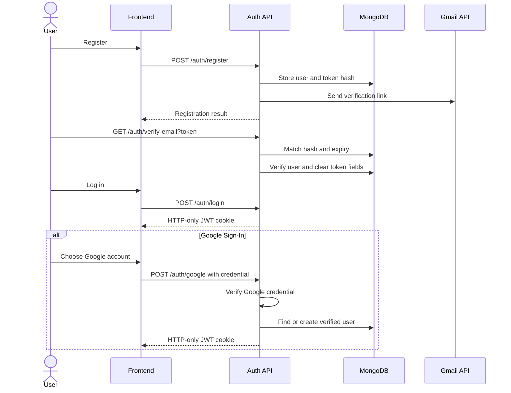
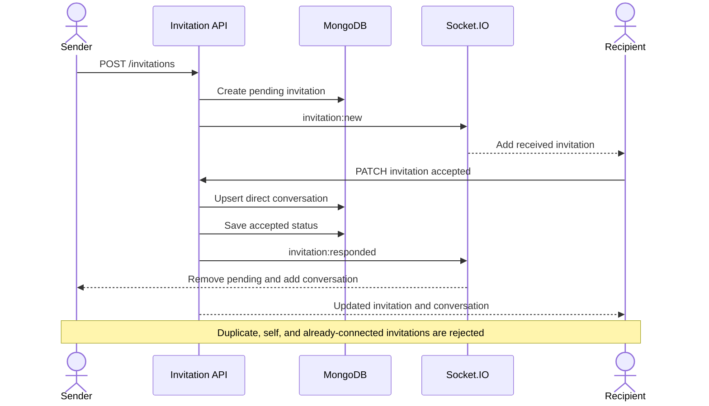

# REST API reference

## Conventions

- Base path: `${VITE_API_URL}/api` from the frontend.
- Protected endpoints authenticate the HTTP-only `jwt` cookie.
- Axios sends `withCredentials: true`.
- JSON request bodies are validated with Zod where a route declares validation.
- Validation failures return HTTP `400` with `errors` containing flattened field errors.
- Controller failures generally return `{ success: false, message }`.
- Object IDs must match a 24-character hexadecimal MongoDB ID.

## Health and development endpoints

| Method | Path | Auth | Request | Success |
| --- | --- | --- | --- | --- |
| GET | `/` | No | None | Plain text `Backend is running` |
| GET | `/health` | No | None | `200` with `status`, process `uptime` in seconds, and an ISO `timestamp` |
| POST | `/api/name` | No | `{ name }` | Development greeting; not used by the production UI |

## Authentication API

| Method | Path | Auth | Request | Success response | Important errors |
| --- | --- | --- | --- | --- | --- |
| POST | `/api/auth/register` | No | Registration body | `201`, `success`, `emailSent`, `message` | `400` validation, `409` email exists, `429` rate limit |
| POST | `/api/auth/login` | No | `{ email, password }` | `200`, sets `jwt` cookie | `401` invalid credentials, `403` verification required |
| GET | `/api/auth/check` | Yes | None | `200`, authenticated `user` | `401` invalid/missing token, `404` user missing |
| GET | `/api/auth/logout` | No | None | `200`, clears `jwt` cookie | `500` internal failure |
| GET | `/api/auth/verify-email?token=...` | No | 64-character hex token | `200`, marks email verified | `400` invalid/expired token |
| POST | `/api/auth/resend-verification` | No | `{ email }` | `200` generic/sent response | `429` cooldown/rate limit, `503` email provider failure |
| PATCH | `/api/auth/change-password` | Yes | `{ currentPassword, newPassword, confirmPassword }` | `200`, replaces password and session cookie | `400` incorrect or reused password |
| POST | `/api/auth/forgot-password` | No | `{ email }` | Generic `200` response | Rate limited; never reveals whether an account exists |
| POST | `/api/auth/reset-password` | No | `{ token, newPassword, confirmPassword }` | `200`, clears session/reset fields | `400` invalid/expired token or reused password |

### Registration body

| Name | Type | Required | Validation |
| --- | --- | --- | --- |
| `firstName` | String | Yes | Trimmed, 2–30 alphabetic characters |
| `lastName` | String | Yes | Trimmed, 2–30 alphabetic characters |
| `email` | String | Yes | Valid email, trimmed and lowercased |
| `dateOfBirth` | Date-compatible value | Yes | User must be at least 18 |
| `password` | String | Yes | Minimum 8 characters |
| `confirmPassword` | String | Yes | Must equal `password`; removed from persistence by controller destructuring |

### Authentication response flow

## User API

`PATCH /api/user/profile` is authenticated and accepts validated partial updates for inline identity/biography editing, preferred-language selection, and appearance preferences. Appearance is submitted as `{ appearance: { preset, colorMode } }`. It returns the updated user. `PATCH /api/user/profilePic` handles image replacement separately.

| Method | Path | Auth | Request | Success response | Notes |
| --- | --- | --- | --- | --- | --- |
| PATCH | `/api/user/profilePic` | Yes | `multipart/form-data`, field `file` | `200`, success message | In-memory Multer upload; controller requires image; Cloudinary transforms to 500×500 |
| GET | `/api/user/search?q=query` | Yes | Query `q` | `200`, `count`, `users` | `q` length 2–50; excludes current user; maximum 20 results |
| POST | `/api/user/push-subscriptions` | Yes | Browser PushSubscription JSON | `200`, success message | Replaces the same endpoint for the current user |
| DELETE | `/api/user/push-subscriptions` | Yes | `{ endpoint }` | `200`, success message | Removes the current browser endpoint |

Profile pictures use an image-only Multer filter and a 5 MB limit. Chat attachments use a 10 MB Multer transport limit followed by Zod validation of file metadata and supported MIME types.

## Invitation API

| Method | Path | Auth | Request | Success response | Notes |
| --- | --- | --- | --- | --- | --- |
| GET | `/api/invitations` | Yes | None | Pending `received` and `sent` arrays | Populates the opposite user |
| POST | `/api/invitations` | Yes | `{ recipientId }` | `201`, populated `invitation` | Emits `invitation:new` |
| PATCH | `/api/invitations/:invitationId` | Yes | `{ action: "accepted" | "declined" }` | Updated `invitation`, and `conversation` when accepted | Recipient-only action; emits `invitation:responded` |
| GET | `/api/invitations/contacts` | Yes | None | `count`, deduplicated accepted `contacts` | Contacts include `connectedAt` |

### Invitation rules

- A user cannot invite themselves.
- The recipient must exist.
- A pending or accepted relationship in either direction prevents another invitation.
- Only the pending invitation’s recipient can respond.
- Acceptance creates or reuses the unique direct conversation.

## Conversation and message API

All routes under `/api/conversations` use protected-route middleware.

| Method | Path | Request | Success response | Authorization |
| --- | --- | --- | --- | --- |
| GET | `/api/conversations` | None | Populated `conversations` array | Returns conversations containing current user |
| PATCH | `/api/conversations/:conversationId/delivered` | None | Count of newly delivered messages | Marks incoming conversation messages delivered for current user |
| PATCH | `/api/conversations/:conversationId/read` | None | Zero unread count | Marks incoming messages read and resets persisted unread state |
| GET | `/api/conversations/:conversationId/messages` | None | Latest 50 messages in ascending display order | Current user must be a participant |
| POST | `/api/conversations/:conversationId/messages` | `{ content, replyTo? }` | `201`, populated message in `data` | Current user must be a participant |
| POST | `/api/conversations/:conversationId/attachments` | `multipart/form-data`: `file`, optional `content`, optional `replyTo` | `201`, populated attachment message in `data` | One supported file up to 10 MB; current user must be a participant |
| POST | `/api/conversations/:conversationId/media` | `{ providerId, mediaType, url, previewUrl, width, height, description? }` | `201`, populated GIF or sticker message in `data` | Backend accepts only `gif`/`sticker` types and HTTPS media URLs hosted on GIPHY domains |
| GET | `/api/conversations/:conversationId/messages/:messageId/attachment` | Optional `?download=1` | `302` to a five-minute Cloudinary URL | Participant-only; attachment must exist |
| POST | `/api/conversations/:conversationId/messages/:messageId/translate` | None | Translation text, target/detected language, and cache flag | Participant-only; target comes from the authenticated profile |
| PATCH | `/api/conversations/:conversationId/messages/:messageId` | `{ content }` | Updated message in `data` | Current user must own the non-deleted text message |
| DELETE | `/api/conversations/:conversationId/messages/:messageId` | None | Soft-deleted message in `data` | Current user must own the non-deleted message |

### Direct-conversation management

| Method | Path | Request | Success response | Authorization |
| --- | --- | --- | --- | --- |
| POST | `/api/conversations/:conversationId/clear` | None | Cleared, populated `conversation` | Either direct-conversation participant |
| DELETE | `/api/conversations/:conversationId/direct` | None | Success message | Either direct-conversation participant |

Clear chat permanently removes every stored message and owned Cloudinary attachment for both participants, resets `lastMessage`, and keeps the direct conversation. Delete conversation removes the history, conversation, and accepted connection for both participants; a new invitation is required to chat again.

Invitation creation also repairs legacy stale connections: when an accepted invitation exists without its matching direct conversation, the stale accepted record is removed and the new invitation is created normally. A matching live conversation still returns `409 Already connected`.

### Group API

| Method | Path | Request | Success response | Authorization |
| --- | --- | --- | --- | --- |
| POST | `/api/conversations/groups` | `{ groupName, participantIds }` | `201`, populated `conversation` | Creator; selected users must be accepted contacts |
| PATCH | `/api/conversations/:conversationId/group` | `{ groupName }` | Updated `conversation` | Group administrator |
| PATCH | `/api/conversations/:conversationId/group/image` | `multipart/form-data`, field `file` | Updated `conversation` | Group administrator |
| POST | `/api/conversations/:conversationId/group/participants` | `{ participantIds }` | Updated `conversation` | Group administrator; accepted contacts only |
| DELETE | `/api/conversations/:conversationId/group/participants/:participantId` | None | Updated `conversation` | Group administrator |
| PATCH | `/api/conversations/:conversationId/group/admins/:participantId` | `{ action: "add" | "remove" }` | Updated `conversation` | Group administrator |
| POST | `/api/conversations/:conversationId/group/leave` | None | Success message | Current group member |
| DELETE | `/api/conversations/:conversationId/group` | None | Success message | Group administrator |

Group creation requires the creator plus at least two accepted contacts. Groups are capped at 100 members. Administrator removal cannot leave a stored group without an administrator. Leaving the final-member group and administrator deletion clean up messages and Cloudinary resources.

### Message body fields

| Name | Type | Required | Validation and behavior |
| --- | --- | --- | --- |
| `content` | String | Yes | Trimmed, 1–5,000 characters |
| `replyTo` | ObjectId or null | No | Must identify a non-deleted message in the same conversation |

### Message retrieval behavior

The query uses an opaque cursor over `createdAt` and `_id`, returns pages of up to 50 messages in ascending display order, and populates sender, reply, delivery, and read-receipt users.

### Edit and delete behavior

- Editing rejects non-text messages, deleted messages, other users’ messages, and unchanged content.
- Editing sets `isEdited` and `editedAt`.
- Deletion clears content and sets `isDeleted` and `deletedAt`.
- Deletion clears edit markers and preserves the document.
- The conversation retains the deleted message as `lastMessage` when it is the latest record.

## Common status codes

| Status | Meaning in this API |
| --- | --- |
| `200` | Successful retrieval, mutation, login, verification, or logout |
| `201` | User, invitation, or message created |
| `400` | Validation failure or invalid operation |
| `401` | Missing, invalid, or expired authentication; invalid login credentials |
| `403` | Login blocked until email verification |
| `404` | User, invitation, conversation, or message not found/authorized |
| `409` | Duplicate email, invitation, or established relationship |
| `429` | Email/Translation rate limit or resend cooldown |
| `502` | External Translation request failed |
| `500` | Unhandled server failure |
| `503` | Email provider failure, missing Translation configuration, or Translation suspended by a usage cap |

### Translation endpoint behavior

The endpoint validates both IDs, verifies conversation membership, loads a non-deleted message containing text, and derives the target from `req.user.preferredLanguage`. Cache lookup occurs before quota reservation. A cache miss reserves monthly and daily characters atomically, calls Google with source-language auto-detection, stores the result, and returns it. See [Translation and cost controls](11-translation-and-cost-controls.md).
