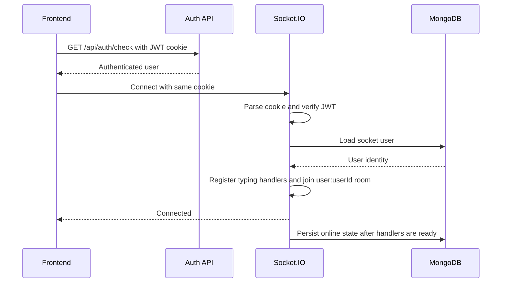
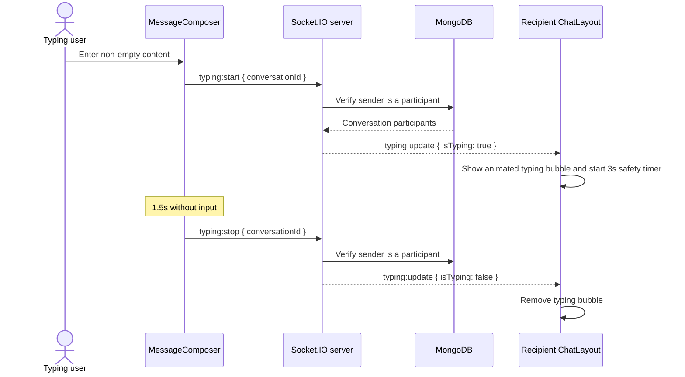
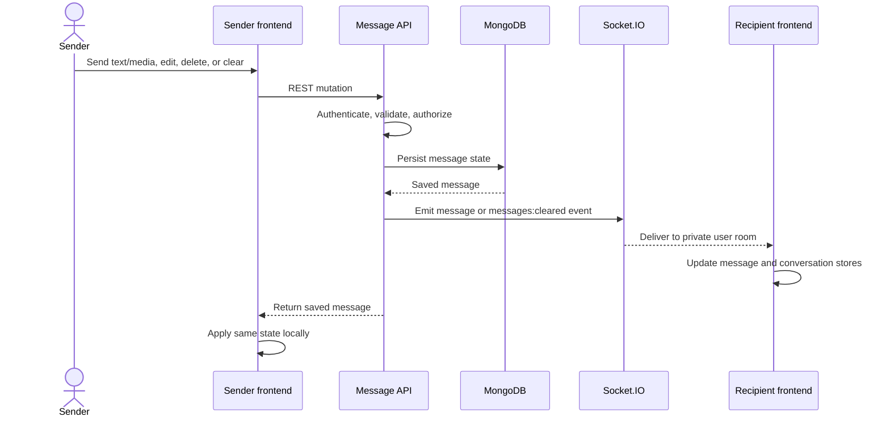
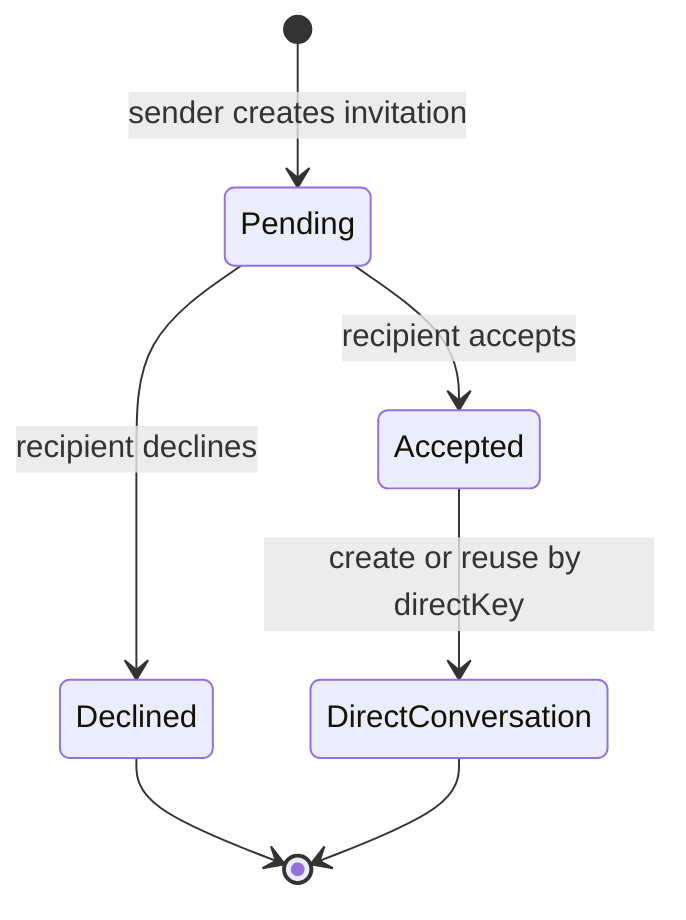

# Real-time events

## Connection and authentication

The frontend creates one Socket.IO client with `autoConnect: false` and `withCredentials: true`. `useAuthStore.checkAuth()` connects it only after REST authentication succeeds. Logout explicitly disconnects the socket.

The server parses the `jwt` cookie from the Socket.IO handshake, verifies it with `JWT_SECRET`, loads the user, and stores the selected user document on `socket.user`. Every authenticated socket joins:

```text
user:<userId>
```

This private room delivers events to all tabs/devices belonging to that user.



## Event contract table

| Event | Producer | Recipients | Payload | Frontend effect |
| --- | --- | --- | --- | --- |
| `message:new` | Message send controller | Other conversation participants | Populated message document | Append if active, update preview, move conversation to top |
| `message:updated` | Message edit controller | Other conversation participants | Populated updated message | Replace active message and update preview only if it is latest |
| `message:deleted` | Message delete controller | Other conversation participants | Populated soft-deleted message | Replace active message and show deleted preview if latest |
| `presence:update` | Socket presence manager | Users sharing a conversation | `{ userId, isOnline, lastSeen }` | Update matching participant objects in every local conversation |
| `invitation:new` | Invitation send controller | Invitation recipient | Populated invitation | Insert received invitation and update badge |
| `invitation:responded` | Invitation response controller | Invitation sender | `{ invitation, conversation }` | Remove pending invitation; add conversation when accepted |
| `typing:start` | Message composer | Socket server | `{ conversationId }` | Request an authenticated typing-state broadcast |
| `typing:stop` | Message composer | Socket server | `{ conversationId }` | Request typing-state removal |
| `typing:update` | Socket server | Other conversation participants | `{ conversationId, userId, firstName, isTyping }` | Show or clear typing status for that conversation |
| `conversation:created` | Group controller | Initial or newly added members | Populated conversation | Insert the group locally |
| `conversation:updated` | Group controller | Current members | Populated conversation | Replace group metadata, members, and administrators |
| `conversation:removed` | Group controller | Removed, leaving, or deletion-affected users | `{ conversationId }` | Remove the conversation and close it if selected |
| `messages:cleared` | Direct-conversation controller | Both direct participants | `{ conversationId }` | Clear the active message list immediately |

Message, invitation, presence, and `typing:update` events are server-to-client events. `typing:start` and `typing:stop` are client-to-server events. Persisted message and invitation mutations continue to originate as REST requests.

Uploaded attachments and GIPHY GIF/sticker messages use the same `message:new` event as ordinary text. The payload's `messageType`, `attachment`, and `externalMedia` fields determine rendering; no provider-specific socket event is required. Translation produces recipient-local derived text through REST and intentionally emits no socket event because it does not alter the source message.

## Typing indicator flow



The composer emits `typing:start` only on the transition from idle to typing rather than on every keystroke. Each change resets its 1.5-second inactivity timer. Emptying the input, sending a message, switching conversations, or unmounting the composer emits `typing:stop`. The recipient also clears stale typing state after three seconds if a stop event is lost.

## Message event flow



The sender is excluded from message socket emission because their REST response contains the authoritative saved document. `_id` checks prevent duplicate insertion of a new message.

## Presence flow

### State storage

| State | Storage | Purpose |
| --- | --- | --- |
| Active socket count | In-memory `Map<userId, count>` | Keeps multi-tab users online until their final socket closes |
| Offline timer | In-memory `Map<userId, timeout>` | Provides a five-second reconnect grace period |
| `isOnline` | User document | Public presence state loaded by conversation queries |
| `lastSeen` | User document | Persisted final-offline timestamp |

```mermaid
sequenceDiagram
    participant S1 as First tab
    participant S2 as Second tab
    participant IO as Socket server
    participant DB as MongoDB
    participant C as Contact

    S1->>IO: Connect
    IO->>IO: Count becomes 1
    IO->>DB: isOnline = true
    IO-->>C: presence:update online
    S2->>IO: Connect
    IO->>IO: Count becomes 2
    S1--xIO: Disconnect
    IO->>IO: Count becomes 1; remain online
    S2--xIO: Disconnect
    IO->>IO: Count becomes 0; start 5s timer
    alt Reconnect during grace
      S1->>IO: Connect
      IO->>IO: Cancel timer; remain online
    else Timer expires
      IO->>DB: isOnline = false, set lastSeen
      IO-->>C: presence:update offline
    end
```

Contacts are found with `Conversation.distinct("participants", { participants: userId })`; the current user is removed before events are emitted. At process startup, all persisted online users are reset to offline because in-memory connection state cannot survive a restart.

## Invitation flow



- `invitation:new` allows the recipient badge/list to update without polling.
- `invitation:responded` removes the sender’s pending state.
- Acceptance carries the populated conversation to both clients, avoiding a full conversation refetch.
- If a user is offline, the REST invitation and conversation queries restore correct state after their next login.

## Client listener ownership

`ChatLayout` registers all domain event handlers while the protected chat interface is mounted and removes the same handler references during cleanup. Domain state is delegated to stores:

| Event family | Store |
| --- | --- |
| Message events | `useMessageStore` and `useConversationStore` |
| Presence | `useConversationStore` |
| Invitations | `useInvitationStore`, with accepted conversations delegated to `useConversationStore` |
| Typing | Local `ChatLayout` state keyed by conversation ID; not persisted in Zustand or MongoDB |

## Current scalability boundary

The Socket.IO server, socket counts, and timers are process-local. Running multiple backend instances would produce incomplete rooms and incorrect counts. Horizontal scaling requires a Redis Socket.IO adapter plus shared presence coordination. Startup-wide presence reset is also suitable only for the current single-instance deployment.
