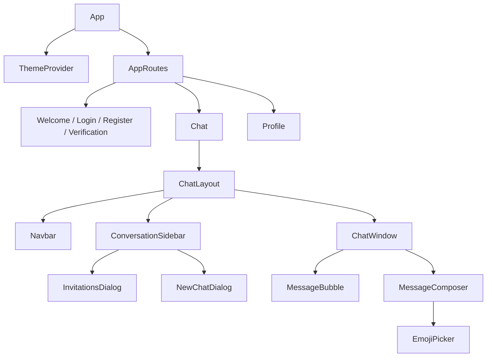
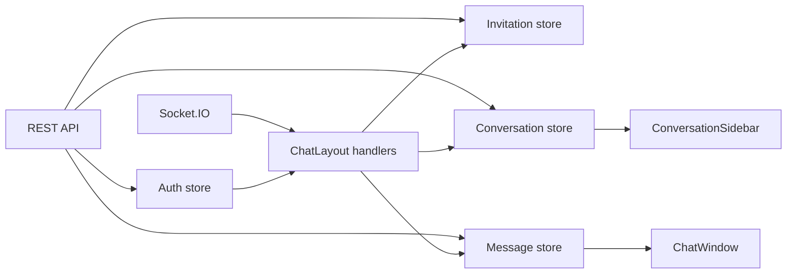
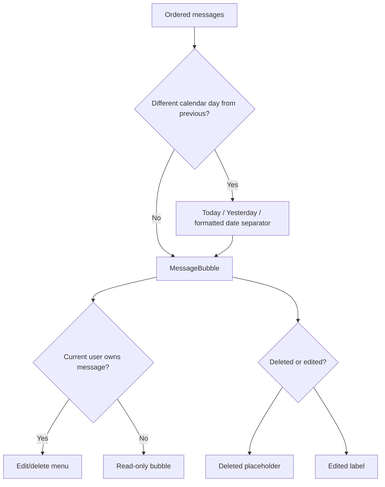

# Frontend design

## Application routes

| Path | Access | Component | Purpose |
| --- | --- | --- | --- |
| `/` | Public | `Welcome` | Landing page and links to login/registration |
| `/login` | Public-only | `Login` | Authenticates verified users |
| `/register` | Public-only | `Register` | Creates an account and begins verification |
| `/check-email` | Public-only | `CheckEmail` | Displays delivery state and supports resend cooldown |
| `/verify-email` | Public-only | `VerifyEmail` | Consumes the emailed verification token |
| `/chat` | Protected | `Chat` → `ChatLayout` | Main conversations and messaging interface |
| `/profile` | Protected | `Profile` | Displays account information and updates profile picture |

`AppRoutes` calls `checkAuth()` on mount. Authenticated users are redirected away from public-only pages, while unauthenticated users are redirected away from protected pages.

## Component hierarchy

## Zustand stores

| Store | Primary state | Main responsibilities |
| --- | --- | --- |
| `useAuthStore` | `authUser`, auth loading flags | Register, login, logout, auth check, verification resend, socket connect/disconnect |
| `useInvitationStore` | Received/sent invitations and action flags | Fetch, send, respond, insert socket invitations, remove responses, delegate accepted conversation insertion |
| `useConversationStore` | Conversation array and loading flag | Fetch list, add conversation, synchronize latest message, update participant presence |
| `useMessageStore` | Active conversation messages and mutation flags | Fetch latest 50, send, insert incoming, replace edited/deleted, clear on selection change |
| `useUserStore` | Profile-picture mutation flag | Upload profile picture and refresh authenticated user |

## Chat data flow

### Conversation selection

`ChatLayout` stores only `selectedConversationId`. It transforms current conversation documents into sidebar view models and derives the selected object on every render. This prevents the open chat header from holding stale presence, name, image, or last-seen values.

### Local synchronization

- New messages append only when they belong to the active conversation.
- Conversation previews update locally and new activity moves the conversation to the top.
- Edited/deleted messages replace matching `_id` values.
- A preview changes on edit/delete only when that message is the current `lastMessage`.
- Accepted invitations insert the returned conversation rather than refetching the whole list.
- Presence updates modify populated participant objects without activating a loading skeleton.

## Message rendering

The composer supports text, native emoji insertion, a 5,000-character limit, and submission loading state. Pressing Enter outside other inputs, dialogs, menus, links, and buttons focuses the message input. Enter within the input submits the form normally.

## Responsive layout

- Desktop: conversation sidebar and chat window are shown side by side.
- Mobile: the sidebar is shown until a conversation is selected; the chat header provides a back button.
- `h-dvh`, bounded scrolling areas, and flex layouts keep the composer and header visible.
- shadcn/Radix primitives provide dialogs, dropdowns, scroll areas, avatars, badges, and form controls.

## Validation and feedback

- React Hook Form and Zod validate registration, login, and search input.
- Sonner provides success/error toasts.
- Request-specific loading flags disable duplicate actions.
- The message store ignores stale message-history responses when the active conversation changed during the request.

## Current frontend gaps

- Older-message pagination and upward-scroll preservation.
- Unread badges and read receipt rendering.
- Typing indicators.
- Reply selection and composer preview, despite backend/schema support.
- Group creation and administration interfaces.
- Attachment, notification, search, and calling interfaces.
