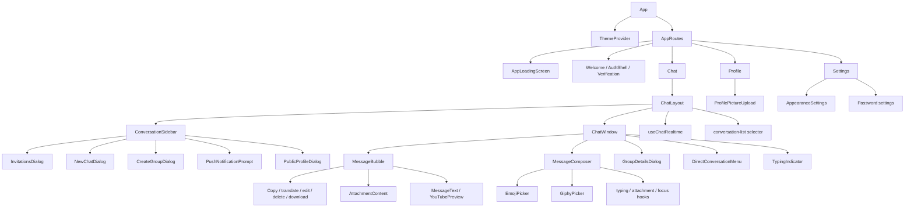
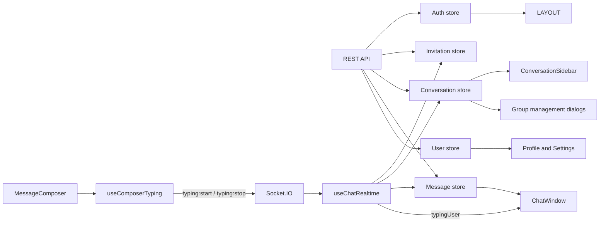
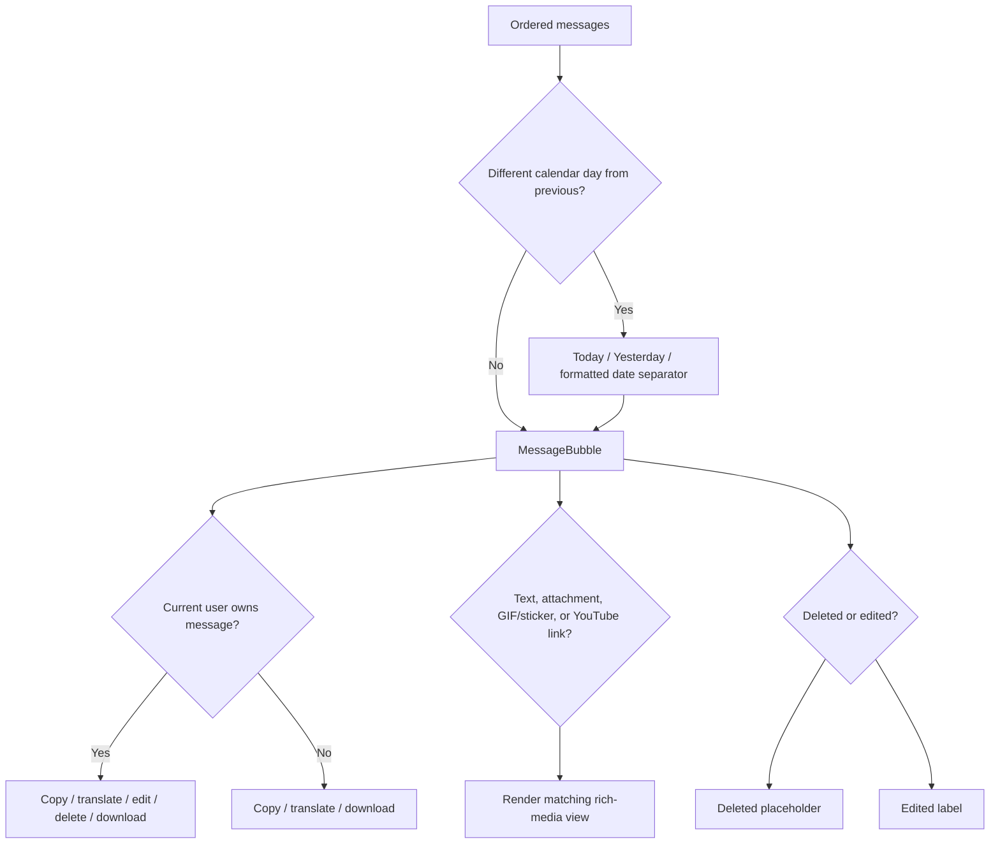

# Frontend design

## Application routes

| Path | Access | Component | Purpose |
| --- | --- | --- | --- |
| `/` | Public | `Welcome` | Landing page and links to login/registration |
| `/login` | Public-only | `Login` | Authenticates verified users |
| `/register` | Public-only | `Register` | Creates an account and begins verification |
| `/check-email` | Public-only | `CheckEmail` | Displays delivery state and supports resend cooldown |
| `/verify-email` | Public-only | `VerifyEmail` | Consumes the emailed verification token |
| `/forgot-password` | Public-only | `ForgotPassword` | Requests a generic-response reset email |
| `/reset-password` | Public-only | `ResetPassword` | Validates the emailed token and replaces the password |
| `/chat` | Protected | `Chat` → `ChatLayout` | Main conversations and messaging interface |
| `/profile` | Protected | `Profile` | Displays account information and updates profile picture |
| `/settings` | Protected | `Settings` | Appearance, language, notifications, and password security |

`AppRoutes` calls `checkAuth()` on mount. Authenticated users are redirected away from public-only pages, while unauthenticated users are redirected away from protected pages. Route components are loaded with `React.lazy`; the landing, authentication, profile, settings, and chat feature bundles are downloaded on demand instead of being included in one initial application bundle.

While the initial authentication request or a lazy route import is pending, `AppRoutes` renders `AppLoadingScreen`. The loader uses the current theme tokens, branded iconography, an accessible live status, and responsive full-viewport positioning.

## Source organization

```text
frontend/src/
|-- app/                    # Application shell and lazy route composition
|-- components/ui/          # shadcn-managed UI primitives
|-- features/
|   |-- auth/               # Auth pages, components, schema, and store
|   |-- chat/               # Chat layout, components, hooks, selectors, and stores
|   |-- invitations/        # Invitation/search UI and store
|   |-- landing/            # Public landing page
|   |-- profile/            # Profile UI, schema, and store
|   `-- settings/           # Settings page and appearance UI
|-- lib/utils.js            # shadcn-compatible cn utility
|-- platform/capacitor/     # Native navigation behavior
`-- shared/                 # API client, socket client, themes, constants, and formatters
```

The shadcn CLI contract is intentionally stable: generated primitives remain under `components/ui`, `cn()` remains in `lib/utils.js`, and global theme CSS remains in `index.css`. Feature code imports those primitives but does not move or duplicate them.

## Component hierarchy



## Visual system and page composition

- The landing page uses a branded header, responsive hero, product preview, trust points, feature cards, call to action, and footer.
- Login and registration share `AuthShell`, which supplies consistent branding, theme control, navigation, benefits, and responsive two-column composition.
- The authenticated dashboard avoids a separate global navbar. A compact ClickChat header is integrated into the conversation sidebar, while the selected conversation has one focused chat header.
- The profile page presents identity, account status, verification state, biography, membership information, and profile-image controls. Name and biography sections enter local inline-edit mode rather than opening a second modal.
- The settings page groups appearance, translation language, browser notifications, and password security away from public-facing identity controls.
- Tailwind theme tokens and shadcn/Radix primitives provide consistent borders, cards, menus, dialogs, avatars, spacing, focus states, and light/dark behavior.

## Zustand stores

| Store | Primary state | Main responsibilities |
| --- | --- | --- |
| `useAuthStore` | `authUser`, auth loading flags | Register, login, logout, auth check, verification resend, socket connect/disconnect |
| `useInvitationStore` | Received/sent invitations and action flags | Fetch, send, respond, insert socket invitations, remove responses, delegate accepted conversation insertion |
| `useConversationStore` | Conversation array and loading flag | Fetch list, add conversation, synchronize latest message, update participant presence |
| `useMessageStore` | Active conversation messages and mutation flags | Fetch latest 50, send, insert incoming, replace edited/deleted, clear on selection change |
| `useUserStore` | Profile-picture mutation flag | Upload a selected profile picture and refresh the authenticated user |

## Chat data flow



### Conversation selection

`ChatLayout` reads `selectedConversationId` from the URL. The memoized `conversation-list` selector transforms current conversation documents into sidebar view models, and the layout derives the selected object from that current list. This prevents the open chat header from holding stale presence, name, image, or last-seen values.

### Local synchronization

- New messages append only when they belong to the active conversation.
- Conversation previews update locally and new activity moves the conversation to the top.
- Edited/deleted messages replace matching `_id` values.
- A preview changes on edit/delete only when that message is the current `lastMessage`.
- Accepted invitations insert the returned conversation rather than refetching the whole list.
- Presence updates modify populated participant objects without activating a loading skeleton.

## Message rendering



The composer supports text, native emoji insertion, GIF/sticker selection, attachment upload, a 5,000-character limit, and submission loading state. Pressing Enter outside other inputs, dialogs, menus, links, and buttons focuses the message input. Enter within the input submits normally.

`MessageBubble` coordinates ownership, actions, editing, translation, reply context, and timestamps. `MessageText` owns linked text and YouTube previews, while `AttachmentContent` owns uploaded image/video/audio/document and external GIF/sticker rendering. The top-right menu is capability-based: copy is limited to text/link content, translate is limited to received text, edit/delete require ownership, and uploaded media includes a download action. Translation appears below the original and can be hidden without mutating message state.

### Typing indicators

`MessageComposer` coordinates submission and store state. `useComposerTyping` tracks whether typing has already been announced, preventing an event on every keystroke; `useAttachmentSelection` owns file validation and preview-URL cleanup; `useComposerFocus` owns the global Enter-to-focus behavior; and focused components render the emoji picker and selected-file progress. Typing starts on non-empty text or emoji input, resets a 1.5-second inactivity timer as content changes, and stops on inactivity, empty content, successful submission, conversation change, or unmount.

`useChatRealtime` listens for `typing:update` and stores the current typing user by conversation ID. A three-second receiver timeout removes stale state if the stop event is lost. `ChatWindow` renders an incoming three-dot message bubble; group bubbles include the writer's first name.

## Group interfaces

- `CreateGroupDialog` loads accepted contacts, validates a name and at least two selections, and inserts the REST result through `useConversationStore`.
- `GroupDetailsDialog` manages the name, image, members, administrator roles, leaving, and deletion.
- Group avatars open group details; normal row content selects the conversation.
- Destructive actions use a ClickChat confirmation modal with action-specific loading feedback.
- `conversation:created`, `conversation:updated`, and `conversation:removed` update Zustand state without refetching the entire list.

## Push-notification interfaces

- `PushNotificationPrompt` offers contextual enablement and a seven-day per-account dismissal.
- Settings contains the permanent per-browser enable/disable control.
- `pushNotifications.js` owns capability checks, service-worker registration, subscription persistence, and unsubscribe behavior.
- `public/sw.js` displays background notifications and deep-links clicks to a conversation.

## Appearance themes

- The Settings page contains a centralized `AppearanceSettings` panel with six visual theme previews.
- ClickChat, Ocean, Forest, Sunset, Lavender, and Midnight coordinate application surfaces, accents, chat canvases, and message bubbles.
- Each preset defines separate sent, received, and typing-bubble backgrounds with readable foreground colors in both light and dark modes.
- Light, dark, and system remain independent color-mode choices, so toggling mode does not discard the selected visual theme.
- MongoDB stores `{ appearance: { preset, colorMode } }` on the user. `checkAuth()` returns it and hydrates the theme after login, so the selection follows the account across devices.
- `ThemeProvider` also caches the visual choice under `clickchat:appearance-theme:v1`, applies it through `data-clickchat-theme`, and synchronizes it across tabs for fast startup.
- The former per-conversation wallpaper control was removed to keep appearance decisions centralized and the chat header uncluttered.

## Responsive layout

- Desktop: conversation sidebar and chat window are shown side by side.
- Mobile: the sidebar is shown until a conversation is selected; the chat header provides a back button.
- Conversation selection is reflected in `?conversation=<id>`, allowing the browser/smartphone Back action to return from the open conversation to the list.
- `h-dvh`, bounded scrolling areas, and flex layouts keep the composer and header visible.
- The conversation list retains native scrolling while hiding scrollbar chrome. Preview text is whitespace-normalized, limited to 42 Unicode characters, and visually ellipsized.
- The message viewport retains scrolling behavior while hiding the scrollbar chrome.
- shadcn/Radix primitives provide dialogs, dropdowns, scroll areas, avatars, badges, and form controls.

## Profile-picture interaction

`ProfilePictureUpload` accepts JPEG, PNG, and WebP images up to 5 MB at the client. A user can click the drop zone or drag an image onto it. Selection starts the upload immediately: the component displays a local preview and progress state, prevents accidental dialog closure during the request, refreshes the authenticated user after success, and closes the dialog automatically. Validation or upload failure keeps the interaction available for another selection.

## Profile and public identity

The authenticated Profile page contains public-facing identity concerns: profile picture, name, biography, account facts, and verification state. The separate Settings page contains private preferences and security controls. This keeps identity editing focused while giving appearance, language, notifications, and password changes a predictable home. Password reset remains available from the public login flow.

In chat, only explicit avatar buttons open `PublicProfileDialog`; the entire conversation row remains dedicated to selecting the conversation. The dialog shows basic public identity data already available to conversation participants.

## Validation and feedback

- React Hook Form and Zod validate registration, login, and search input.
- Sonner provides success/error toasts.
- Request-specific loading flags disable duplicate actions.
- The message store ignores stale message-history responses when the active conversation changed during the request.

## Current frontend gaps

- Older-message pagination and upward-scroll preservation.
- Unread badges and read receipt rendering.
- Reply selection and composer preview, despite backend/schema support.
- Multi-file galleries, upload cancellation/retry, search, and calling interfaces.
