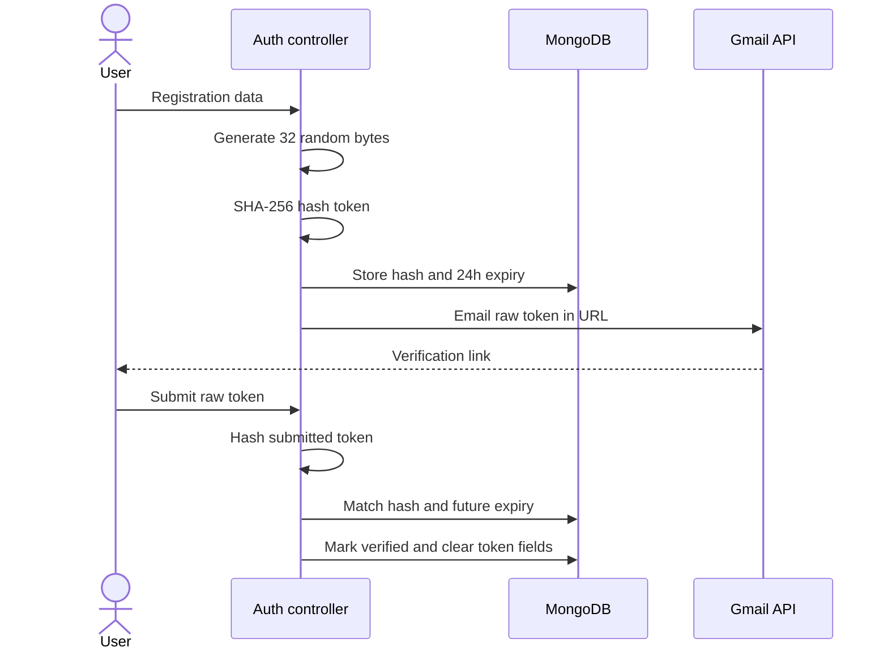

# Security design

## Security controls

| Area | Current control |
| --- | --- |
| Password storage | bcrypt-generated salt and hash |
| Session token | Signed JWT containing `userId` |
| Cookie | HTTP-only; `secure` and `SameSite=None` in production, `SameSite=Lax` in development |
| Email verification | Cryptographically random 32-byte token; only SHA-256 hash stored; 24-hour expiry |
| Resend protection | Per-user 60-second cooldown plus IP rate limit |
| Input validation | Zod schemas for auth, invitations, message IDs/content, and user search |
| REST authentication | `protectRoute` verifies cookie and reloads user without password |
| Socket authentication | Independently parses and verifies the same cookie during handshake |
| Conversation authorization | Message operations require authenticated user membership |
| Message ownership | Edit/delete queries require current user as sender |
| Invitation authorization | Only pending invitation recipient can accept/decline |
| Upload filtering | Multer MIME allow-list, 10 MB limit; profile controller additionally requires image |
| Search safety | User input is regex-escaped before MongoDB regex use |
| Secrets | Environment variables; expected to remain outside source control |

## Email verification flow

## Authorization matrix

| Operation | Required authorization |
| --- | --- |
| View conversations/messages | Authenticated participant |
| Send message | Authenticated participant |
| Edit/delete message | Authenticated participant and original sender |
| Send invitation | Authenticated sender; target exists and is not self |
| Accept/decline invitation | Authenticated pending recipient |
| Upload profile picture | Authenticated owner |
| Search users | Authenticated user; current user excluded |

## Upload security

Multer stores uploads in memory and rejects files over 10 MB or outside the configured MIME allow-list. The profile endpoint then checks that the MIME type begins with `image/`. Cloudinary transforms the image and replaces the user’s previous asset. If persistence fails after upload, the new asset is cleaned up where possible.

MIME types are client-provided metadata and are not a complete content-security check. Production attachment work should add file-signature inspection, malware scanning for documents, stricter per-route allow-lists, and secure download headers.

## Current risks and recommended improvements

| Priority | Gap | Recommendation |
| --- | --- | --- |
| High | No password reset/change workflow | Add short-lived hashed reset tokens, rate limits, and session invalidation |
| High | No security headers middleware | Add and configure Helmet, including CSP appropriate to the frontend |
| High | No account blocking/reporting | Add relationship-level blocks and moderation reporting before public growth |
| Medium | JWT revocation is unavailable | Add token version/session records for logout-all and compromised-session response |
| Medium | Login has no dedicated rate limiter | Add IP/account-aware throttling while avoiding user enumeration |
| Medium | Upload validation trusts MIME metadata | Add magic-byte/content inspection and per-feature allow-lists |
| Medium | In-memory presence assumes one server | Use Redis coordination when horizontally scaling |
| Low | Some generic `500` responses expose inconsistent wording | Centralize error handling and structured logs |

## Privacy considerations

- Presence events are sent only to users sharing a conversation.
- Search returns limited public profile fields and a maximum of 20 users.
- Passwords, verification hashes, and Cloudinary internal IDs are excluded from normal query results.
- Email addresses are visible in user search and invitation data; future privacy settings may need to limit this exposure.
