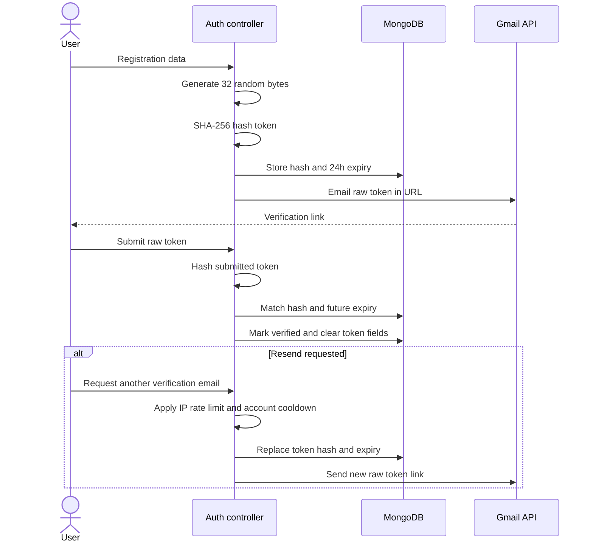

# Security design

## Security controls

| Area | Current control |
| --- | --- |
| Password storage | bcrypt-generated salt and hash |
| Session token | Signed JWT containing `userId` |
| Cookie | HTTP-only; `secure` and `SameSite=None` in production, `SameSite=Lax` in development |
| Email verification | Cryptographically random 32-byte token; only SHA-256 hash stored; 24-hour expiry |
| Resend protection | Per-user 60-second cooldown plus IP rate limit |
| Password recovery | Random short-lived token; only SHA-256 hash stored; generic forgot-password response |
| Password-change invalidation | `passwordChangedAt` rejects JWTs issued before the password change |
| Input validation | Zod schemas for auth, invitations, message IDs/content, and user search |
| REST authentication | `protectRoute` verifies cookie and reloads user without password |
| Socket authentication | Independently parses and verifies the same cookie during handshake |
| Conversation authorization | Message operations require authenticated user membership |
| Typing authorization | Server validates conversation membership before forwarding typing state |
| Message ownership | Edit/delete queries require current user as sender |
| Invitation authorization | Only pending invitation recipient can accept/decline |
| Upload filtering | Multer hard size/count limits; image-only profile filter; Zod MIME/metadata validation for chat attachments |
| Translation authorization | Authenticated conversation membership; server-selected preferred target language |
| Translation cost control | IP rate limit, cache, atomic daily/monthly character reservation, compiled hard caps, and kill switch |
| Search safety | User input is regex-escaped before MongoDB regex use |
| Secrets | Environment variables; expected to remain outside source control |

## Email verification flow

## Authorization matrix

| Operation | Required authorization |
| --- | --- |
| View conversations/messages | Authenticated participant |
| Send message | Authenticated participant |
| Edit/delete message | Authenticated participant and original sender |
| Send invitation | Authenticated sender; target exists and is not self |
| Accept/decline invitation | Authenticated pending recipient |
| Upload profile picture | Authenticated owner |
| Search users | Authenticated user; current user excluded |
| Send typing state | Authenticated conversation participant; recipients are other participants only |
| Rename/image/add/remove/admin/delete group | Authenticated current group administrator |
| Leave group | Authenticated current group member |
| Save/delete push subscription | Authenticated owner of the current session |

## Upload security

Multer stores uploads in memory and enforces hard count and size limits: 5 MB for profile pictures and 10 MB for chat attachments. Profile uploads use an image-only filter. Chat uploads are parsed by Multer and then validated with Zod before Cloudinary receives them. Conversation membership is checked before upload, and partial Cloudinary assets are cleaned up when message persistence fails.

MIME types are client-provided metadata and are not a complete content-security check. Production hardening should add file-signature inspection, malware scanning for documents, and secure download headers.

## Current risks and recommended improvements

| Priority | Gap | Recommendation |
| --- | --- | --- |
| High | Chat/profile uploads have no per-user request or byte quota | Add per-user rate limits plus daily/monthly uploaded-byte ledgers before broad public access |
| High | Cloudinary `upload` URLs are stored and returned with messages | Use authenticated/private delivery and short-lived signed access for sensitive attachments |
| High | No security headers middleware | Add and configure Helmet, including CSP appropriate to the frontend |
| High | No account blocking/reporting | Add relationship-level blocks and moderation reporting before public growth |
| Medium | JWT revocation is unavailable | Add token version/session records for logout-all and compromised-session response |
| Medium | Login has no dedicated rate limiter | Add IP/account-aware throttling while avoiding user enumeration |
| Medium | Text/media creation and typing socket events lack dedicated throttles | Add per-user message limits and server-side socket event throttling to protect MongoDB/compute |
| Medium | Upload validation trusts MIME metadata | Add magic-byte/content inspection and per-feature allow-lists |
| Medium | In-memory presence assumes one server | Use Redis coordination when horizontally scaling |
| Low | Some generic `500` responses expose inconsistent wording | Centralize error handling and structured logs |

## Privacy considerations

- Presence events are sent only to users sharing a conversation.
- Typing events contain no message content and are forwarded only after conversation-membership verification.
- Search returns limited public profile fields and a maximum of 20 users.
- Passwords, verification hashes, and Cloudinary internal IDs are excluded from normal query results.
- Email addresses are visible in user search and invitation data; future privacy settings may need to limit this exposure.

## Secret and billing boundary

The VAPID public key is intentionally exposed to the browser. `VAPID_PRIVATE_KEY` is a backend-only secret and must never use a `VITE_*` name or enter a client bundle. Push endpoints and encryption keys are user-associated delivery credentials and are not returned by ordinary profile or search queries.

Backend credentials belong only in `backend/.env` locally and in Railway environment variables in production. Vite exposes every `VITE_*` value to browsers, so secrets such as the Translation key, Cloudinary secret, MongoDB URI, JWT secret, Gmail client secret, and refresh token must never use that prefix. The GIPHY client key is intentionally public and should be restricted in the provider dashboard where supported.

Application Translation caps cannot stop direct use of a leaked key or usage by another application in the same Google project. Restrict the key to Cloud Translation and, when Railway provides stable egress, to the production outbound IP. Google Cloud budgets are notification mechanisms rather than spending caps.

Railway, Cloudinary, MongoDB Atlas, and Vercel have billing/quota systems separate from Google Cloud. Production operators must configure alerts or hard limits in each provider; the Google Cloud budget does not cover them.
