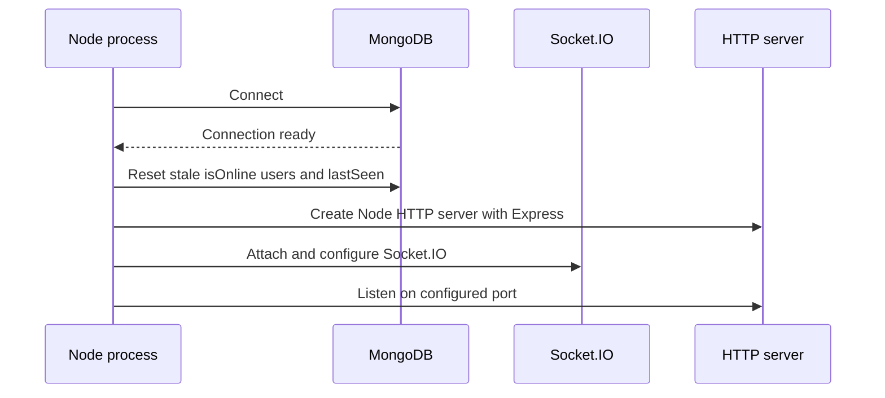
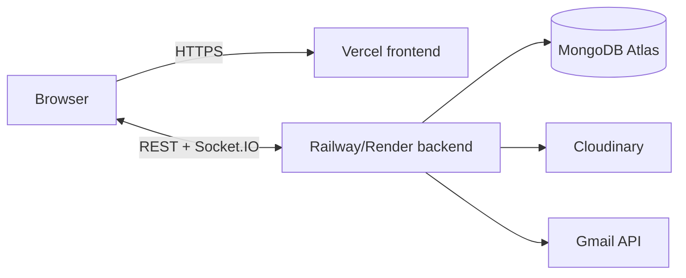

# Setup and deployment

## Prerequisites

- Node.js 22 or newer
- npm
- MongoDB or MongoDB Atlas
- Cloudinary account
- Google Cloud project with Gmail API enabled
- Dedicated Gmail sender account and OAuth 2.0 credentials

## Environment variables

### Backend

Create `backend/.env`.

| Name | Required | Description |
| --- | --- | --- |
| `PORT` | No | Express/Socket.IO port; defaults to `5000` |
| `MONGO_URI` | Yes | MongoDB connection string |
| `CLIENT_URL` | Yes | Exact allowed frontend origin and email-link base URL |
| `JWT_SECRET` | Yes | Secret used to sign and verify session JWTs |
| `JWT_EXPIRE` | No | JWT expiry string; defaults to `7d` |
| `NODE_ENV` | Recommended | Controls production cookie security settings |
| `CLOUDINARY_CLOUD_NAME` | For profile uploads | Cloudinary cloud name |
| `CLOUDINARY_API_KEY` | For profile uploads | Cloudinary API key |
| `CLOUDINARY_API_SECRET` | For profile uploads | Cloudinary API secret |
| `GMAIL_USER` | For verification email | Sender Gmail address |
| `GOOGLE_CLIENT_ID` | For verification email | Google OAuth client ID |
| `GOOGLE_CLIENT_SECRET` | For verification email | Google OAuth client secret |
| `GOOGLE_REDIRECT_URI` | For token generation | OAuth redirect URI |
| `GOOGLE_REFRESH_TOKEN` | For verification email | Sender account refresh token with `gmail.send` scope |

Example without real secrets:

```env
PORT=5000
MONGO_URI=mongodb_connection_string
CLIENT_URL=http://localhost:5173
JWT_SECRET=replace_with_a_long_random_secret
JWT_EXPIRE=7d
NODE_ENV=development
CLOUDINARY_CLOUD_NAME=cloud_name
CLOUDINARY_API_KEY=api_key
CLOUDINARY_API_SECRET=api_secret
GMAIL_USER=sender@example.com
GOOGLE_CLIENT_ID=oauth_client_id
GOOGLE_CLIENT_SECRET=oauth_client_secret
GOOGLE_REDIRECT_URI=http://localhost:3000/oauth2callback
GOOGLE_REFRESH_TOKEN=oauth_refresh_token
```

### Frontend

Create `frontend/.env`.

| Name | Required | Description |
| --- | --- | --- |
| `VITE_API_URL` | Yes | Backend origin without `/api`, used by Axios and Socket.IO |
| `VITE_GIPHY_API_KEY` | For GIF search | GIPHY developer API key used by the client-side picker as required by GIPHY |

```env
VITE_API_URL=http://localhost:5000
VITE_GIPHY_API_KEY=giphy_api_key
```

## Gmail OAuth token generation

From `backend`:

```bash
npm run gmail:token
```

Open the printed authorization URL, approve `gmail.send` with the sender account, and store the returned refresh token in local and Railway/Render environment variables. Never commit OAuth credentials or refresh tokens.

## Local installation

```bash
git clone <repository-url>
cd click-chat/backend
npm install
npm run dev
```

In another terminal:

```bash
cd click-chat/frontend
npm install
npm run dev
```

Open `http://localhost:5173`.

The maintained source tree is web-only. It does not include an Android project or Capacitor build scripts, so the commands above are the complete supported local workflow.

## Available commands

| Directory | Command | Purpose |
| --- | --- | --- |
| `backend` | `npm run dev` | Start backend with Nodemon |
| `backend` | `npm start` | Start backend with Node |
| `backend` | `npm run gmail:token` | Generate Gmail OAuth refresh token interactively |
| `frontend` | `npm run dev` | Start Vite development server |
| `frontend` | `npm run build` | Create production frontend build |
| `frontend` | `npm run lint` | Run ESLint |
| `frontend` | `npm run preview` | Preview Vite production build |

The backend currently has no automated test or lint script.

## Startup sequence



Resetting presence at startup is correct for the current single backend instance. It must not be reused unchanged in a multi-instance rolling deployment.

## Cloud deployment

### Current production endpoints

| Service | URL |
| --- | --- |
| Web application | [https://clickchat-ldrp.vercel.app/](https://clickchat-ldrp.vercel.app/) |
| Backend API and Socket.IO — Render (active) | [https://click-chat-64j1.onrender.com/](https://click-chat-64j1.onrender.com/) |
| Backend API and Socket.IO — Railway (inactive) | [https://click-chat-production.up.railway.app/](https://click-chat-production.up.railway.app/) |

| Layer | Service | Configuration |
| --- | --- | --- |
| Frontend | Vercel | Vite build; `vercel.json` rewrites all paths to `/` for React Router |
| Backend | Railway/Render | Node process running the Express/Socket.IO server |
| Database | MongoDB Atlas | `MONGO_URI` supplied to Railway/Render |
| Media | Cloudinary | API credentials supplied to Railway/Render |
| Email | Gmail REST API | OAuth credentials and sender refresh token supplied to Railway/Render |



## Deployment checks

1. Confirm `CLIENT_URL` exactly matches the deployed frontend origin.
2. Confirm `VITE_API_URL` points to the Railway/Render backend origin.
3. Set `NODE_ENV=production` so the cross-site JWT cookie is secure and `SameSite=None`.
4. Confirm the Railway/Render service supports WebSocket connections and the frontend reaches Socket.IO.
5. Verify the Gmail refresh token belongs to the configured sender.
6. Verify MongoDB and Cloudinary network/credential configuration.
7. Test registration, email verification, login, profile upload, invitation, messaging, and presence after deployment.

For Render, set the service's **Health Check Path** to `/health`. The endpoint returns a fast `200` response with process status, uptime, and a timestamp. This health check helps Render validate deployments and restart an unresponsive process; it does not prevent a free service from sleeping after inactivity.

The backend CORS configuration also permits `http://localhost` and `https://localhost` for compatibility with the previously installed experimental APK. Those origins do not mean the Android/Capacitor source is maintained in this repository.
