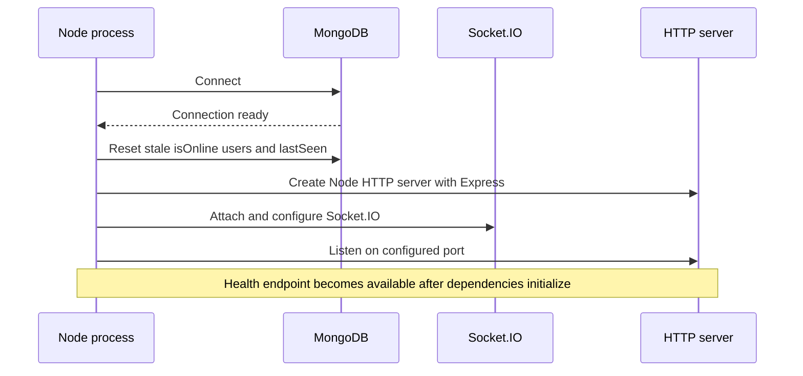
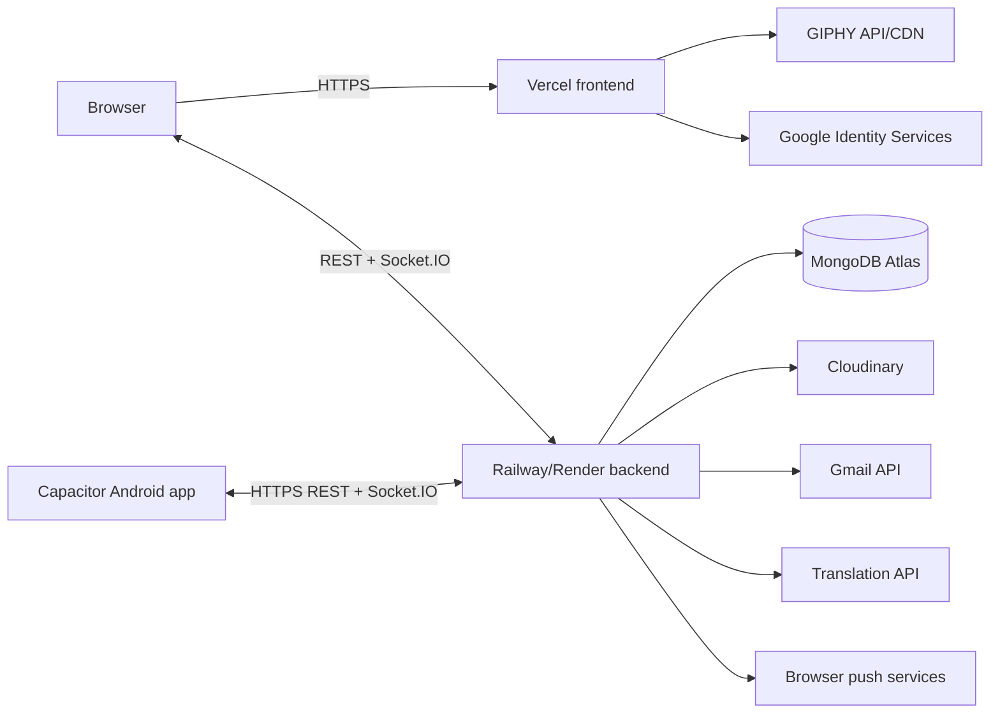

# Setup and deployment

## Prerequisites

- Node.js 22 or newer
- npm
- MongoDB or MongoDB Atlas
- Cloudinary account
- Google Cloud project with Gmail API enabled
- Dedicated Gmail sender account and OAuth 2.0 credentials
- Google Cloud project with Cloud Translation API enabled when Translation is required
- GIPHY developer key when GIF/sticker discovery is required
- Generated VAPID key pair when browser push notifications are required

## Environment variables

### Backend

Create `backend/.env`.

| Name | Required | Description |
| --- | --- | --- |
| `PORT` | No | Express/Socket.IO port; defaults to `5000` |
| `MONGO_URI` | Yes | MongoDB connection string |
| `CLIENT_URL` | Yes | Exact allowed frontend origin and email-link base URL |
| `JWT_SECRET` | Yes | Secret used to sign and verify session JWTs |
| `JWT_EXPIRE` | No | JWT expiry string; defaults to `7d` |
| `NODE_ENV` | Recommended | Controls production cookie security settings |
| `CLOUDINARY_CLOUD_NAME` | For profile uploads | Cloudinary cloud name |
| `CLOUDINARY_API_KEY` | For profile uploads | Cloudinary API key |
| `CLOUDINARY_API_SECRET` | For profile uploads | Cloudinary API secret |
| `GMAIL_USER` | For verification email | Sender Gmail address |
| `GOOGLE_CLIENT_ID` | For verification email | Google OAuth client ID |
| `GOOGLE_CLIENT_SECRET` | For verification email | Google OAuth client secret |
| `GOOGLE_REDIRECT_URI` | For token generation | OAuth redirect URI |
| `GOOGLE_REFRESH_TOKEN` | For verification email | Sender account refresh token with `gmail.send` scope |
| `GOOGLE_TRANSLATE_API_KEY` | For Translation | Backend-only key restricted to Cloud Translation API |
| `TRANSLATION_ENABLED` | No | Emergency switch; set to `false` to suspend new external translations |
| `TRANSLATION_DAILY_CHARACTER_LIMIT` | No | Requested daily cap, clamped by code to at most `12000` |
| `TRANSLATION_MONTHLY_CHARACTER_LIMIT` | No | Requested monthly cap, clamped by code to at most `400000` |
| `VAPID_PUBLIC_KEY` | For Web Push | Public application-server key generated with `web-push` |
| `VAPID_PRIVATE_KEY` | For Web Push | Backend-only application-server private key |
| `VAPID_EMAIL` | For Web Push | Operator contact formatted as `mailto:address@example.com` |

Example without real secrets:

```env
PORT=5000
MONGO_URI=mongodb_connection_string
CLIENT_URL=http://localhost:5173
JWT_SECRET=replace_with_a_long_random_secret
JWT_EXPIRE=7d
NODE_ENV=development
CLOUDINARY_CLOUD_NAME=cloud_name
CLOUDINARY_API_KEY=api_key
CLOUDINARY_API_SECRET=api_secret
GMAIL_USER=sender@example.com
GOOGLE_CLIENT_ID=oauth_client_id
GOOGLE_CLIENT_SECRET=oauth_client_secret
GOOGLE_REDIRECT_URI=http://localhost:3000/oauth2callback
GOOGLE_REFRESH_TOKEN=oauth_refresh_token
GOOGLE_TRANSLATE_API_KEY=backend_only_translation_key
TRANSLATION_ENABLED=true
TRANSLATION_DAILY_CHARACTER_LIMIT=12000
TRANSLATION_MONTHLY_CHARACTER_LIMIT=400000
VAPID_PUBLIC_KEY=generated_public_key
VAPID_PRIVATE_KEY=generated_private_key
VAPID_EMAIL=mailto:operator@example.com
```

### Frontend

Create `frontend/.env`.

| Name | Required | Description |
| --- | --- | --- |
| `VITE_API_URL` | Yes | Backend origin without `/api`, used by Axios and Socket.IO |
| `VITE_GIPHY_API_KEY` | For GIF search | GIPHY developer API key used by the client-side picker as required by GIPHY |
| `VITE_VAPID_PUBLIC_KEY` | For Web Push | Same public VAPID key configured on the backend; safe for browser exposure |

```env
VITE_API_URL=http://localhost:5000
VITE_GIPHY_API_KEY=giphy_api_key
VITE_VAPID_PUBLIC_KEY=generated_public_key
```

## Web Push setup

From `backend`, generate one key pair:

```bash
npx web-push generate-vapid-keys
```

Store both values on the backend and copy only the public value to `VITE_VAPID_PUBLIC_KEY`. Vite embeds frontend variables during the build, so redeploy the frontend after changing the public key. Production push requires HTTPS. Rotating keys invalidates existing browser subscriptions.

## Gmail OAuth token generation

From `backend`:

```bash
npm run gmail:token
```

Open the printed authorization URL, approve `gmail.send` with the sender account, and store the returned refresh token in local and Railway/Render environment variables. Never commit OAuth credentials or refresh tokens.

## Cloud Translation setup

1. Enable **Cloud Translation API** in the same Google Cloud project used for the backend key.
2. Create a dedicated API key named for the ClickChat backend.
3. Apply an API restriction allowing only **Cloud Translation API**.
4. Apply an IP restriction to the production backend's fixed outbound IP when available. Do not use the browser/Vercel IP.
5. Store the key only as `GOOGLE_TRANSLATE_API_KEY` in `backend/.env` and Railway/Render variables.
6. Set the internal daily/monthly values shown above and restart the backend.
7. Configure Google Cloud budget email alerts. Treat them as delayed notifications, not hard caps.

The Translation implementation uses Basic v2 and omits `source`, allowing Google to detect the source language. The user's validated profile preference supplies `target`. See [Translation and cost controls](11-translation-and-cost-controls.md).

## Local installation

```bash
git clone <repository-url>
cd click-chat/backend
npm install
npm run dev
```

In another terminal:

```bash
cd click-chat/frontend
npm install
npm run dev
```

Open `http://localhost:5173`.

### Android APK

The Capacitor wrapper is maintained under `frontend/android`. Build the frontend with the deployed HTTPS backend URL, synchronize it into Android, and compile a debug APK:

```powershell
cd click-chat/frontend
$env:VITE_API_URL="https://click-chat-64j1.onrender.com"
npm run build
npx cap sync android
cd android
./gradlew.bat assembleDebug
```

The generated installable APK is written to `frontend/android/app/build/outputs/apk/debug/app-debug.apk`. The Android build requires JDK 21 and the Android SDK. A debug APK is suitable for installation and testing; publishing requires a separately signed release bundle or APK and secure signing-key management.

### Android Google Sign-In

Android uses the native Credential Manager flow through `@capawesome/capacitor-google-sign-in`; it does not attempt Google OAuth inside the embedded WebView. The existing web OAuth client ID remains `VITE_GOOGLE_CLIENT_ID` and is passed as the server client ID so the backend can verify the same ID-token audience.

Create an additional OAuth client in the same Google Cloud project:

1. Select application type **Android**.
2. Set package name to `com.clickchat.app`.
3. For the current debug APK, register SHA-1 `9A:41:7F:89:E1:B3:8B:EB:93:A8:83:3D:BB:06:5C:F8:2F:D3:13:A6`.
4. Keep the existing web client ID in `VITE_GOOGLE_CLIENT_ID` and `GOOGLE_AUTH_CLIENT_ID`; do not replace it with the Android client ID.
5. When producing a release build, create or update the Android OAuth client with the release signing certificate SHA-1. If Google Play App Signing is enabled, also register the Play Console app-signing SHA-1.

The debug fingerprint is machine/signing-key specific. Recalculate it if the debug keystore changes.

### Android navigation and display behavior

- Android hardware Back and the system back gesture close an open dialog/menu first.
- Back from an open conversation returns to the conversation list.
- Back on another page uses router history; Back at the app root exits the app.
- Predictive-back callbacks are enabled in the Android manifest.
- Capacitor System Bars inject safe-area values for notches and gesture navigation.
- Android navigation controls use immersive mode and reappear temporarily when the user swipes from the bottom edge.
- The keyboard resizes the document body so the message composer remains visible.
- Mixed HTTP/HTTPS content, WebView zoom, and production WebView debugging are disabled.

## Available commands

| Directory | Command | Purpose |
| --- | --- | --- |
| `backend` | `npm run dev` | Start backend with Nodemon |
| `backend` | `npm start` | Start backend with Node |
| `backend` | `npm run gmail:token` | Generate Gmail OAuth refresh token interactively |
| `frontend` | `npm run dev` | Start Vite development server |
| `frontend` | `npm run build` | Create production frontend build |
| `frontend` | `npm run lint` | Run ESLint |
| `frontend` | `npm run preview` | Preview Vite production build |
| `frontend` | `npx cap sync android` | Copy the current web build and plugins into Android |
| `frontend/android` | `./gradlew.bat assembleDebug` | Compile an installable debug APK |

The backend currently has no automated test or lint script.

## Startup sequence



Resetting presence at startup is correct for the current single backend instance. It must not be reused unchanged in a multi-instance rolling deployment.

## Cloud deployment

### Current production endpoints

| Service | URL |
| --- | --- |
| Web application | [https://clickchat-ldrp.vercel.app/](https://clickchat-ldrp.vercel.app/) |
| Backend API and Socket.IO — Render (active) | [https://click-chat-64j1.onrender.com/](https://click-chat-64j1.onrender.com/) |
| Backend API and Socket.IO — Railway (inactive) | [https://click-chat-production.up.railway.app/](https://click-chat-production.up.railway.app/) |

| Layer | Service | Configuration |
| --- | --- | --- |
| Frontend | Vercel | Vite build; `vercel.json` rewrites all paths to `/` for React Router |
| Backend | Railway | Node process running the Express/Socket.IO server |
| Database | MongoDB Atlas | `MONGO_URI` supplied to Railway |
| Media | Cloudinary | API credentials supplied to Railway |
| Email | Gmail REST API | OAuth credentials and sender refresh token supplied to Railway |
| Translation | Google Cloud Translation Basic v2 | Restricted API key and internal caps supplied to Railway |
| GIF/sticker discovery | GIPHY | Public client key supplied to Vercel at build time |



## Deployment checks

1. Confirm `CLIENT_URL` exactly matches the deployed frontend origin.
2. Confirm `VITE_API_URL` points to the Railway/Render backend origin.
3. Set `NODE_ENV=production` so the cross-site JWT cookie is secure and `SameSite=None`.
4. Confirm the Railway/Render service supports WebSocket connections and the frontend reaches Socket.IO.
5. Verify the Gmail refresh token belongs to the configured sender.
6. Verify MongoDB and Cloudinary network/credential configuration.
7. Confirm Translation usage models use the same production MongoDB database across every backend instance.
8. Confirm the Translation key does not appear in the frontend bundle or browser network configuration.
9. Test registration, verification, password recovery/change, profile editing, preferred language, invitations, direct/group text/media/GIF messages, Translation, Web Push, downloads, mobile Back behavior, and presence.
10. Verify Translation suspension using small limits in a non-production database before relying on the production caps.

## Cost and quota checklist

- Google Cloud: budget email thresholds, API-key restrictions, Translation internal caps, and billing reports.
- Railway/Render: compute usage alert and hard usage limit where the active plan supports it.
- MongoDB Atlas: confirm `M0` if free-only operation is intended; otherwise configure organization billing alerts.
- Cloudinary: monitor storage, transformation, and bandwidth usage; add application upload quotas before public growth.
- Vercel: confirm Hobby/free status or configure spend controls for a paid team.
- GIPHY/Gmail: monitor quota exhaustion because it can disable features even when it does not create a direct usage bill.

Provider alerts are independent. A Google Cloud budget does not monitor Railway/Render, Atlas, Cloudinary, Vercel, or GIPHY.

For Render, set the service's **Health Check Path** to `/health`. The endpoint returns a fast `200` response with process status, uptime, and a timestamp. This health check helps Render validate deployments and restart an unresponsive process; it does not prevent a free service from sleeping after inactivity.

The backend CORS configuration permits `http://localhost` and `https://localhost`, which cover local browser development and Capacitor's local Android web origin. Production web access still requires the exact deployed `CLIENT_URL`.
