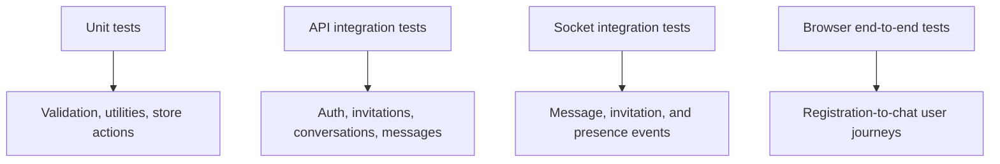
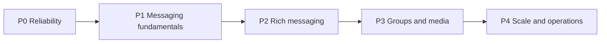

# Testing and roadmap

## Current verification capability

- Frontend ESLint through `npm run lint`.
- Frontend production compilation through `npm run build`.
- Node syntax checking can be run against backend files with `node --check`.
- No automated unit, integration, end-to-end, or Socket.IO test suite is currently configured.

## Manual acceptance matrix

### Authentication

| Scenario | Expected result |
| --- | --- |
| Valid registration | Account created and verification email requested |
| Duplicate email | `409` error |
| Under-18 registration | Client/server validation failure |
| Login before verification | `403` and verification guidance |
| Valid verification link | Account marked verified and token fields cleared |
| Expired/invalid link | `400` error |
| Rapid resend | Cooldown or rate-limit response |
| Logout | Cookie cleared, socket disconnected, protected route unavailable |

### Invitations

| Scenario | Expected result |
| --- | --- |
| Send invitation | Sender pending list and recipient badge update immediately |
| Duplicate pending invitation | `409` error |
| Accept invitation | Both users receive one direct conversation without page refresh |
| Decline invitation | Pending state disappears for both users |
| Offline recipient/sender | Correct state loads through REST after next login |

### Messaging

| Scenario | Expected result |
| --- | --- |
| Send text/emoji | Persisted once and delivered in real time |
| Edit own latest message | Both message and preview update |
| Edit older message | Message updates; latest preview remains unchanged |
| Delete latest message | Both clients show deleted bubble and “Message deleted” preview |
| Delete older message | Bubble changes; latest preview remains unchanged |
| Date boundary | Separator appears when calendar day changes |
| Switch conversation during history request | Stale response does not replace active conversation messages |

### Presence

| Scenario | Expected result |
| --- | --- |
| First socket connects | User becomes online and contacts update |
| Second tab connects | No duplicate state transition |
| One of two tabs closes | User remains online |
| Final tab closes | User becomes offline after five seconds |
| Reconnect within five seconds | Offline timer is cancelled; no flicker |
| Backend restarts | Stale online flags reset; reconnecting clients become online again |

### Interface and profile

| Scenario | Expected result |
| --- | --- |
| Initial authentication check | Branded full-screen loader remains visible until the check completes |
| Responsive landing/auth pages | Content remains usable without horizontal overflow on mobile and desktop |
| Theme change | Landing, authentication, dashboard, dialogs, and profile use the selected theme consistently |
| Valid profile image selection | Upload starts immediately and the dialog closes after success |
| Invalid profile image | Unsupported type or image over 5 MB is rejected before upload |
| Upload in progress | Dialog cannot be dismissed accidentally and progress state remains visible |

## Recommended automated test architecture

### Suggested priorities

1. API integration tests using an isolated MongoDB test database.
2. Socket tests with two authenticated clients and multi-tab scenarios.
3. Zustand action tests for deduplication and targeted state updates.
4. Browser tests for authentication, invitation acceptance, and real-time messaging.
5. CI workflow running lint, build, backend tests, and frontend tests.

## Known limitations

| Area | Limitation | Impact |
| --- | --- | --- |
| Message history | Only latest 50 messages are returned | Older history is inaccessible |
| Unread state | Counts are fixed at zero in the UI | Users cannot identify unseen conversations |
| Read receipts | Sender receipt is stored, but no complete update/event/UI workflow exists | Delivery/read state is not visible |
| Typing | No typing events or UI | Reduced real-time feedback |
| Replies | Schema, API, and bubble display exist; composer selection does not | Users cannot initiate replies through the current UI |
| Groups | Schema fields and validation exist; routes/UI are incomplete | Only direct chat is functional |
| Attachments | Upload helpers and message types exist; message routes/UI are incomplete | Text/emoji only |
| Presence scale | Counts/timers are process-local | Single backend instance only |
| Testing | No automated suite | Regression risk grows with new features |
| Platform packaging | Android/Capacitor source is not maintained in this repository | New APK builds require a separate packaging phase later |
| Security | Password recovery, session management, blocking/reporting, and security headers are incomplete | Not ready for broad public production use |

## Prioritized roadmap

### P0 — Reliability and test foundation

- Add automated backend integration and Socket.IO tests.
- Add frontend store/component tests and a CI workflow.
- Add centralized error handling, structured logging, and health checks.
- Add login rate limiting and security headers.

### P1 — Messaging fundamentals

1. Cursor-based older-message pagination with scroll-position preservation.
2. Per-conversation unread counts.
3. Complete read-receipt API, events, and UI.
4. Debounced typing indicators with automatic expiry.
5. Complete reply selection, composer preview, and reply navigation.
6. Optimistic send state, client IDs, retry, and reconnection resynchronization.

### P2 — Conversation features

- Message reactions.
- Message search.
- Pin, mute, archive, and per-user conversation settings.
- Browser/push notifications and notification preferences.
- Blocking and reporting.

### P3 — Rich media and groups

- Secure image and document attachments with progress and previews.
- Complete group creation, membership, roles, images, and system messages.
- GIF picker.
- Voice messages.
- Voice and video calling.

### P4 — Scale and operations

- Redis Socket.IO adapter and distributed presence coordination.
- Background jobs for email, uploads, and notifications.
- Query/index monitoring and message-list virtualization.
- Error monitoring, audit events, moderation tools, and administrative workflows.
