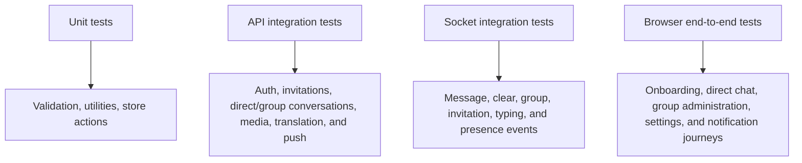
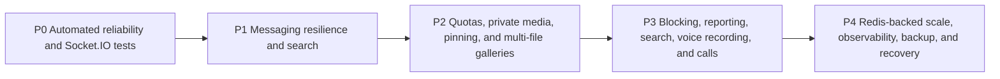

# Testing and roadmap

## Current verification capability

- Frontend ESLint through `npm run lint`.
- Frontend production compilation through `npm run build`.
- Node syntax checking can be run against backend files with `node --check`.
- No automated unit, integration, end-to-end, or Socket.IO test suite is currently configured.

## Manual acceptance matrix

### Authentication

| Scenario | Expected result |
| --- | --- |
| Valid registration | Account created and verification email requested |
| Duplicate email | `409` error |
| Under-18 registration | Client/server validation failure |
| Login before verification | `403` and verification guidance |
| Valid verification link | Account marked verified and token fields cleared |
| Expired/invalid link | `400` error |
| Rapid resend | Cooldown or rate-limit response |
| Logout | Cookie cleared, socket disconnected, protected route unavailable |
| Forgot password for known/unknown email | Same generic response; known account receives a time-limited link |
| Reset with valid token | Password changes, reset fields clear, old session is unavailable |
| Change password while authenticated | Current password verified; JWT is reissued and older JWTs are rejected |

### Invitations

| Scenario | Expected result |
| --- | --- |
| Send invitation | Sender pending list and recipient badge update immediately |
| Duplicate pending invitation | `409` error |
| Accept invitation | Both users receive one direct conversation without page refresh |
| Decline invitation | Pending state disappears for both users |
| Offline recipient/sender | Correct state loads through REST after next login |

### Messaging

| Scenario | Expected result |
| --- | --- |
| Send text/emoji | Persisted once and delivered in real time |
| Send supported attachment | Upload progress is shown; media persists and reaches the other participant in real time |
| Reject invalid attachment | Unsupported, empty, or oversized files return a clear validation error |
| Edit own latest message | Both message and preview update |
| Edit older message | Message updates; latest preview remains unchanged |
| Delete latest message | Both clients show deleted bubble and “Message deleted” preview |
| Delete older message | Bubble changes; latest preview remains unchanged |
| Clear direct chat | Confirmation appears; all messages/uploads disappear for both users while the empty conversation remains |
| Delete direct conversation | Confirmation appears; conversation and accepted connection disappear for both users |
| Reconnect after deletion | A new invitation can be sent and accepted to create a fresh direct conversation |
| Legacy accepted invitation without conversation | Sending an invitation removes the stale record and creates a new pending invitation |
| Date boundary | Separator appears when calendar day changes |
| Switch conversation during history request | Stale response does not replace active conversation messages |
| Open conversation with unread messages | Enough history loads to reveal and focus the first unread incoming message |
| Open fully read conversation | View focuses the latest message |
| Recipient receives message | Sender indicator changes from sent to delivered |
| Recipient views focused conversation | Sender indicator changes to read; hidden/unfocused pages do not mark read |
| Group recipients acknowledge message | Sender sees delivered/read participant totals |
| Open a sent group message receipt | A group-only menu lists members who read it and those with delivery only |
| Send GIF/sticker | GIPHY result is stored as external metadata and delivered to the recipient without Cloudinary upload |
| Long latest message | Sidebar shows one line, at most 42 Unicode characters plus `...`, without row overflow |
| Open/download attachment | Participant receives a short-lived redirect; unrelated user is rejected |
| Reply to text or media | Composer shows a cancellable preview and the sent bubble references the populated original |
| Open a reply reference | Older pages load when necessary, then the original scrolls into view and highlights |
| Delete a replied-to message | Existing reply preview changes to “Original message was deleted” |
| React to an incoming message | Bubble trigger opens the composer emoji picker and the selected emoji appears as a reaction chip |
| Change/remove reaction | A new emoji replaces the user's prior reaction; selecting the same emoji removes it |
| Multiple users choose one emoji | One chip displays the aggregated count and participant dialog |
| Attempt to react to own message | UI omits the trigger and API rejects a forged request |

### Groups

| Scenario | Expected result |
| --- | --- |
| Create group | Creator plus at least two accepted contacts receive one synchronized group |
| Rename/change image | Admin mutation updates all current members without refresh |
| Add/remove member | Added member receives the group; removed member loses access and local state |
| Promote/demote admin | Role updates live and at least one administrator remains |
| Admin leaves | Another member is promoted when necessary |
| Delete group | Conversation, messages, group image, and stored message files are removed |

### Web Push

| Scenario | Expected result |
| --- | --- |
| Enable from prompt/profile | Browser subscription is stored for the authenticated user |
| Background recipient | Text, attachment, GIF, and sticker sends produce a system notification |
| Several background messages | Every message remains a distinct notification instead of replacing the previous item |
| Group message | Notification title identifies the group and the body identifies the sender |
| Visible ClickChat window | Service worker suppresses redundant system notification |
| Click notification | Existing/new window opens the target conversation |
| Disable | Browser unsubscribes and backend endpoint is removed |
| Expired subscription | `404`/`410` delivery result removes stale endpoint |

### Appearance themes

| Scenario | Expected result |
| --- | --- |
| Apply a preset | Application surfaces, chat canvas, and message bubbles use the selected theme |
| Sent and received messages | Both bubble types retain readable foreground/background contrast |
| Typing indicator | Uses the themed received-bubble treatment |
| Change color mode | Light, dark, and system modes retain the selected visual preset |
| Restore default | ClickChat with system mode is applied immediately |
| Reload or another tab | Saved appearance remains and synchronizes through storage events |

### Translation

| Scenario | Expected result |
| --- | --- |
| Translate received text | Original remains visible and translated text appears below it |
| Repeat same message/language | Cached result returns without another Google call or quota reservation |
| Edit then translate | Content hash changes and a fresh translation is stored |
| Daily/monthly limit reached | `503 TRANSLATION_SERVICE_SUSPENDED`; Google is not called |
| Translation disabled/missing key | Clear service-unavailable response |
| Excessive attempts | `429 TRANSLATION_RATE_LIMITED` |
| Two concurrent reservations near cap | Atomic counter permits only requests that fit remaining allowance |

### Presence

| Scenario | Expected result |
| --- | --- |
| First socket connects | User becomes online and contacts update |
| Second tab connects | No duplicate state transition |
| One of two tabs closes | User remains online |
| Final tab closes | User becomes offline after five seconds |
| Reconnect within five seconds | Offline timer is cancelled; no flicker |
| Backend restarts | Stale online flags reset; reconnecting clients become online again |

### Typing indicators

| Scenario | Expected result |
| --- | --- |
| Begin entering text or emoji | Other participants see an animated typing bubble; groups label the sender |
| Continue entering content | Sender does not emit a new start event for every keystroke |
| Stop entering content | Indicator clears after approximately 1.5 seconds |
| Empty or submit the composer | Indicator clears immediately |
| Change conversations while typing | Previous conversation receives a stop event |
| Lost stop event or abrupt disconnect | Recipient safety timer clears the indicator within approximately 3 seconds |
| Invalid or unrelated conversation ID | Server ignores the event and sends no update |

### Interface and profile

| Scenario | Expected result |
| --- | --- |
| Initial authentication check | Branded full-screen loader remains visible until the check completes |
| Responsive landing/auth pages | Content remains usable without horizontal overflow on mobile and desktop |
| Theme change | Landing, authentication, dashboard, dialogs, and profile use the selected theme consistently |
| Valid profile image selection | Upload starts immediately and the dialog closes after success |
| Invalid profile image | Unsupported type or image over 5 MB is rejected before upload |
| Upload in progress | Dialog cannot be dismissed accidentally and progress state remains visible |
| Inline name/bio edit | Only the selected section enters edit mode and persists validated data |
| Preferred language update | Profile refreshes and subsequent translations target the new language |
| Avatar click | Public profile opens; clicking ordinary row content selects conversation instead |
| Mobile browser Back | Open conversation returns to conversation list through URL history |
| Profile/Settings navigation | Shared tabs switch directly between account pages on mobile and desktop |

## Recommended automated test architecture

### Suggested priorities

1. API integration tests using an isolated MongoDB test database.
2. Socket tests with two authenticated clients and multi-tab scenarios.
3. Zustand action tests for deduplication and targeted state updates.
4. Browser tests for authentication, invitation acceptance, and real-time messaging.
5. CI workflow running lint, build, backend tests, and frontend tests.

## Known limitations

| Area | Limitation | Impact |
| --- | --- | --- |
| Message history | Cursor-based pages load while scrolling upward | History remains efficient for long conversations |
| Unread state | Persisted per conversation and synchronized in real time | Opening a conversation resets its count across tabs and devices |
| Read receipts | Sent, delivered, and read states persist and synchronize in real time | Group messages display participant totals |
| Attachments | One file up to 10 MB per message; no cancellation, retry, signature inspection, or malware scan | Rich media works, but production hardening and multi-file UX remain |
| Presence scale | Counts/timers are process-local | Single backend instance only |
| Testing | No automated suite | Regression risk grows with new features |
| Platform packaging | Capacitor Android wrapper and debug APK build are maintained | Store publication still requires release signing, store assets, and native OAuth validation |
| Security | Upload/message quotas, login throttling, private attachment delivery, blocking/reporting, and security headers remain incomplete | Not ready for untrusted broad public traffic |

## Prioritized roadmap

### P0 — Reliability and test foundation

- Add automated backend integration and Socket.IO tests.
- Add frontend store/component tests and a CI workflow.
- Add centralized error handling, structured logging, and health checks.
- Add login rate limiting and security headers.
- Add per-user upload-byte/message quotas and socket typing-event throttling.
- Move sensitive attachments to authenticated/private Cloudinary delivery.

### P1 — Messaging fundamentals

1. Add conversation and cross-conversation message search with jump-to-result navigation.
2. Add optimistic send state, client IDs, retry, and reconnection resynchronization.

### P2 — Conversation features

- Pin, mute, archive, and per-user conversation settings.
- Message forwarding.
- Blocking and reporting.

### P3 — Rich media and calls

- Multi-file attachment galleries, cancellation, retry, signature inspection, and malware scanning.
- Group system messages and membership audit history.
- Voice messages.
- Voice and video calling.

### P4 — Scale and operations

- Redis Socket.IO adapter and distributed presence coordination.
- Background jobs for email, uploads, and notifications.
- Query/index monitoring and message-list virtualization.
- Error monitoring, audit events, moderation tools, and administrative workflows.
