# ClickChat diagram catalog

This page collects the principal analysis and design diagrams for the current ClickChat web application. Every diagram reflects behavior implemented in the current branch unless a note explicitly says otherwise.

## Rendering guidance

- Render this file in GitHub, VS Code Markdown Preview, or another Mermaid-compatible viewer.
- Each concern is intentionally presented as a separate, compact diagram to reduce crossing lines and overlapping nodes.
- Short labels and one-direction layouts are used so the diagrams remain readable on ordinary screens.
- If a viewer still compresses a diagram, open that diagram by itself or widen the preview pane.

## 1. System context diagram

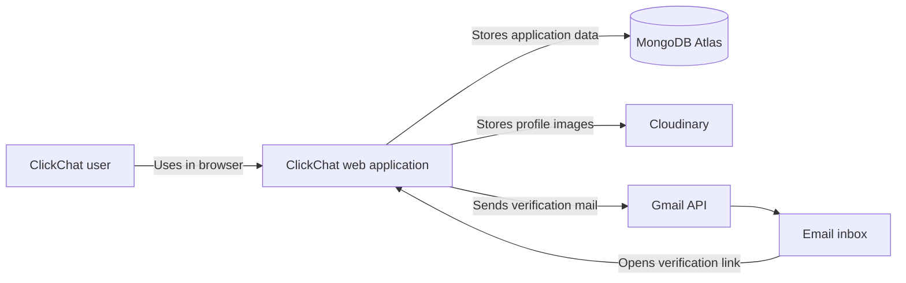

## 2. User role diagram

Mermaid has no native UML use-case syntax, so this use-case view uses a flowchart with clearly separated actor and system boundaries.

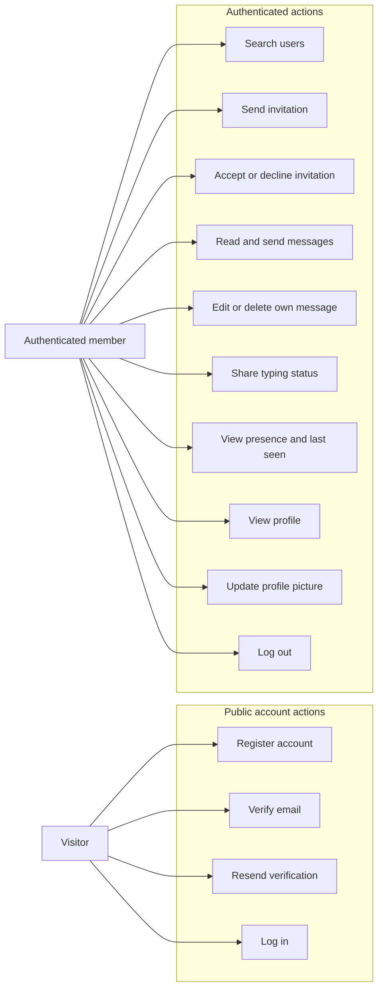

## 3. User journey diagram

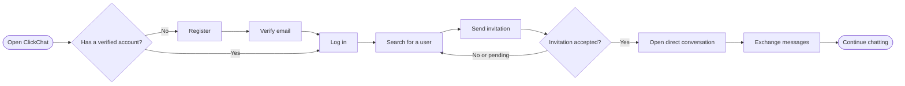

## 4. Data-flow diagram — Level 0

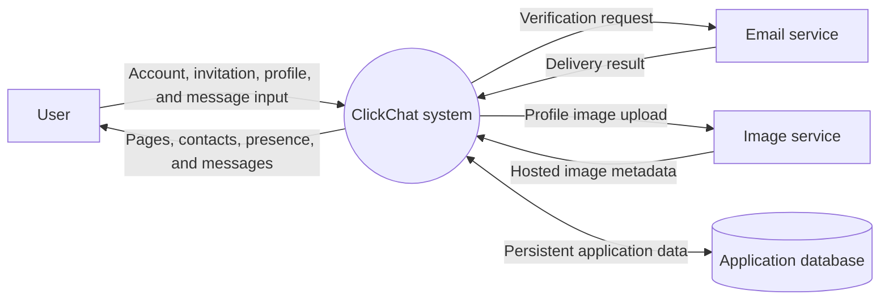

## 5. Data-flow diagram — Level 1

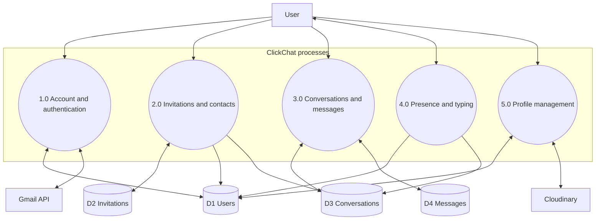

## 6. Data-flow diagram — authentication detail

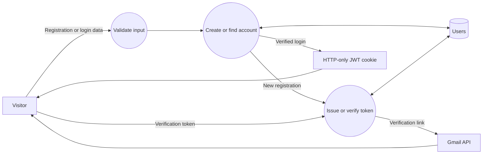

## 7. Data-flow diagram — messaging detail

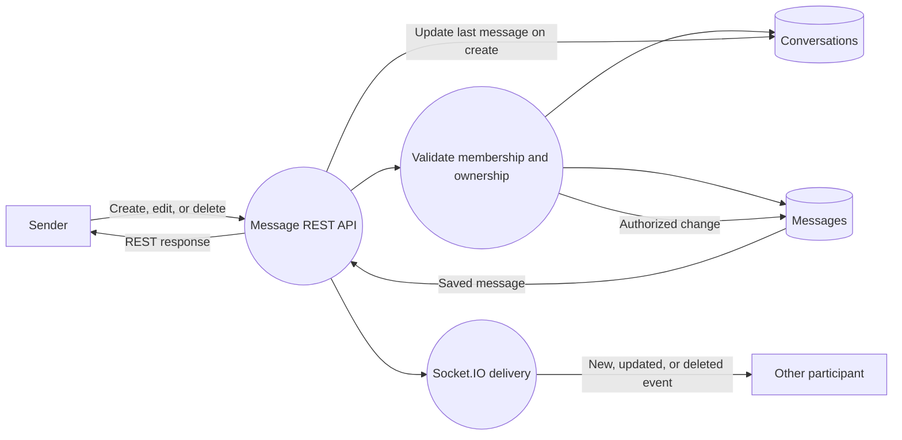

## 8. Logical component diagram

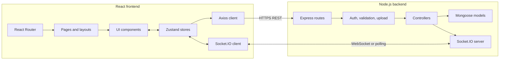

## 9. Deployment diagram

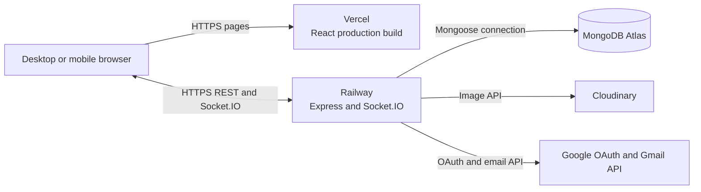

## 10. UML package diagram

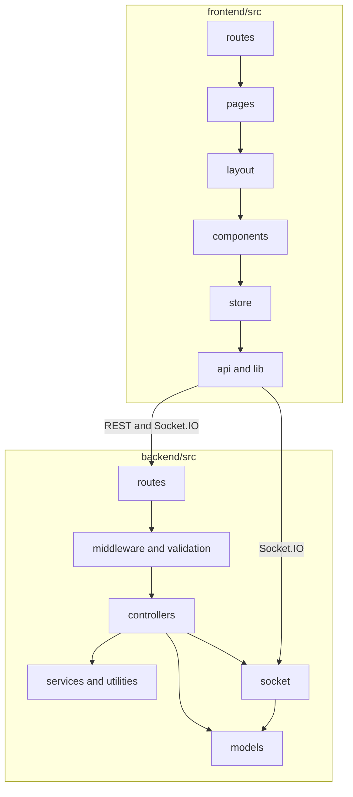

## 11. UML class diagram — persistent domain

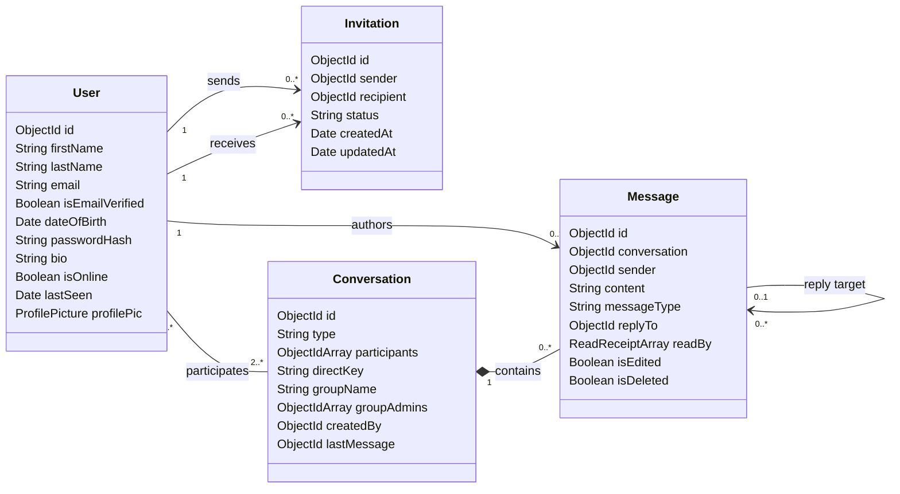

## 12. Entity-relationship diagram

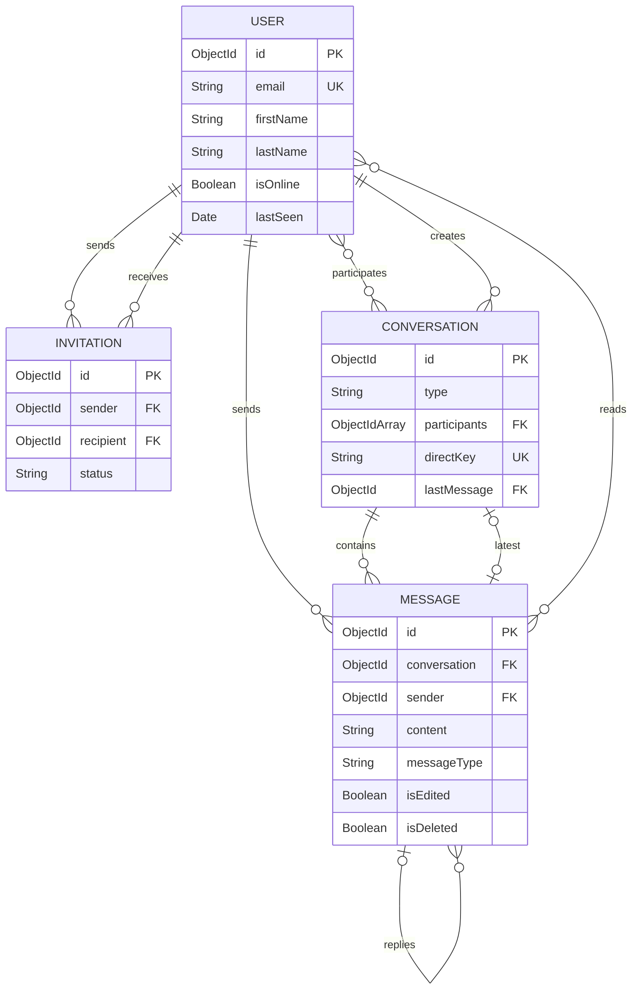

## 13. Registration and verification sequence

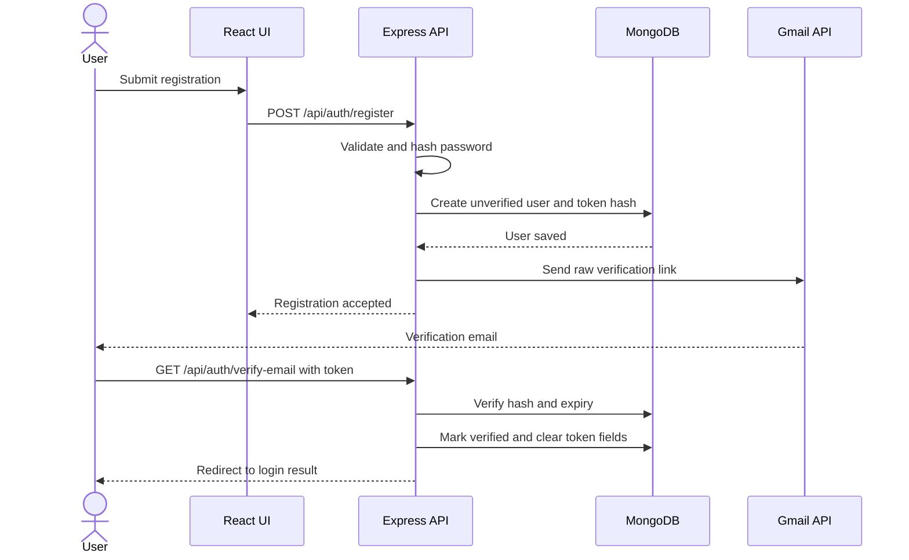

## 14. Login and socket connection sequence

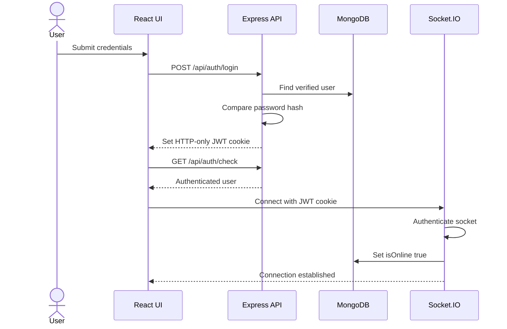

## 15. Invitation acceptance sequence

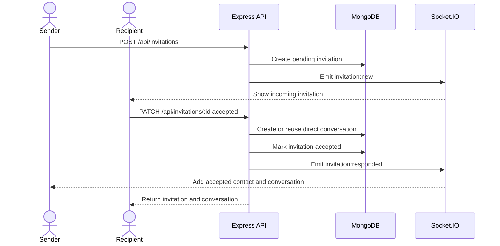

## 16. Message delivery sequence

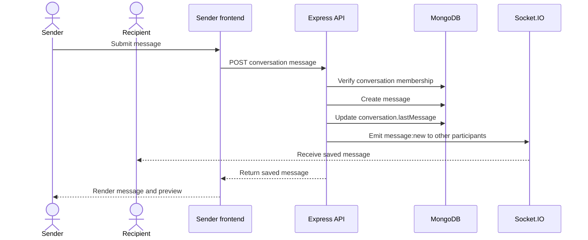

## 17. Typing indicator sequence

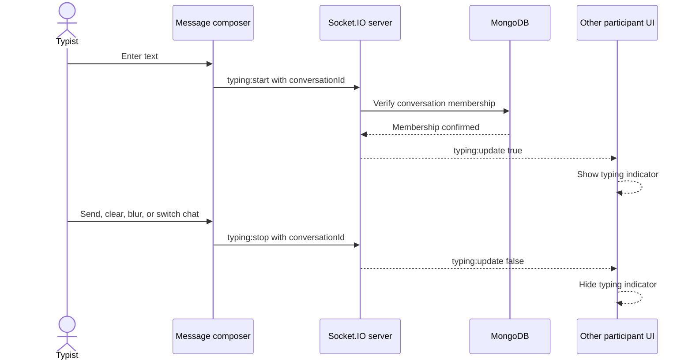

Typing state is ephemeral and is not stored in MongoDB.

## 18. Presence state diagram

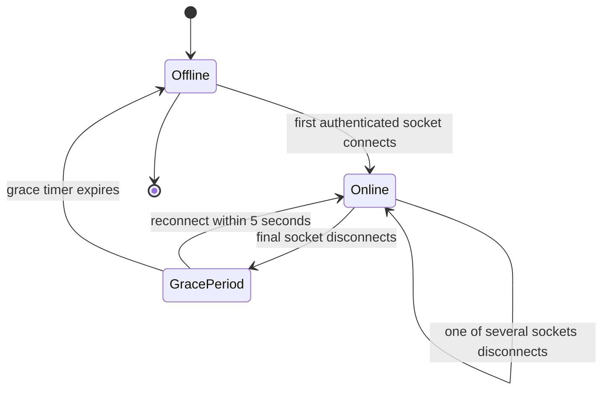

## 19. Invitation state diagram

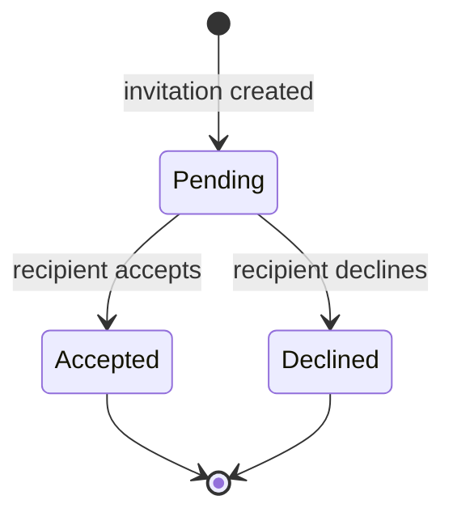

## 20. Message lifecycle state diagram

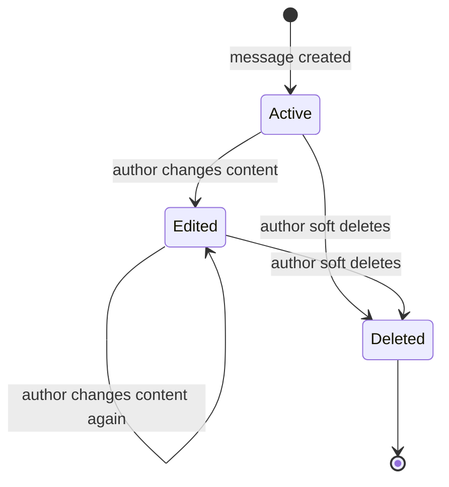

The deleted record remains in MongoDB with empty content and deletion metadata so clients can render the deleted-message placeholder consistently.

## 21. Profile-picture upload activity diagram

```mermaid
flowchart TD
    Start(["User selects an image"])
    Validate{"JPEG, PNG, or WebP within limit?"}
    Upload["Send multipart PATCH request"]
    Authorize["Authenticate user"]
    Store["Upload image to Cloudinary"]
    Update["Update user profilePic metadata"]
    Refresh["Update frontend user state"]
    Close["Close upload dialog"]
    Error["Show validation or upload error"]

    Start --> Validate
    Validate -->|"No"| Error
    Validate -->|"Yes"| Upload
    Upload --> Authorize
    Authorize --> Store
    Store --> Update
    Update --> Refresh
    Refresh --> Close
```

## 22. Frontend route navigation diagram

```mermaid
flowchart TB
    Load["Application starts"]
    Check["GET /api/auth/check"]
    Auth{"Authenticated?"}

    subgraph Public["Public routes"]
        Welcome["/"]
        Login["/login"]
        Register["/register"]
        Verify["/verify-email"]
        CheckEmail["/check-email"]
    end

    subgraph Protected["Protected routes"]
        Chat["/chat"]
        Profile["/profile"]
    end

    Load --> Check
    Check --> Auth
    Auth -->|"No"| Welcome
    Auth -->|"Yes"| Chat
    Welcome --> Login
    Welcome --> Register
    Register --> CheckEmail
    CheckEmail --> Verify
    Login --> Chat
    Chat <--> Profile
```

## 23. Real-time event map

```mermaid
flowchart LR
    subgraph Producers["Event producers"]
        MessageAPI["Message controller"]
        InviteAPI["Invitation controller"]
        SocketHandlers["Socket connection handlers"]
        Composer["Message composer"]
    end

    Rooms["Per-user Socket.IO rooms"]

    subgraph Consumers["Frontend consumers"]
        MessageStore["Message store"]
        ConversationStore["Conversation store"]
        InvitationStore["Invitation store"]
        PresenceUI["Presence UI"]
        TypingUI["Typing indicator"]
    end

    MessageAPI -->|"message:new, message:updated, message:deleted"| Rooms
    InviteAPI -->|"invitation:new, invitation:responded"| Rooms
    SocketHandlers -->|"presence:update"| Rooms
    Composer -->|"typing:start, typing:stop"| SocketHandlers
    SocketHandlers -->|"typing:update"| Rooms

    Rooms --> MessageStore
    Rooms --> ConversationStore
    Rooms --> InvitationStore
    Rooms --> PresenceUI
    Rooms --> TypingUI
```

## 24. Authorization decision flow

```mermaid
flowchart TD
    Request["Protected request or socket connection"]
    Cookie{"JWT cookie present?"}
    Valid{"JWT valid and unexpired?"}
    User{"User exists?"}
    Resource{"Authorized for target resource?"}
    Allow["Perform operation"]
    Reject401["Reject as unauthenticated"]
    Reject403["Reject as unauthorized"]

    Request --> Cookie
    Cookie -->|"No"| Reject401
    Cookie -->|"Yes"| Valid
    Valid -->|"No"| Reject401
    Valid -->|"Yes"| User
    User -->|"No"| Reject401
    User -->|"Yes"| Resource
    Resource -->|"No"| Reject403
    Resource -->|"Yes"| Allow
```

Resource authorization includes checks such as conversation membership, invitation recipient ownership, and message authorship.
