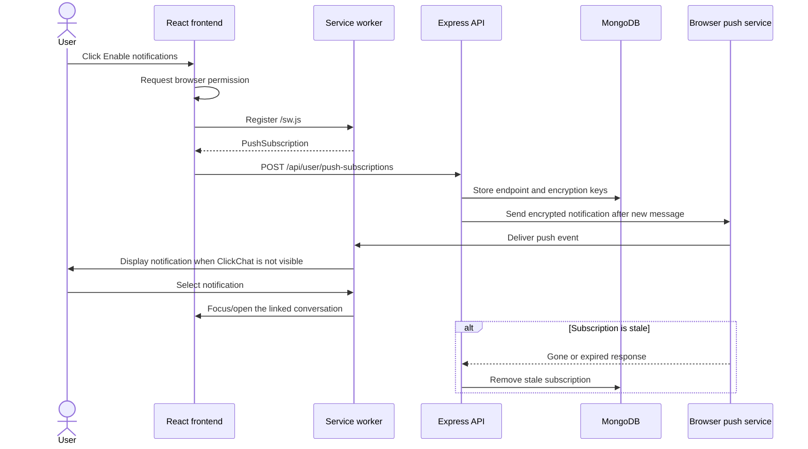

# Groups and Web Push

## Scope

ClickChat supports managed group conversations and free standards-based browser push notifications. Both features extend the existing authenticated conversation system: REST remains authoritative for mutations, MongoDB is the source of truth, and Socket.IO distributes persisted group changes.

## Group lifecycle

An authenticated user can create a group with a 2–50 character name and at least two accepted contacts. The creator is included as the first administrator. Creation is capped at 100 total members.

Administrators can:

- rename the group;
- upload or replace its Cloudinary image;
- add accepted contacts;
- remove members;
- promote members to administrator;
- demote administrators while preserving at least one administrator; and
- permanently delete the group, messages, group image, and message attachments.

Any member can leave. If the final administrator leaves, the backend promotes a remaining member automatically. If the final member leaves, the group and its stored resources are deleted.

Group access is enforced on every message and management request through conversation membership. Management mutations additionally require the requester to appear in `groupAdmins`.

## Group API

| Method | Path | Purpose |
| --- | --- | --- |
| `POST` | `/api/conversations/groups` | Create a group |
| `PATCH` | `/api/conversations/:conversationId/group` | Rename a group |
| `PATCH` | `/api/conversations/:conversationId/group/image` | Replace the group image |
| `POST` | `/api/conversations/:conversationId/group/participants` | Add members |
| `DELETE` | `/api/conversations/:conversationId/group/participants/:participantId` | Remove a member |
| `PATCH` | `/api/conversations/:conversationId/group/admins/:participantId` | Add or remove administrator status |
| `POST` | `/api/conversations/:conversationId/group/leave` | Leave a group |
| `DELETE` | `/api/conversations/:conversationId/group` | Permanently delete a group |

## Live group synchronization

The backend emits the complete populated conversation after successful persistence:

| Event | Recipient | Meaning |
| --- | --- | --- |
| `conversation:created` | Initial or newly added members | Insert the group locally |
| `conversation:updated` | Current members | Replace local group metadata and membership |
| `conversation:removed` | Removed, leaving, or deletion-affected members | Remove the conversation and close it if selected |

Group messages continue using `message:new`, `message:updated`, `message:deleted`, and `typing:update`. Incoming group bubbles show the sender name, and ephemeral typing state is rendered as an animated bubble.

## Web Push flow



The browser creates the endpoint and encryption values. ClickChat stores multiple subscriptions per user so separate browsers and devices can receive notifications. The VAPID public key is exposed to the frontend; the private key remains backend-only.

The backend sends a short sender/message preview after text, attachment, GIF, or sticker persistence. Direct notifications use the sender as the title. Group notifications use the group name as the title and prefix the preview with the sender. Every payload carries its message ID, conversation ID, message type, timestamp, and deep link.

The service worker uses a message-level notification tag, so consecutive messages—including several from one conversation—remain distinct instead of replacing the previous notification. It suppresses redundant system notifications while a visible ClickChat window exists, focuses or opens the relevant conversation when selected, activates updated worker logic immediately, and refreshes its registration without relying on the browser's HTTP cache. HTTP `404` and `410` delivery responses remove expired subscriptions.

## Notification preference behavior

- The chat sidebar shows an enable prompt only when notifications are supported, not already enabled, and not dismissed recently.
- **Not now** is remembered per account for seven days in local storage.
- Profile settings provide a permanent per-browser enable/disable control.
- A denied permission is controlled by browser site settings; application code cannot override it.
- Production requires HTTPS. Localhost is treated as a secure development context by supported browsers.

## Environment variables

Backend:

```env
VAPID_PUBLIC_KEY=generated_public_key
VAPID_PRIVATE_KEY=generated_private_key
VAPID_EMAIL=mailto:operator@example.com
```

Frontend build:

```env
VITE_VAPID_PUBLIC_KEY=the_same_public_key
```

Generate a pair once with `npx web-push generate-vapid-keys`. Rotating the pair invalidates existing subscriptions, so users must enable notifications again.
